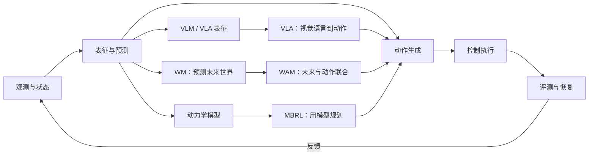

# Embodied AI Starter Map

具身智能学习地图，面向想从机器人基础走到 VLA、World Model、RL/MBRL 和 WAM 的读者。仓库的重点不是罗列名词，而是把每个方向放回同一条链路：

```text
观测与状态 -> 表征与预测 -> 动作生成 -> 控制执行 -> 评测与恢复
```

## 先从你的目标开始

| 你想做什么 | 先看什么 | 后面接什么 |
| --- | --- | --- |
| 先看懂全貌 | [知识图谱](docs/knowledge-map.md) | [学习路线](docs/roadmap.md) |
| 跑一个 RL 示例 | [强化学习基础](docs/reinforcement-learning.md) | [MuJoCo 教程](docs/mujoco-tutorial.md) |
| 学机器人坐标、TF 和规划 | [机器人学基础](docs/robotics.md) | RViz 2、MoveIt 2、ros2_control |
| 跑 GPU 并行仿真 | [Isaac Sim 教程](docs/isaac-sim-tutorial.md) | Isaac Lab、ManiSkill |
| 研究 VLA 或动作策略 | [模型基础](docs/model-basics.md) | [论文清单](docs/papers.md) 和 OpenVLA/OpenPI |
| 研究 World Model | [WM 专题](docs/world-model-directions.md) | pixel、latent、对象中心、3D/4D 和闭环验证 |
| 研究 WAM | [WM 专题](docs/world-model-directions.md) | [WAM 代码入口](docs/codebases.md#5-world-model像素latent-与-3d4d) |
| 做机器人策略后训练 | [强化学习基础](docs/reinforcement-learning.md) | PPO、GRPO、SAPO、RLinf |
| 适配 RoboDojo/XPolicyLab | [XPolicyLab 教程](docs/xpolicylab-tutorial.md) | debug 评测、策略服务和环境接入 |

如果你还没有明确方向，按这个顺序读即可：

```text
知识图谱 -> 机器人学基础 -> 模型基础 -> RL 基础
        -> 选择 VLA / WM / MBRL / WAM 路线
        -> 在仿真 benchmark 中验证，再考虑真机
```

## 一张图看懂几条路线



这里有三个容易混淆的边界：

- **VLA** 直接学习从视觉和语言到动作；**WM** 预测动作条件下的未来状态；**WAM** 把未来预测结构性接入动作生成。
- **Model-free / Model-based** 说的是决策时是否显式使用动力学模型；**Online / Offline** 说的是训练数据是否继续来自环境交互。
- WM 不等于视频生成，MBRL 也不要求一定使用视频 WM。是否属于完整机器人 WM，要看动作条件、未来目标和闭环证据。

## 文档地图

### 基础

- [知识图谱](docs/knowledge-map.md)：统一说明 VLA、WM、WAM、MBRL 和 RL 的关系。
- [机器人学基础](docs/robotics.md)：SO(3)/SE(3)、四元数、TF/tf2、ROS 2 Humble、`rclpy`、RViz 2、MoveIt 2、动力学、手眼标定、`ros2_control` 和 `rosbag2`。
- [模型基础](docs/model-basics.md)：Transformer、Diffusion、Flow Matching、DiT，以及它们如何输出动作或未来状态。
- [强化学习基础](docs/reinforcement-learning.md)：V/Q/A、单步转移、rollout batch、DQN、DDPG、TD3、SAC、PPO、IQL、GRPO 和 SAPO。

### 研究方向

- [WM 专题](docs/world-model-directions.md)：按 pixel、latent、对象中心、运动场、物理状态、3D/4D 和长期记忆整理世界模型，并说明数据字段、训练目标、动作接口和闭环评价。
- [论文清单](docs/papers.md)：按 VLA、WM、WAM、MBRL、RL、数据和 benchmark 分级阅读。
- [代码仓与工具](docs/codebases.md)：官方代码、仿真器、数据集、训练框架和实践入口。
- [Benchmark 指南](docs/benchmarks.md)：LIBERO、CALVIN、ManiSkill、Meta-World、RoboDojo、RoboTwin、RoboCasa、DMControl 等的用途和比较边界。
- [学习路线](docs/roadmap.md)：按章节组织的阅读和实践顺序。
- [术语表](docs/glossary.md)：缩写、相近概念和容易混淆的边界。

### 仿真与实践

- [MuJoCo + Gymnasium 教程](docs/mujoco-tutorial.md)：从 MJCF、仿真循环、状态和传感器到 Gymnasium 环境。
- [Isaac Sim 教程](docs/isaac-sim-tutorial.md)：URDF 导入、USD 场景、Articulation、传感器、无头运行和 Isaac Lab。
- [XPolicyLab 教程](docs/xpolicylab-tutorial.md)：策略适配器、RoboDojo debug、策略服务和环境客户端。
- [手眼标定示例](examples/hand_eye_calibration/README.md)：采样、CSV 字段、Eye-in-hand/Eye-to-hand 求解和验证。

ROS 2、OpenCV 和机器人依赖安装可参考[鱼香 ROS 社区论坛](https://fishros.org.cn/forum/)。机器人章节统一以 Ubuntu 22.04 + ROS 2 Humble 为基线。

## 推荐的实践闭环

1. 先固定 observation、action、frame、单位、控制频率和终止定义。
2. 在 MuJoCo、Isaac Sim、ManiSkill 或 RoboTwin 中跑通最小环境。
3. 用 PPO/SAC 或现成 VLA 建立可复现基线，保存配置、随机种子和评测协议。
4. 再加入 WM、MBRL 或 WAM，明确预测结果如何改变动作或候选排序。
5. 在未见任务、布局、视角和本体上测试，并记录失败类型、延迟和安全事件。
6. 仿真结果稳定后，再做标定、控制器适配和真机小规模验证。

常用入口：

- 操作策略： [LIBERO](https://github.com/Lifelong-Robot-Learning/LIBERO)、[CALVIN](https://github.com/mees/calvin)、[RoboDojo](https://github.com/robodojo-benchmark/RoboDojo)、[RoboTwin](https://github.com/RoboTwin-Platform/RoboTwin)。
- RL/MBRL： [Gymnasium](https://github.com/Farama-Foundation/Gymnasium)、[CleanRL](https://github.com/vwxyzjn/cleanrl)、[Stable-Baselines3](https://github.com/DLR-RM/stable-baselines3)、[TD-MPC2](https://github.com/nicklashansen/tdmpc2)、[DreamerV3](https://github.com/danijar/dreamerv3)。
- VLA/动作策略： [OpenVLA](https://github.com/openvla/openvla)、[OpenPI](https://github.com/Physical-Intelligence/openpi)、[Diffusion Policy](https://github.com/real-stanford/diffusion_policy)、[LeRobot](https://github.com/huggingface/lerobot)。

## 仓库结构

```text
.
├── README.md
├── docs/
│   ├── knowledge-map.md
│   ├── robotics.md
│   ├── model-basics.md
│   ├── reinforcement-learning.md
│   ├── world-model-directions.md
│   ├── mujoco-tutorial.md
│   ├── isaac-sim-tutorial.md
│   ├── xpolicylab-tutorial.md
│   ├── papers.md
│   ├── codebases.md
│   ├── benchmarks.md
│   ├── roadmap.md
│   └── glossary.md
├── examples/hand_eye_calibration/
├── CONTRIBUTING.md
└── LICENSE
```

## 致谢

感谢 [jiangranlv/embodied-ai-start](https://github.com/jiangranlv/embodied-ai-start)、[TianxingChen/Embodied-AI-Guide](https://github.com/TianxingChen/Embodied-AI-Guide)、[OpenMOSS/Awesome-WAM](https://github.com/OpenMOSS/Awesome-WAM)、[RoboDojo](https://robodojo-benchmark.com/) 和 [Embodied Meta-LLM Leaderboard](https://ppsdk.github.io/embodied-meta-leaderboard/) 提供的资源整理、方向分类和评测思路。

本仓库链接的代码、论文、数据和许可证归原作者及维护者所有。本仓库只作学习导航和交叉引用，不代表与相关项目存在官方合作或背书关系。
