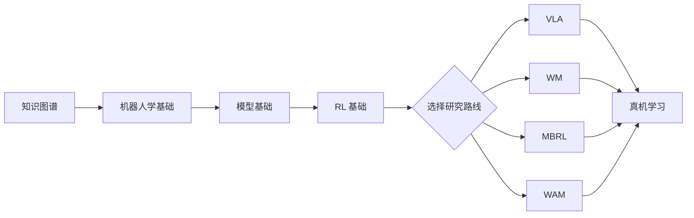
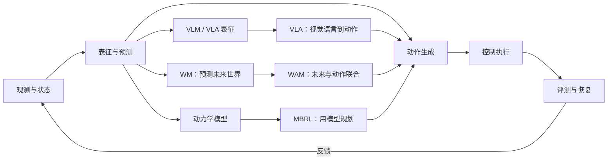

# Embodied AI Starter Map | 具身智能入门

具身智能学习地图，面向想从机器人基础走到 VLA、World Model、RL/MBRL 和 WAM 的读者。内容从坐标系、运动学、动力学、ROS 2、仿真和控制接口开始，逐步连接到视觉语言动作策略、动作生成、世界模型、模型辅助强化学习和世界动作模型。每条路线都配有论文、开源代码、benchmark 与实践入口，并把 observation、action、时间对齐、闭环评测和真机部署放在同一条链路里。你可以把它当作阅读索引，也可以按教程从 MuJoCo、Isaac Sim 或 ROS 2 Humble 开始动手。

## 先从你的目标开始

| 你想做什么               | 先看什么                                    | 后面接什么                                                     |
| ------------------------ | ------------------------------------------- | -------------------------------------------------------------- |
| 先看懂全貌               | [知识图谱](docs/knowledge-map.md)              | [学习路线](docs/roadmap.md)                                       |
| 跑一个 RL 示例           | [强化学习基础](docs/reinforcement-learning.md) | [MuJoCo 教程](docs/mujoco-tutorial.md)                            |
| 学机器人坐标、TF 和规划  | [机器人学基础](docs/robotics.md)               | RViz 2、MoveIt 2、ros2_control                                 |
| 跑 GPU 并行仿真          | [Isaac Sim 教程](docs/isaac-sim-tutorial.md)   | Isaac Lab、ManiSkill                                           |
| 从仿真走到真实机械臂     | [机器人学基础](docs/robotics.md)               | 手眼标定、ros2_control、rosbag2 和 Piper 实践                  |
| 研究 VLA 或动作策略      | [模型基础](docs/model-basics.md)               | [论文清单](docs/papers.md) 和 OpenVLA/OpenPI                      |
| 研究 World Model         | [WM 专题](docs/world-model-directions.md)      | pixel、latent、对象中心、3D/4D 和闭环验证                      |
| 研究 WAM                 | [WM 专题](docs/world-model-directions.md)      | [WAM 代码入口](docs/codebases.md#5-world-model像素latent-与-3d4d) |
| 做机器人策略后训练       | [强化学习基础](docs/reinforcement-learning.md) | PPO、GRPO、SAPO、RLinf                                         |
| 适配 RoboDojo/XPolicyLab | [XPolicyLab 教程](docs/xpolicylab-tutorial.md) | debug 评测、策略服务和环境接入                                 |

如果你还没有明确方向，按这个顺序读即可：



## 一张图看懂几条路线



- **VLA** 直接学习从视觉和语言到动作；**WM** 预测动作条件下的未来状态；**WAM** 把未来预测结构性接入动作生成。
- **Model-free / Model-based** 说的是决策时是否显式使用动力学模型；**Online / Offline** 说的是训练数据是否继续来自环境交互。
- WM 不等于视频生成，MBRL 也不要求一定使用视频 WM。是否属于完整机器人 WM，要看动作条件、未来目标和闭环证据。

## 文档地图

### 基础

- [知识图谱](docs/knowledge-map.md)：统一说明 VLA、WM、WAM、MBRL 和 RL 的关系。
- [机器人学基础](docs/robotics.md)：SO(3)/SE(3)、四元数、TF/tf2、ROS 2 Humble、`rclpy`、RViz 2、MoveIt 2、动力学、手眼标定、`ros2_control` 和 `rosbag2`。
- [模型基础](docs/model-basics.md)：Transformer、Diffusion、Flow Matching、DiT，以及它们如何输出动作或未来状态。
- [强化学习基础](docs/reinforcement-learning.md)：V/Q/A、单步转移、rollout batch、DQN、DDPG、TD3、SAC、PPO、IQL、GRPO 和 SAPO。

### 研究方向

- [VLA 与动作策略](docs/papers.md#s1vla-与动作策略)：视觉、语言和机器人状态到动作，关注动作接口、泛化和推理延迟。
- [RL 与 MBRL](docs/reinforcement-learning.md)：从 DQN、PPO、SAC、IQL 到 GRPO/SAPO，关注数据来源、价值学习、探索和策略后训练。
- [WM 专题](docs/world-model-directions.md)：按 pixel、latent、对象中心、运动场、物理状态、3D/4D 和长期记忆整理世界模型，并说明数据字段、训练目标、动作接口和闭环评价。
- [WAM 与未来动作联合建模](docs/papers.md#s1wam世界与动作联合建模)：关注未来表征怎样进入动作生成，以及训练期监督、测试期想象和异步执行。
- [论文清单](docs/papers.md)：按 VLA、WM、WAM、MBRL、RL、数据和 benchmark 分级阅读。
- [代码仓与工具](docs/codebases.md)：官方代码、仿真器、数据集、训练框架和实践入口。
- [Benchmark 指南](docs/benchmarks.md)：LIBERO、CALVIN、ManiSkill、Meta-World、RoboDojo、RoboTwin、RoboCasa、DMControl 等的用途和比较边界。
- [学习路线](docs/roadmap.md)：按章节组织的阅读和实践顺序。
- [术语表](docs/glossary.md)：缩写、相近概念和容易混淆的边界。

### 仿真与实践

- [MuJoCo + Gymnasium 教程](docs/mujoco-tutorial.md)：从 MJCF、仿真循环、状态和传感器到 Gymnasium 环境。
- [Isaac Sim 教程](docs/isaac-sim-tutorial.md)：URDF 导入、USD 场景、Articulation、传感器、无头运行和 Isaac Lab。
- [XPolicyLab 教程](docs/xpolicylab-tutorial.md)：策略适配器、RoboDojo debug、策略服务和环境客户端。
- [手眼标定示例](examples/hand_eye_calibration/README.md)：采样、CSV 字段、Eye-in-hand/Eye-to-hand 求解和验证。

ROS 2、OpenCV 和机器人依赖安装可参考[鱼香 ROS 社区论坛](https://fishros.org.cn/forum/)。机器人章节统一以 Ubuntu 22.04 + ROS 2 Humble 为基线。

## 从仿真到真机

推荐的真机入口：

- [Piper ROS Humble 实践](docs/robotics.md#13-piper-ros-humble从仿真到真实机械臂)：从仿真、驱动、关节状态到真实机械臂接入。
- [机器人学基础](docs/robotics.md)：TF、RViz 2、MoveIt 2、动力学、手眼标定、`ros2_control` 和 `rosbag2`。
- [bimanual-vla](https://github.com/SUNNYsyy2005/bimanual-vla)：双臂 VLA 真机部署参考，具体硬件和启动命令以项目 README 为准。

## 仓库结构

```text
.
├── README.md
├── docs/
│   ├── knowledge-map.md
│   ├── robotics.md
│   ├── model-basics.md
│   ├── reinforcement-learning.md
│   ├── world-model-directions.md
│   ├── mujoco-tutorial.md
│   ├── isaac-sim-tutorial.md
│   ├── xpolicylab-tutorial.md
│   ├── papers.md
│   ├── codebases.md
│   ├── benchmarks.md
│   ├── roadmap.md
│   └── glossary.md
├── examples/hand_eye_calibration/
├── CONTRIBUTING.md
└── LICENSE
```

## 致谢

感谢所有公开论文、代码、数据集、仿真器和教程的作者与维护者。本仓库的学习路径和资源索引参考了以下项目：

- **资源整理与方向索引**：[jiangranlv/embodied-ai-start](https://github.com/jiangranlv/embodied-ai-start)、[TianxingChen/Embodied-AI-Guide](https://github.com/TianxingChen/Embodied-AI-Guide) 和 [OpenMOSS/Awesome-WAM](https://github.com/OpenMOSS/Awesome-WAM)。它们帮助整理具身学习、VLA、WM 和 WAM 的阅读入口。
- **模型与策略实现**：[OpenVLA](https://github.com/openvla/openvla)、[OpenPI](https://github.com/Physical-Intelligence/openpi)、[Diffusion Policy](https://github.com/real-stanford/diffusion_policy)、[LeRobot](https://github.com/huggingface/lerobot)、[V-JEPA 2](https://github.com/facebookresearch/vjepa2)、[TD-MPC2](https://github.com/nicklashansen/tdmpc2) 和 [DreamerV3](https://github.com/danijar/dreamerv3)。这些项目提供了 VLA、动作策略、latent world model 和 MBRL 的可运行参考。
- **仿真、数据与评测**：[MuJoCo](https://github.com/google-deepmind/mujoco)、[Isaac Sim](https://developer.nvidia.com/isaac/sim)、[Gymnasium](https://github.com/Farama-Foundation/Gymnasium)、[ManiSkill](https://github.com/haosulab/ManiSkill)、[LIBERO](https://github.com/Lifelong-Robot-Learning/LIBERO)、[CALVIN](https://github.com/mees/calvin)、[RoboTwin](https://github.com/RoboTwin-Platform/RoboTwin)、[RoboDojo](https://robodojo-benchmark.com/) 和 [Embodied Meta-LLM Leaderboard](https://ppsdk.github.io/embodied-meta-leaderboard/)。它们提供环境、数据协议、任务定义和评测思路。
- **机器人软件与实践**：[ROS 2](https://docs.ros.org/en/humble/)、[MoveIt 2](https://moveit.picknik.ai/humble/index.html)、[ros2_control](https://control.ros.org/humble/index.html)、[OpenCV](https://opencv.org/)、[鱼香 ROS 社区](https://fishros.org.cn/forum/) 和 [bimanual-vla](https://github.com/SUNNYsyy2005/bimanual-vla)。这些项目覆盖通信、坐标变换、规划、控制、视觉处理和真机部署。

本仓库链接的代码、论文、数据和许可证归原作者及维护者所有。链接只用于学习导航和交叉引用，不代表与相关项目存在官方合作或背书关系。使用代码或数据时，请以原项目的许可证、引用要求和当前文档为准。
