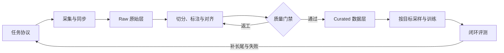

# 📦 具身数据：从采集契约到训练配比

> 具身数据记录机器人在什么任务和环境中看到了什么、执行了什么，以及动作带来了什么结果。

**预计阅读**：20 min 
**前置知识**：机器人状态与动作格式、坐标系、手眼标定 
**下一步**：[机器人学基础](robotics.md) · [VLA 专题](vla.md) · [Robot Agent 专题](robot-agent.md)

普通视频只记录了视觉变化，机器人策略还需要知道动作语义、坐标系、控制频率和执行结果。缺少其中任何一项，都可能让两段看起来相似的数据表达完全不同的控制过程。

一条可维护的数据管线通常按这个顺序推进：先写任务和数据契约，再选择采集方式，随后完成人机或跨本体对齐，最后才做切分、标注、质检和训练采样。下文引用的论文与项目用于说明已有机制；验收门槛和配比表则是工程起点，应根据目标机器人上的闭环结果继续调整。

## 1. 先定义数据契约

开始采集前，先把每个任务写成可执行的协议。协议需要说明：

- 指令和允许的语言改写、对象集合、初始状态与随机化范围；
- 成功、部分成功、失败和超时条件，以及谁负责给出标签；
- 最大时长、重置方式、禁止动作、人工接管和急停条件；
- 相机内外参、机器人 URDF/关节顺序、末端执行器类型与 TCP；
- 观测频率、控制频率、硬件时间戳源和允许的最大同步误差；
- 动作是绝对量还是增量，位于 `joint / base / world / camera / end-effector` 中哪个参考系；
- 代码、固件、标定和处理脚本版本，以及数据许可证、操作者授权和来源记录。

数据层级可以统一为 `episode → segment → step`：

- `episode` 对应一次完整任务尝试，成功和失败都要保留；
- `segment` 对应接近、预接触、抓取、运输、放置或恢复等阶段；
- `step` 保存时间对齐的观测、机器人状态、动作、标定、任务和质量字段。

这样分层后，任务结果属于 episode，接触和技能边界属于 segment，模型训练所需的时间窗口则从 step 中生成。三者混在同一层，后续切窗、采样和结果标注都会变得含糊。

## 2. 采集：五类互补数据

| 路线 | 对齐方式 | 主要价值 | 主要风险 |
| --- | --- | --- | --- |
| Ego + 人手 → 机器人 | 估计手腕和物体运动，再把人手轨迹 retarget 为目标末端轨迹；[Qwen-RobotManip](https://github.com/QwenLM/Qwen-RobotManip) 公开了 human-to-robot 合成、相机系末端增量和跨本体掩码思路 | 低成本扩展物体、场景和行为覆盖 | 人手接触、自由度和机器人可达域并不等价；伪动作要携带置信度和来源 |
| UMI + Ego | 用 [UMI](https://umi-gripper.github.io/) 式手持夹具和末端相机记录夹爪轨迹；叠加头戴相机时还要标定 `ego ↔ UMI camera ↔ gripper` | 野外、双手和长时程示范 | SLAM 漂移、遮挡、多相机时钟偏移和机器人不可达 |
| VR/XR 遥操作 | 将头部、手柄或手部追踪结果 retarget 到机器人；[Open-TeleVision](https://github.com/OpenTeleVision/TeleVision) 提供了沉浸式主动视觉反馈的实现参考 | 人形、双臂、灵巧手和移动操作 | 网络延迟、奇异位形、操作者差异与眩晕 |
| 主从臂遥操作 | leader/follower 可以同构，也可以通过标定建立映射；采集时同步记录两侧状态、相机和夹爪，可参考 [ALOHA/ACT](https://github.com/tonyzhaozh/act) | 高质量、低歧义的真机动作监督 | 硬件成本、场景覆盖和操作者策略偏置 |
| 自主 rollout、接管与仿真 | 保存策略自主尝试、接管前后窗口、恢复动作和可验证的仿真反事实 | 失败、恢复、安全边界和长尾接触 | 仿真偏差、失败标签噪声和危险探索 |

这些路线解决的问题不同。Ego 视频扩展语义和场景，UMI 与遥操作提供较明确的动作监督，目标本体数据用于闭环适配，自主 rollout 和接管片段则暴露策略真正会遇到的偏离状态。[DROID](https://droid-dataset.github.io/droid/) 展示了分布式真机采集和多场景任务组织的一种做法。

### 2.1 该记录哪些模态

基础记录通常包括多视角 RGB、关节位置和速度、末端位姿、夹爪状态、动作、指令、时间戳与相机标定。RGB-D、点云、力和力矩、触觉、音频、底盘状态及安全事件是否加入，要看任务是否真的会用到这些信号。

在插接、旋拧、柔性物体操作和抓取滑移任务中，力矩与触觉可以直接输入模型，也能帮助确定接触边界、识别失败和学习恢复。若某种模态只存在于部分本体，应使用 availability mask 标出缺失项，不要用零值冒充真实测量。

## 3. Human-to-Robot 与跨本体对齐

把动作补成相同长度，只解决了张量形状问题。真正的跨本体对齐还要检查四个层面：

1. 表示层要统一相机模型、图像方向、状态字段、关节顺序、夹爪语义和单位。
2. 几何层要能沿带时间戳的变换链追溯每个动作，并明确 TCP 与相机内外参。
3. 运动层负责把手腕或源机器人的运动转换为目标末端或关节动作，同时处理可达性、IK 多解、速度、加速度和碰撞。
4. 行为层检查相同指令在不同本体上是否产生相近的任务效果。轨迹看起来相似，并不足以证明行为已经对齐。

### 3.1 建议的验收门禁

下面的门禁用于组织工程验收。具体阈值取决于硬件和任务，不是论文给出的通用数值。

| 门禁 | 检查内容 | 不通过时怎么处理 |
| --- | --- | --- |
| 时间同步 | 相机、机器人和触觉事件的时间偏移、漂移、丢帧和控制延迟 | 重同步或隔离该段，禁止用插值隐藏长缺口 |
| 几何闭环 | 重投影误差、TF 闭环误差、TCP 与物体轨迹一致性 | 重标定并保留旧标定版本 |
| 运动学可执行 | IK 成功率、关节限位、速度/加速度、碰撞和奇异性 | 降低伪动作置信度或删除不可执行监督 |
| 接触一致 | 视觉、夹爪、力/触觉的接触时刻和接触阶段一致 | 重新切分 segment 或标记弱标签 |
| 机器人回放 | 在低速、安全条件下回放代表性片段，检查任务效果 | 只用于表征/未来预测，不进入高权重动作损失 |

平均误差会掩盖长尾问题，因此还要看 P50/P95、最差任务类别，以及不同操作者和场景下的结果。每条伪动作样本都应保存对齐方法、源轨迹、目标本体、置信度和失败原因，训练时才能据此降权或屏蔽。

## 4. 采集后的处理

### 4.1 Raw、Processed 和 Curated 分层

- `Raw` 保存原始传感器流、动作、任务记录和采集配置。该层只追加，不覆盖。
- `Processed` 保存同步、去畸变、坐标转换、切分和自动标注结果，同时记录处理代码与参数版本。
- `Curated` 是通过质检、可供特定训练目标使用的数据视图，仍要保留指向 Raw 的 provenance。

### 4.2 切分、标注和质检

1. 接入时按硬件时间戳重采样，并检测丢帧、重复帧、控制延迟和时钟漂移。
2. 切分先确定完整尝试，再参考夹爪边沿、末端速度、接触事件、物体状态变化和人工标记划分 skill segment。自动边界需要抽样复核。
3. 标注覆盖指令、对象与目标、技能阶段、成功状态、人工干预、恢复结果和失败原因。
4. 动作对齐同时保存原始动作与统一 action schema。缺失自由度使用 mask，不参与损失计算。
5. 质检关注标定误差、动作突跳、碰撞、遮挡、伪动作置信度和标签一致性。
6. 数据集按场景、对象实例、操作者、任务模板和采集日期分组划分，避免同一演示的相邻片段跨越 train、val 和 test。

语言模型可以生成候选指令或失败原因，但这些文本不能反过来充当成功证据。供 evaluator 或 critic 使用的结果标签，应来自环境谓词、传感器记录或人工复核。

### 4.3 数据治理

数据发布或交给其他团队前，需要核对人脸、屏幕、地址和语音等隐私信息，也要确认操作者是否知情、能否撤回数据，以及第三方场景和对象是否获得授权。代码、数据与模型许可证还可能限制商业训练或再分发。数据卡应记录来源、任务和本体分布、处理历史、已知偏差、危险行为及删除流程。

格式可参考 [RLDS/Open X-Embodiment](https://robotics-transformer-x.github.io/) 和 [LeRobot](https://github.com/huggingface/lerobot)。格式统一不等于语义统一，转换时必须保留原始动作定义、坐标变换和 provenance。

## 5. 训练配比：先按目标分桶，再动态调整

为了让配比可解释，可以先把数据分为七类：目标本体真机 $R_t$、跨本体对齐真机 $R_x$、Ego/UMI 对齐数据 $H_a$、仿真或合成数据 $S$、失败与恢复 $F$、Agent 规划与工具轨迹 $A$、无动作视频 $V$。

下表给出 sample/chunk 级别的起始采样比例。它是本仓库的工程建议，不是所列论文报告的最优结论，也不代表各类数据在磁盘上的小时数占比。

| 训练阶段 | $R_t$ | $R_x$ | $H_a$ | $S$ | $F$ | $A$ | $V$ |
| --- | ---: | ---: | ---: | ---: | ---: | ---: | ---: |
| 表征或 WM 预训练 | 8% | 12% | 20% | 10% | 5% | 0% | 45% |
| 通用 VLA/WAM 预训练 | 25% | 30% | 20% | 15% | 5% | 5% | 0% |
| 目标机器人适配 | 65% | 10% | 5% | 5% | 10% | 5% | 0% |
| Agent planner/evaluator 训练 | 25% | 10% | 0% | 15% | 25% | 25% | 0% |

实际采样分两层进行。先在数据桶或数据集之间抽样，再在桶内平衡任务、操作者、对象和成败类型，这样可以避免大数据集淹没规模较小但更贴近目标本体的数据。

不同数据还应使用不同的 loss mask。无动作视频不计算动作损失，低置信度伪动作需要降权，失败数据主要用于成功判别、价值、恢复或对比目标。每轮训练后可参考各桶的 held-out loss、目标本体闭环成功率、恢复率、P95 安全事件和动作分布偏移，将比例调整 5 到 10 个百分点，不必长期锁死在初始值。

[Octo 的 OXE mixture 配置](https://github.com/octo-models/octo/blob/main/octo/data/oxe/oxe_dataset_mixes.py)是显式设置跨数据集采样权重的代码参考。Agent 轨迹的结构、记忆污染控制和公平评测见 [Robot Agent 专题](robot-agent.md)。

## 6. 最小可交付数据集

扩大采集规模之前，先做出一份规模不大但能够完整走通的数据集。它应包含：

- 可版本化的 task spec、episode schema、坐标系和动作定义；
- 可重放的 Raw → Processed → Curated 管线；
- 同步、标定、动作限位、碰撞和数据泄漏检查报告；
- 成功、失败、接管和恢复的代表样本；
- 各数据桶的 held-out 集，以及目标机器人闭环验证；
- 可审计的数据卡、许可证、隐私处理记录和 provenance。

## 7. 论文与项目入口

- [Qwen-RobotManip Technical Report](https://arxiv.org/abs/2606.17846)：表示、运动和行为对齐，以及 egocentric human-to-robot 合成。
- [Universal Manipulation Interface](https://arxiv.org/abs/2402.10329)：野外手持式采集和机器人复现。
- [EgoMimic](https://arxiv.org/abs/2410.24221)：联合使用 egocentric human video 与机器人演示。
- [Open-TeleVision](https://arxiv.org/abs/2407.01512)：带主动视觉反馈的沉浸式遥操作。
- [DROID](https://arxiv.org/abs/2403.12945)：多机构、多场景真实机器人操作数据。
- [Open X-Embodiment](https://arxiv.org/abs/2310.08864)：跨机器人数据规范化、混合与通用策略训练。

更多论文和实现见[论文清单](papers.md)与[代码仓](codebases.md)。模型训练可继续阅读 [VLA](vla.md) 和 [WAM](wam.md)，任务级轨迹与运行时闭环见 [Robot Agent](robot-agent.md)。
