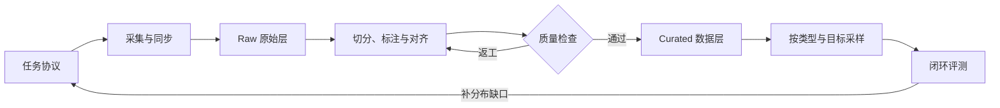

# 📦 具身数据：从类型划分到训练配比

> 具身数据记录谁在什么环境中看到了什么、执行了什么，以及动作带来了什么结果。

**预计阅读**：25 min`<br>`
**前置知识**：机器人状态与动作格式、坐标系、手眼标定`<br>`
**下一步**：[机器人学基础](robotics.md) · [VLA 专题](vla.md) · [Robot Agent 专题](robot-agent.md)

本章以五类数据为主线：Ego + 人手视频、Ego 人手到机械臂的运动学/动作对齐、UMI + Ego、VR/XR 遥操作和主从臂遥操作。它们覆盖了从无机器人动作的人类观察，到弱对齐的人体/工具运动，再到可直接记录目标机器人动作的遥操作示范。

自主 rollout、纠偏、众包、仿真和合成数据仍然有用，但放在扩展类型中说明。这样的层级更符合当前具身策略训练的实际数据入口，也能避免补充类型冲淡主线。

## 1. 五类主要数据

| 主路线                               | 主要信号                                         | 动作监督强度                  | 主要用途                                         | 首要问题                                   |
| ------------------------------------ | ------------------------------------------------ | ----------------------------- | ------------------------------------------------ | ------------------------------------------ |
| 1. Ego + 人手视频                    | 第一视角 RGB/RGB-D、手腕/手指、物体和任务语境    | 通常没有机器人动作            | 视觉语言表征、操作阶段、可供性、目标和 WM 预训练 | 遮挡、深度歧义，不能直接当作 action label  |
| 2. Ego 人手 → 机械臂运动学/动作对齐 | 人手与物体运动、retarget 后的末端或关节伪动作    | 有伪动作，质量由对齐决定      | human-to-robot 预训练、跨本体动作先验            | 接触差异、可达域、IK、坐标系和伪动作置信度 |
| 3. UMI + Ego                         | 手持夹具轨迹、末端相机、可选头戴 Ego 相机        | 工具/夹爪运动，接近机器人动作 | 野外、双手、长时程和跨场景示范                   | SLAM 漂移、多相机同步、机器人可执行性      |
| 4. VR/XR 遥操作                      | 头部、手柄/手部追踪、机器人状态和实际动作        | 直接机器人动作                | 人形、双臂、灵巧手与移动操作                     | 系统延迟、坐标漂移、奇异位形和操作者差异   |
| 5. 主从臂遥操作                      | leader/follower 状态、多视角相机、夹爪和实际动作 | 直接机器人动作，语义最清楚    | 接触丰富、双臂和精细操作                         | 硬件成本、工作空间映射和本体机械差异       |

第一类和第二类需要分开统计。原始 Ego + 人手视频没有机器人动作，只有经过手腕/物体估计、运动学 retarget、可达性和碰撞检查后，才会得到可用于动作学习的伪标签。[Qwen-RobotManip](https://arxiv.org/abs/2606.17846) 提供了 human-to-robot 合成、相机坐标系末端动作和跨本体 action mask 的参考，但生成后的样本仍要保存源视频、目标本体、对齐方法和置信度。

## 2. 扩展类型与数据标签

### 2.1 五类主线之外的补充数据

| 扩展类型         | 常见内容                                                       | 主要用途                                           | 与五类主线的关系                         |
| ---------------- | -------------------------------------------------------------- | -------------------------------------------------- | ---------------------------------------- |
| 其他直接示教     | 手把手、SpaceMouse/手柄、视觉手部遥操、远程众包                | 低成本示范、扩大操作者和场景覆盖                   | 补充 VR 与主从臂，不替代二者的主线位置   |
| 机器人自主交互   | 脚本/规划器轨迹、策略 rollout、play、探索和 RL 经验            | dynamics、WM/WAM、价值与策略改进                   | 补目标策略自己的状态分布                 |
| 纠偏、失败与恢复 | 人工接管窗口、DAgger 式纠偏、残差修正和恢复动作                | evaluator、critic、风险、恢复策略和 Agent 失败模型 | 在主线示范之后补偏离与恢复状态           |
| 仿真、合成与变换 | 数字孪生、domain randomization、渲染、重定向、重标注和视觉增强 | 长尾、反事实、预训练和跨本体扩展                   | 扩大主线数据，不应冒充独立真实交互       |
| 结果与决策监督   | 成功谓词、奖励、偏好对、技能边界、工具调用和 Agent 轨迹        | reward/evaluator、偏好学习、planner 与工具选择     | 作为标签附着在轨迹上，不是独立传感器模态 |

[MimicPlay](https://arxiv.org/abs/2302.12422)、[DexCap](https://arxiv.org/abs/2403.07788)、[RoboTurk](https://arxiv.org/abs/1811.02790) 和 [DAgger](https://arxiv.org/abs/1011.0686) 分别提供 human play、便携动捕、远程众包和在线纠偏的参考。这些方法用于补覆盖、补长尾或补反馈，不改变本章五类主路线的优先级。

### 2.2 用五条独立轴描述每条数据

| 分类轴   | 典型取值                                              | 它回答的问题                       |
| -------- | ----------------------------------------------------- | ---------------------------------- |
| 执行者   | 人类、遥操作机器人、自主机器人、脚本/规划器           | 动作是谁产生的                     |
| 环境     | 真实、仿真、数字孪生、合成渲染                        | 观测和动力学来自哪里               |
| 本体关系 | 无机器人、目标本体、同构本体、跨本体                  | 动作能否直接迁移到目标机器人       |
| 监督强度 | 无动作、人体运动、伪动作、机器人动作、纠偏、偏好/结果 | 哪些损失可以安全计算               |
| 轨迹结果 | 成功、部分成功、失败、接管、恢复                      | 轨迹在策略或评价训练中扮演什么角色 |

一条 episode 可以同时属于多个标签。例如，它可能是“真实环境 + 目标本体 + VR 遥操作 + 失败 + 人工接管 + RGB-D/力觉”。目录只按 `vr/` 或 `success/` 分文件，会丢失其余维度。更稳妥的做法是在 manifest 中显式保存这些标签。

模态是另一条轴，放在第 5 节统一说明。分类完成后，训练 loader 应按字段筛选和采样，而不是从文件名猜数据语义。

## 3. 采集前先定义数据契约



开始采集前，先把任务写成可执行协议：

- 指令和允许的语言改写、对象集合、初始状态与随机化范围；
- 成功、部分成功、失败和超时条件，以及标签由谁给出；
- 最大时长、重置方式、禁止动作、人工接管和急停条件；
- 相机内外参、机器人 URDF/关节顺序、末端执行器类型与 TCP；
- 观测频率、控制频率、硬件时间戳源和允许的最大同步误差；
- 动作是绝对量还是增量，位于 `joint / base / world / camera / end-effector` 中哪个参考系；
- 代码、固件、标定和处理脚本版本，以及数据许可证、操作者授权和来源记录。

数据层级可以统一为 `episode → segment → step`。episode 对应一次完整任务尝试，成功和失败都要保留；segment 对应接近、预接触、抓取、运输、放置或恢复等阶段；step 保存时间对齐的观测、机器人状态、动作、标定、任务和质量字段。

这样分层后，任务结果属于 episode，接触和技能边界属于 segment，模型训练的时间窗口从 step 中生成。三者混在同一层，后续切窗、采样和结果标注都会变得含糊。

## 4. 五类主要数据怎样采集

### 4.1 Ego + 人手视频

这类数据以第一视角视频为主体，可以同时保存手腕/手指估计、物体轨迹、深度和语言。它适合扩展物体、场景和行为覆盖，也能学习操作阶段、可供性、目标和未来变化，但原始数据通常没有同步的机器人状态与动作。

[EgoMimic](https://arxiv.org/abs/2410.24221) 联合训练第一视角人类视频与机器人演示，[MimicPlay](https://arxiv.org/abs/2302.12422) 从 human play 提取高层计划，再用少量遥操作数据承担低层动作监督。这类方法保留了人类视频的规模优势，同时没有把视频帧直接冒充机器人动作。

### 4.2 Ego 人手到机械臂的运动学/动作对齐

这一类在 Ego + 人手视频之上增加动作转换。基本链路是：估计手腕、手指和物体运动，确定相机坐标与尺度，把人体动作 retarget 到目标末端或关节空间，再检查 IK、关节限位、速度、碰撞和接触合理性。满足动作质量要求的样本可以提供伪动作监督；动作不可靠的样本仍可留在表征或未来预测数据中。

[Qwen-RobotManip](https://github.com/QwenLM/Qwen-RobotManip) 可作为主参考，其公开材料包括 human-to-robot 合成、相机坐标系末端增量和跨本体 action mask。若任务涉及灵巧手，[DexCap](https://arxiv.org/abs/2403.07788) 提供了手腕/手指动捕、三维场景观测与运动学映射的相邻参考。两者采用的采集与转换方法不同，但都说明了动作标签来自对齐过程，而不是原始视频本身。

### 4.3 UMI + Ego

[Universal Manipulation Interface](https://arxiv.org/abs/2402.10329) 使用手持夹具和末端相机记录操作轨迹。与纯手部视频相比，UMI 的工具运动和夹爪语义更接近机器人末端；叠加头戴 Ego 相机后，还能保留更大的场景视野和操作者任务语境。

这条路线需要标定 `ego camera ↔ UMI camera ↔ gripper` 的时空关系，并检查 SLAM 漂移、遮挡、多相机时钟偏移、机器人可达性和碰撞。UMI 轨迹接近机器人动作，但在用于动作监督前，仍要检查它能否在目标本体上执行。

### 4.4 VR/XR 遥操作

VR/XR 将头部、手柄或手部追踪结果映射到机器人头部、手臂、灵巧手或移动底盘。[Open-TeleVision](https://arxiv.org/abs/2407.01512) 提供了沉浸式主动视觉反馈的参考，[AnyTeleop](https://arxiv.org/abs/2307.04577) 则覆盖多种手臂、手、相机以及仿真/真机配置。

采集时除了机器人实际动作，还要保存操作者输入、retarget 前后姿态、网络和系统延迟、跟踪置信度、控制权状态与安全事件。只保存最终关节轨迹，会丢失奇异位形、跟踪失败和延迟引起的动作偏差。

### 4.5 主从臂遥操作

主从臂路线由 leader 控制 follower。两侧可以同构，也可以通过标定、缩放和 IK 建立映射。[GELLO](https://arxiv.org/abs/2309.13037) 使用与目标机械臂运动学结构相近的低成本主控制器，[ALOHA/ACT](https://arxiv.org/abs/2304.13705) 提供双臂主从采集与 action chunking 的参考。

这类数据直接记录目标机器人的状态和动作，监督歧义通常低于人手 retarget，适合接触丰富、精细和双臂任务。主要成本在硬件、工作空间映射、主从机械差异和操作者负担。采集时仍要主动覆盖不同速度、路径、抓取方式和恢复策略，避免把单个操作者的习惯当成唯一正确动作。

### 4.6 补充采集方式

手把手示教、SpaceMouse/手柄、视觉手部遥操和远程众包可以在成本、便携性或操作者吞吐上补充五类主路线。RoboTurk 是移动设备远程众包的参考。机器人自主 rollout、DAgger 式纠偏、失败和恢复数据则用于覆盖部署偏离状态。

仿真、数字孪生、domain randomization、human-to-robot 渲染、重标注和视觉增强也可补长尾。所有派生样本都应指向源 episode，并记录脚本、参数、版本和置信度。增强得到的多个视图不能在统计时被当作多次独立真实交互。

## 5. 模态、时间和样本结构

基础记录通常包括多视角 RGB、关节位置和速度、末端位姿、夹爪状态、动作、指令、时间戳与相机标定。按任务可以加入 RGB-D、点云、对象位姿、力和力矩、触觉、音频、IMU、底盘状态、控制权状态与安全事件。

[RH20T](https://arxiv.org/abs/2307.00595) 是多模态组织的参考，其机器人序列同时包含视觉、力、音频和动作信息，并提供对应的人类示范视频与语言描述。具体项目不必追求模态越多越好，关键是每种模态都能同步、标定，并对应明确的训练或评价用途。

在插接、旋拧、柔性物体操作和抓取滑移任务中，力与触觉可以直接输入模型，也能辅助确定接触边界、识别失败和学习恢复。若某种模态只存在于部分本体，应使用 availability mask 标出缺失项，不要用零值冒充真实测量。

一个 step 建议区分四类时间：传感器采样时间、命令生成时间、命令下发时间和实际执行状态时间。数据只保存“第几帧”而没有硬件时间戳，很难排查图像、动作和接触事件之间的固定延迟。

## 6. Human-to-Robot 与跨本体对齐

把动作补成相同长度，只解决了张量形状问题。真正的跨本体对齐还要检查四个层面：

1. 表示层统一相机模型、图像方向、状态字段、关节顺序、夹爪语义和单位。
2. 几何层要能沿带时间戳的变换链追溯每个动作，并明确 TCP 与相机内外参。
3. 运动层负责把手腕或源机器人的运动转换为目标末端或关节动作，同时处理可达性、IK 多解、速度、加速度和碰撞。
4. 行为层检查相同指令在不同本体上是否产生相近的任务效果。轨迹看起来相似，并不足以证明行为已经对齐。

### 6.1 对齐质量怎么检查

对齐不是一次性的“通过/不通过”。检查的目的是确认动作标签可靠到什么程度，并据此决定数据用途。不同任务可以采用不同阈值，但要回答下面几个问题。

| 检查项         | 要回答的问题                                              | 可查看的证据                                        | 发现问题后怎么处理                                             |
| -------------- | --------------------------------------------------------- | --------------------------------------------------- | -------------------------------------------------------------- |
| 时间关系       | 图像、人体/工具运动、机器人命令和实际状态是否对应同一时刻 | 时钟偏移与漂移、丢帧、命令到执行延迟、接触事件      | 重新同步、截断缺口，或将该段降为无动作数据                     |
| 坐标与标定     | 相机、人体/工具、TCP、机器人基座和对象之间的变换是否一致  | 重投影误差、TF 闭环、已知标定物、TCP 与对象轨迹     | 修正标定后重新处理；无法追溯时隔离该段                         |
| 动作语义       | 单位、轴方向、旋转表示、绝对/增量动作和夹爪含义是否一致   | 单步动作可视化、动作反变换、控制周期和夹爪开合检查  | 修正转换器，不在错误语义上直接做归一化或训练                   |
| 运动学可执行性 | retarget 后的动作能否由目标机器人安全执行                 | IK、关节限位、速度/加速度、奇异性、自碰撞和环境碰撞 | 重新 retarget、投影到可行域，或降低/移除动作监督               |
| 接触与任务效果 | 对齐后的动作是否作用于正确对象，并产生预期状态变化        | RGB-D、对象位姿、夹爪、力/触觉、成功谓词和人工复核  | 重切 segment、修正结果标签，或只保留视觉监督                   |
| 目标本体验证   | 代表性动作在目标机器人上是否仍保持方向、尺度和时序        | 仿真回放、低速受控回放或小规模闭环测试              | 根据失败类型修正动作映射，不能用回放失败的数据做高置信动作监督 |

检查完成后，数据可以按用途分级：

| 级别            | 可以怎样使用                                                                           |
| --------------- | -------------------------------------------------------------------------------------- |
| 直接动作监督    | 时间、动作语义和运动学一致，接触与任务效果有可靠证据，可进入正常行为克隆或动作预测损失 |
| 弱动作监督      | 动作方向基本可信，但尺度、接触或 retarget 仍有不确定性；保留置信度，并降低动作损失权重 |
| 仅表征/未来监督 | 图像和任务语境可用，但动作无法可靠恢复；只用于视觉语言表征、目标、进度或未来预测       |
| 隔离返工        | 时间、标定、来源或标签无法追溯；不进入训练集，等待重新处理或人工复核                   |

每条伪动作应保存对齐方法、源轨迹、目标本体、检查结果、置信度和失败原因，训练时才能据此选择 loss mask 和权重。

## 7. 采集后的处理

### 7.1 Raw、Processed 和 Curated 分层

- `Raw` 保存原始传感器流、动作、任务记录和采集配置。该层只追加，不覆盖。
- `Processed` 保存同步、去畸变、坐标转换、切分和自动标注结果，同时记录处理代码与参数版本。
- `Curated` 是通过质检、可供特定训练目标使用的数据视图，仍要保留指向 Raw 的 provenance。

### 7.2 采集前先定义标注体系

标注从任务设计开始，而不是等视频采完再补。每个 task spec 先定义一套有限、可版本化的标签体系：

- `task_id / task_version`、标准指令、允许的语言改写和禁止歧义；
- 对象类别、对象实例、目标区域、初始状态和随机化变量；
- 成功、部分成功、失败、超时和人工终止的判定规则；
- 接近、预接触、抓取、运输、放置、验证和恢复等技能阶段；
- 未检测到对象、定位错误、抓取失败、滑落、碰撞、超时、控制异常等失败类别；
- 人工接管、重新演示、局部修正和急停的事件码。

标签表要允许 `unknown / uncertain / not_applicable`。标注员被迫在错误选项中二选一，产生的确定标签通常比缺失标签更难修复。任务、对象和失败类别也要有稳定 ID，显示名称可以修改，ID 不应随文案变化。

### 7.3 采集中记录事件标签

能够由系统直接记录的信息，不应全部留到采集后看视频推断。采集端可以同步写入：

- episode 开始、结束、重置、暂停和超时；
- 当前任务、对象、目标、操作者匿名 ID、采集设备和标定版本；
- 夹爪开合、接触、碰撞、控制权切换、人工接管和急停事件；
- 操作者按键标记的技能边界、失败时刻、失败原因候选和恢复开始/结束；
- 环境成功谓词、控制器错误码、网络延迟和传感器异常。

采集中标记不一定是最终真值，但它能为后续切分提供时间锚点。操作者给出的失败原因应保留为 `operator_annotation`，环境谓词和传感器事件则分别记录来源，避免把不同证据覆盖成一个布尔字段。

### 7.4 采集后切分

切分先确定完整 episode，再划分 skill segment，最后按训练窗口生成 step/chunk。边界可以综合人工事件标记、夹爪开合沿、末端速度变化、接触/力觉峰值、物体状态变化、控制权切换和模型候选结果。

接触任务中，边界最好允许一个不确定区间，而不是只保存单帧时间点。自动切分后要抽样复核以下问题：关键接触是否跨在两个 segment 之间，恢复动作是否被并入失败段，reset 后的新轨迹是否误接到上一个 episode，以及不同相机和机器人状态是否使用同一时间基准。

### 7.5 分层标注哪些内容

| 标注层级            | 主要字段                                                             | 典型用途                                      |
| ------------------- | -------------------------------------------------------------------- | --------------------------------------------- |
| Dataset / source    | 数据来源、采集接口、本体、场景、许可证、处理版本                     | 数据治理、去重、采样和复现                    |
| Episode             | task ID、指令、对象/目标、初始条件、最终结果、终止原因、操作者和环境 | 任务条件策略、成功率、数据划分                |
| Segment             | 技能类型、作用对象、接触阶段、子目标、前置/后置状态、失败与恢复类别  | skill policy、进度、失败检测和 Agent 工具轨迹 |
| Step / frame        | 可见对象、位姿/跟踪、动作有效性、接触/力觉、安全事件、控制权         | 感知、动作、dynamics 和风险训练               |
| Language            | 原始指令、规范指令、改写、对象指代、步骤描述和失败解释               | VLM/VLA、检索、planner 和 evaluator           |
| Action / embodiment | 原始动作、统一动作、坐标系、单位、mask、retarget 方法与置信度        | 行为克隆、跨本体训练和动作审计                |

成功标签应同时保存结果和值得追溯的证据，例如目标物体位姿、夹爪状态、环境谓词或人工复核记录。只保存 `success=true`，后续无法判断标签错在任务规则、传感器还是人工判断。

语言标注可以包含同一任务的多种表达，但要区分原始操作者指令、人工改写和模型生成文本。模型可以生成候选指令、技能描述或失败原因，不能把自身生成的文本反过来当作任务成功证据。

### 7.6 标注来源、置信度和复核

同一个字段可能来自四种来源：环境/传感器直接记录、确定性规则、模型辅助标注、人工标注。每条标签建议至少保存：

```yaml
label_name: failure_type
label_value: grasp_slip
label_source: human_review       # sensor | rule | model | operator | human_review
confidence: 0.92
evidence: force_event_1842
annotator_or_model: reviewer_07
schema_version: failure-v2
created_at: 2026-09-17T14:20:00+08:00
```

`confidence` 的含义要按标签类型定义，不能把不同模型的 softmax 分数直接混用。传感器或规则标签也可能出错，因此仍需保留证据和生成版本。高风险标签、模型低置信结果和多来源冲突样本进入人工复核队列。

质检至少统计标签覆盖率、`unknown` 比例、不同标注员或来源的分歧、抽检错误率、边界偏移和各失败类别的样本量。复核时保留原标签、修订标签和裁决记录，不在原字段上静默覆盖。train/val/test 按场景、对象实例、操作者、任务模板和采集日期分组划分，避免同一演示的相邻片段跨集合泄漏。

### 7.7 动作标注与对齐

动作标注同时保存原始动作和统一 action schema。每条动作要能追溯坐标系、单位、控制频率、绝对/增量语义、夹爪定义、action mask 和时间戳。缺失自由度用 mask 表示，不参与损失计算。

Ego 人手、UMI 和跨本体数据还要记录源运动、retarget 输出、目标本体、IK/碰撞检查结果和伪动作置信度。若动作不满足运动学要求，可以保留视觉、语言和未来状态标签，但不能继续把它当作高置信机器人监督。

### 7.8 数据格式与版本

格式可参考 [RLDS/Open X-Embodiment](https://robotics-transformer-x.github.io/) 和 [LeRobot](https://github.com/huggingface/lerobot)。格式统一不等于语义统一，转换时仍要保留原始动作定义、坐标变换、采集方式、类型标签和 provenance。

数据修复、重标注和删除都应产生新版本。模型 checkpoint 需要记录所用数据清单与采样配置，避免数据更新后无法解释性能变化。

### 7.9 隐私、许可证和数据治理

数据发布或交给其他团队前，需要核对人脸、屏幕、地址和语音等隐私信息，也要确认操作者是否知情、能否撤回数据，以及第三方场景和对象是否获得授权。代码、数据与模型许可证还可能限制商业训练或再分发。

数据卡应记录来源、采集接口、任务和本体分布、动作监督强度、模态、标注 schema、标签来源、处理历史、已知偏差、危险行为与删除流程。来自网络视频、众包操作者和家庭场景的数据尤其需要单独审查授权边界。

## 8. 训练配比：先按监督资格分桶

可以先把训练样本分为八个桶：无机器人动作的人类视频 $V$、人类运动/retarget 数据 $H$、目标本体直接示范 $R_t$、跨本体机器人示范 $R_x$、仿真/合成数据 $S$、自主 rollout $U$、失败/纠偏/恢复 $F$、Agent 规划与工具轨迹 $A$。五类主路线中，原始 Ego + 人手主要进入 $V$，human-to-robot 和 UMI 对齐数据进入 $H$，VR 与主从臂采集的目标机器人动作进入 $R_t$；跨机器人复用时再进入 $R_x$。

下表给出 sample/chunk 级别的起始采样比例。它是本仓库的工程建议，不是所列论文报告的最优结论，也不代表各类数据在磁盘上的小时数占比。

| 训练阶段                     | $R_t$ | $R_x$ | $H$ | $S$ | $U$ | $F$ | $A$ | $V$ |
| ---------------------------- | ------: | ------: | ----: | ----: | ----: | ----: | ----: | ----: |
| 表征或 WM 预训练             |      8% |     12% |   15% |   10% |    5% |    5% |    0% |   45% |
| 通用 VLA/WAM 预训练          |     25% |     30% |   15% |   15% |    5% |    5% |    5% |    0% |
| 目标机器人适配               |     60% |     10% |    5% |    5% |    5% |   10% |    5% |    0% |
| Agent planner/evaluator 训练 |     20% |     10% |    0% |   15% |   10% |   20% |   25% |    0% |

实际采样分两层进行。先在数据桶或数据集之间抽样，再在桶内平衡任务、操作者、对象、采集接口和成败类型，避免大数据集淹没规模较小但更贴近目标本体的数据。

不同数据使用不同的 loss mask。无动作视频不计算动作损失，人类运动数据只有在 retarget 结果满足动作质量要求后才进入机器人动作监督，低置信伪动作需要降权。自主 rollout 和失败数据可以训练 dynamics、成功判别、价值、风险与恢复，但是否用于行为克隆要按 segment 决定。结果和偏好标签附着在相应轨迹上，不单独重复计算为新 episode。

每轮训练后可参考各桶的 held-out loss、目标本体闭环成功率、恢复率、P95 安全事件和动作分布偏移，将比例调整 5 到 10 个百分点。[Octo 的 OXE mixture 配置](https://github.com/octo-models/octo/blob/main/octo/data/oxe/oxe_dataset_mixes.py)提供了显式设置跨数据集采样权重的代码参考。

## 9. 最小可交付数据集

扩大采集规模之前，先用小规模数据走通完整链路。最低交付包括：

- 可版本化的 task spec、annotation schema、episode schema、类型标签、坐标系和动作定义；
- 采集前标签表，以及采集中任务、事件、接管和安全标记；
- episode/segment/step 切分结果与边界复核记录；
- 语言、对象、动作、成功/失败、恢复和 Agent 工具轨迹中的任务所需标签；
- 标签来源、置信度、证据、标注员/模型和 schema 版本；
- 可重放的 Raw → Processed → Curated 管线；
- 同步、标定、标注一致性、动作限位、碰撞和数据泄漏检查报告；
- 各数据桶的 held-out 集、目标机器人闭环验证和可审计的数据卡。

## 10. 论文与项目入口

- 人类视频与运动：[MimicPlay](https://arxiv.org/abs/2302.12422) · [EgoMimic](https://arxiv.org/abs/2410.24221) · [DexCap](https://arxiv.org/abs/2403.07788) · [UMI](https://arxiv.org/abs/2402.10329)
- 人机与跨本体对齐：[Qwen-RobotManip](https://arxiv.org/abs/2606.17846) · [Open X-Embodiment](https://arxiv.org/abs/2310.08864)
- 遥操作：[Open-TeleVision](https://arxiv.org/abs/2407.01512) · [AnyTeleop](https://arxiv.org/abs/2307.04577) · [GELLO](https://arxiv.org/abs/2309.13037) · [ALOHA/ACT](https://arxiv.org/abs/2304.13705) · [RoboTurk](https://arxiv.org/abs/1811.02790)
- 纠偏与离线示范：[DAgger](https://arxiv.org/abs/1011.0686) · [robomimic](https://arxiv.org/abs/2108.03298)
- 多模态与大规模真机：[RH20T](https://arxiv.org/abs/2307.00595) · [BridgeData V2](https://arxiv.org/abs/2308.12952) · [DROID](https://arxiv.org/abs/2403.12945)

更多实现见[代码仓](codebases.md)，完整阅读顺序见[论文清单](papers.md)。模型训练可继续阅读 [VLA](vla.md) 和 [WAM](wam.md)，任务级轨迹与运行时闭环见 [Robot Agent](robot-agent.md)。
