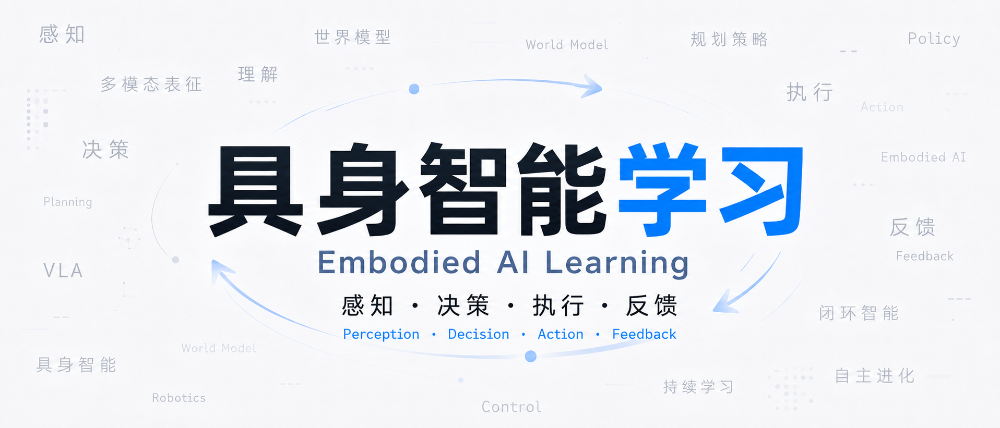
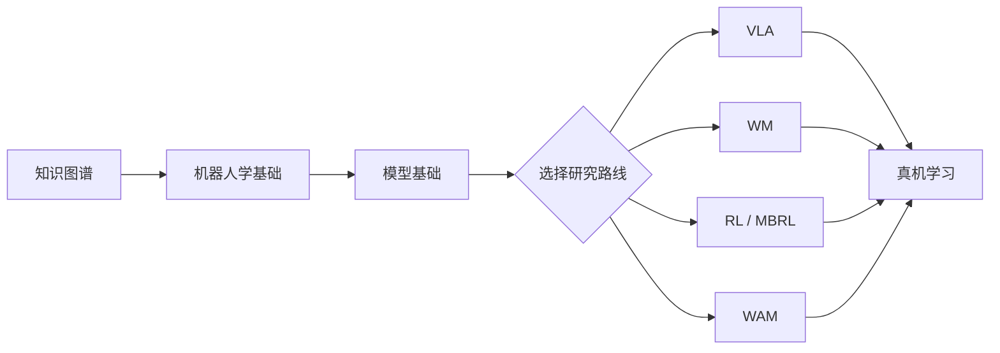

# 具身智能学习地图

从机器人基础出发，逐步走到 VLA、World Model、RL/MBRL 和 WAM。

[开始阅读](roadmap.md){ .md-button .md-button--primary }
[查看代码仓](codebases.md){ .md-button }

## 先从目标开始

| 路线 | 适合你如果… | 起点 |
| --- | --- | --- |
| 🤖 Robotics | 想先搞懂坐标、控制和真机闭环 | [机器人学基础](robotics.md) |
| 👁️ VLA | 想研究视觉、语言和动作策略 | [模型基础](model-basics.md) |
| 🌍 World Model | 想做未来预测、生成或 WAM | [WM 专题](world-model-directions.md) |
| 🎮 RL / MBRL | 想做强化学习、规划和策略后训练 | [强化学习基础](reinforcement-learning.md) |

## 学习顺序

## 站点内容

左侧导航按 Start Here、Foundations、Research、Resources 和 Practice 分组。每篇长文档开头都有适合读者、前置知识、预计阅读时间和本文路线，右侧目录可直接跳转。

ROS 2、OpenCV 和机器人依赖安装可参考[鱼香 ROS 社区论坛](https://fishros.org.cn/forum/)。机器人章节以 Ubuntu 22.04 + ROS 2 Humble 为基线。
