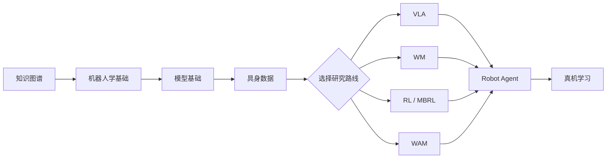

# 具身智能学习地图

从机器人基础、具身数据出发，逐步走到 VLA、World Model、RL/MBRL、WAM 和 Robot Agent。

[开始阅读](roadmap.md){ .md-button .md-button--primary }
[查看代码仓](codebases.md){ .md-button }

## 先从目标开始

| 路线 | 适合你如果… | 起点 |
| --- | --- | --- |
| 🤖 Robotics | 想先搞懂坐标、控制和真机闭环 | [机器人学基础](robotics.md) |
| 📦 Embodied Data | 想采集、处理和混合训练数据 | [具身数据专题](embodied-data.md) |
| 👁️ VLA | 想研究视觉、语言和动作策略 | [VLA 专题](vla.md) |
| 🌍 World Model | 想做未来预测、生成或 WAM | [WM 专题](world-model-directions.md) |
| 🔗 WAM | 想研究未来世界与动作联合建模 | [WAM 专题](wam.md) |
| 🧠 Robot Agent | 想做长时程规划、工具、记忆和恢复 | [Robot Agent 专题](robot-agent.md) |
| 🎮 RL / MBRL | 想做强化学习、规划和策略后训练 | [RL / MBRL 专题](mbrl.md) |

## 学习顺序

## 站点内容

左侧导航按 Start Here、Foundations、Research、Resources 和 Practice 分组。学习路线共 10 章；具身数据与 Robot Agent 同时拥有 Roadmap 章节和独立专题页，可从上方目标入口直接进入。

ROS 2、OpenCV 和机器人依赖安装可参考[鱼香 ROS 社区论坛](https://fishros.org.cn/forum/)。机器人章节以 Ubuntu 22.04 + ROS 2 Humble 为基线。
