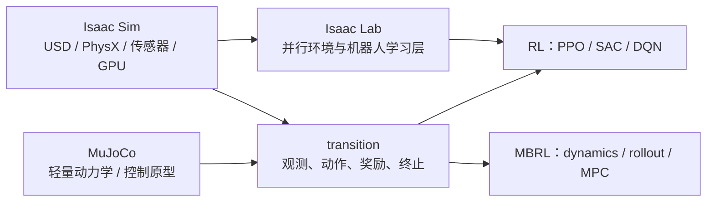
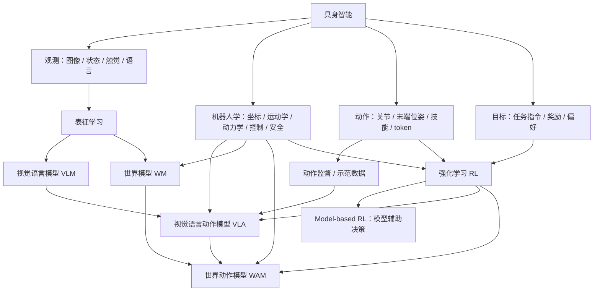
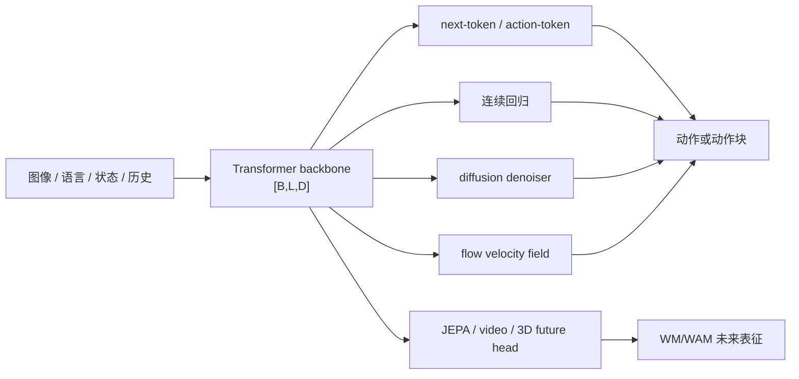
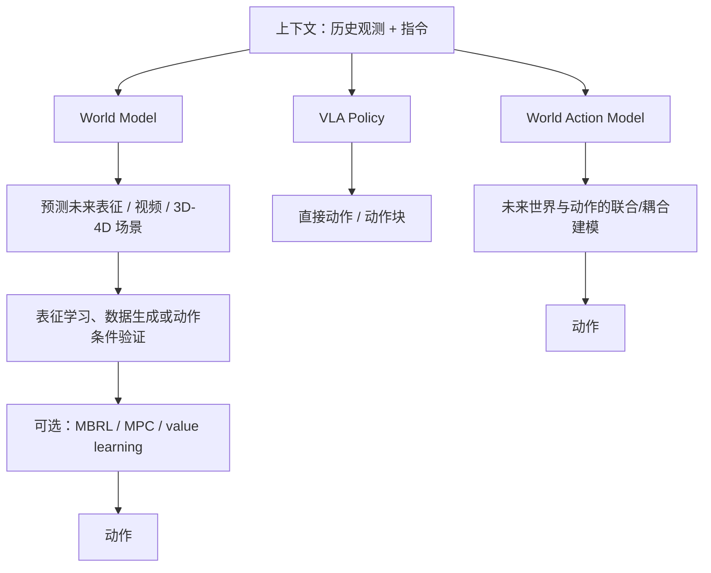
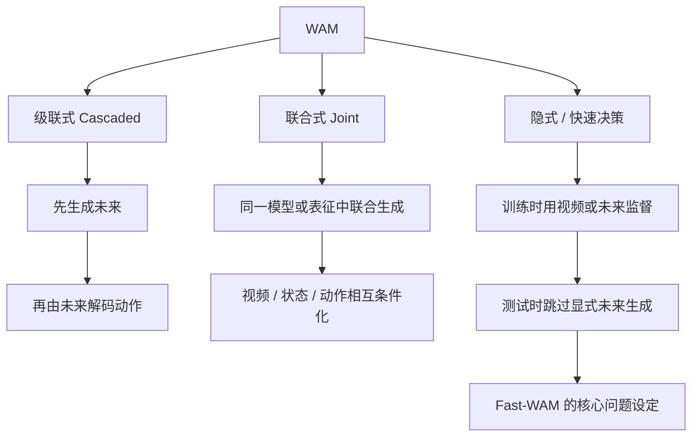
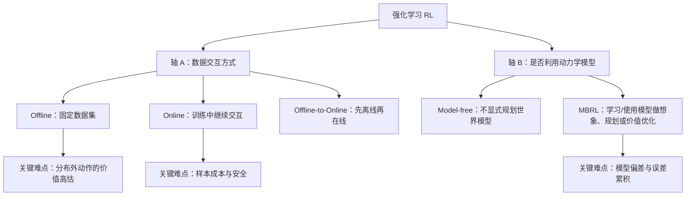
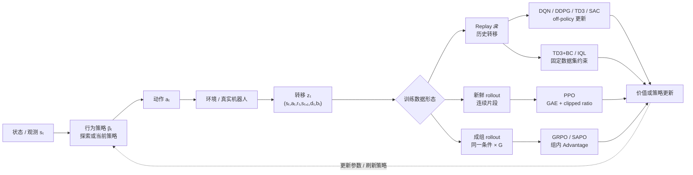
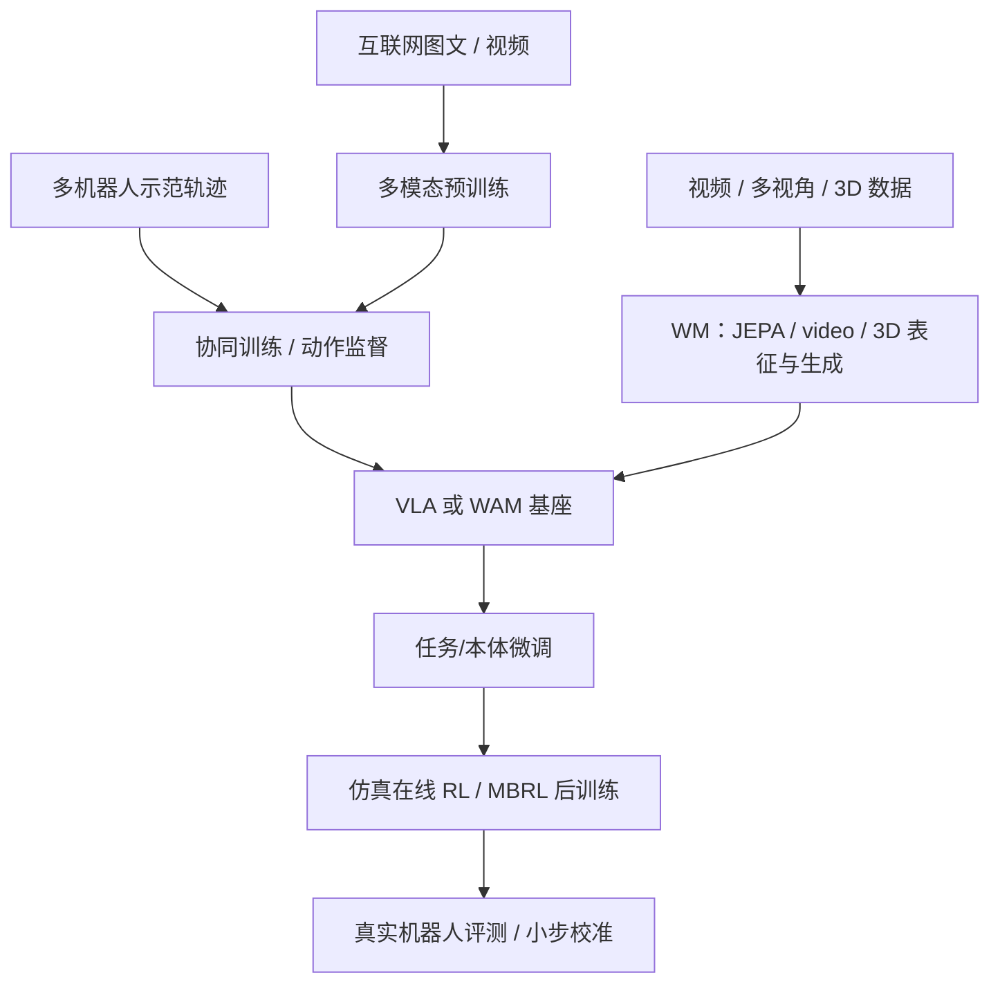

# 知识图谱：WM、MBRL、WAM 与 RL

先抓住四个问题：模型预测什么？动作从哪里来？数据怎么得到？部署时要不要规划？把这四个问题想清楚，WM、MBRL、WAM 和 RL 就不容易混在一起。

## 0. 机器人学基础

模型最后要变成机器人的动作。机器人学负责中间这段：坐标系是否一致、目标能不能到、动作是否平滑、会不会撞上东西，以及出问题时如何停机。需要动手时看[机器人学基础](robotics.md)。

## 0.1 仿真器与学习层

仿真器负责让物体运动、碰撞并产生传感器数据，RL/MBRL 再读取这些数据学习。换仿真器或改配置时，至少把物理步长、策略步长、动作保持（decimation）、资产版本和并行环境数记下来。



仿真教程：[MuJoCo 仿真教程](mujoco-tutorial.md) · [Isaac Sim 仿真教程](isaac-sim-tutorial.md)。Isaac Lab 建立在 Isaac Sim 之上，适合把场景配置转换成大规模机器人学习环境；它不是另一个独立的物理引擎。

## 1. 具身学习全景



### 核心对象

| 对象 | 典型学习目标                                     | 决策接口                                             | 常见优势                       | 常见风险                                  |
| ---- | ------------------------------------------------ | ---------------------------------------------------- | ------------------------------ | ----------------------------------------- |
| VLM  | 图文对齐、生成与理解                             | 通常不直接输出机器人动作                             | 语义知识和泛化强               | 缺少动作与物理接地                        |
| VLA  | $\pi(a_t \mid o_{\le t}, l)$                   | 直接输出动作或动作块                                 | 端到端、部署路径短             | 容易成为反应式映射；时序/物理建模可能不足 |
| WM   | 学习潜在状态、未来视频、3D/4D 场景或动作条件演化 | 表征、预测、生成、检索或作为其他模块的输入           | 物理表征、反事实预测、数据生成 | 预测与真实控制脱节、生成幻觉、长时程漂移  |
| MBRL | 学习动力学/奖励模型并用于规划、价值或策略优化    | imagined rollout、MPC、model-predictive actor-critic | 样本效率、可做反事实决策       | 模型偏差、OOD rollout、规划成本           |
| WAM  | 联合或耦合地预测未来世界与动作                   | 未来生成后解码动作，或直接由世界表征出动作           | 将物理预测和策略学习统一       | 训练/推理昂贵                             |

### Backbone 与生成头

在比较 VLA、WM 或 WAM 时，先把“如何处理上下文”和“如何生成连续目标”拆开：



| 层                             | 主要问题                           | 典型张量/目标                                     | 不应直接推出的结论                                 |
| ------------------------------ | ---------------------------------- | ------------------------------------------------- | -------------------------------------------------- |
| Transformer backbone           | 如何融合 token、模态和历史？       | $[B,L,D]$、attention、causal/bidirectional mask | 使用 Transformer 不等于使用 next-token 或生成式 WM |
| Next-token / action-token head | 如何把动作离散化并按序列预测？     | logits$[B,L,V]$、交叉熵                         | token 化不保证连续动作精度或低延迟                 |
| Diffusion head                 | 如何从噪声逐步恢复动作/未来？      | $[B,H,A]$、epsilon/x0/v loss、scheduler         | 去噪 loss 不等于闭环控制成功率                     |
| Flow-matching head             | 如何学习从源分布到数据分布的速度？ | $v_\theta(x,t,C)$、ODE integration              | flow 标签不说明 solver、步数或控制频率             |
| JEPA/video/3D head             | 如何预测未来表征、视频或几何？     | latent/video/3D future objective                  | 需结合动作条件和决策证据                           |

详细公式、训练/推理伪代码见[模型基础](model-basics.md)。判断一个模型是否属于 MBRL，仍要追问它是否把 dynamics/reward 用于 rollout、MPC、value 或 policy optimization。

## 2. WM → WAM：差异与相似性

这里的 **World Model 是广义表征/预测/生成范式**，当前常见路线包括：

- **JEPA / latent predictive learning**：预测未来表征而不是重建每个像素，强调可预测、可迁移的 latent dynamics；
- **视频世界模型**：生成或预测动作条件的未来视频/视频潜变量，关注时空一致性、交互性和长时程记忆；
- **3D/4D 世界模型**：维护几何、对象、视角和时间演化，可用 3D Gaussian、点云、occupancy、隐式场或多视图 token 表示；
- **动作条件 WM**：把 action 作为输入并检验未来是否对动作敏感，但仍不一定包含规划器或策略优化。

### 2.1 WM 的最小定义与数据

在机器人任务中，世界模型至少要回答一件可检验的事：**给定当前观测和一段动作，未来会怎样**。令观测为 $o_t$、动作
$a_t$，编码器得到世界状态 $z_t$，动力学模型预测未来：

$$
z_t=E_\phi(o_{\le t},a_{<t}),\qquad
\widehat z_{t+1}=F_\theta(z_t,a_t,\xi_t),
$$

其中 $\xi_t$ 表示随机性或未观测因素。若有解码器，再得到可视化观测

$$
\widehat o_{t+1}=D_\psi(\widehat z_{t+1}).
$$

这里的 $z_t$ 可以是像素序列的隐变量、JEPA 特征、对象粒子集合或 3D 场景。一个 3DGS/VGGT 编码器本身只提供空间表征，**没有时间预测和未来目标时不能单独称为 WM**。同样，WM 不必自带 actor 或 planner；只有把模型用于 imagined rollout、MPC、价值估计或策略更新时，才进入 MBRL。

训练样本至少保存：

| 字段            | 符号/形状                                      | 作用                                                |
| --------------- | ---------------------------------------------- | --------------------------------------------------- |
| 观测历史        | $o_{t-L+1:t}$，如 $[L,H,W,3]$ 或多视角数组 | 编码当前世界状态                                    |
| 动作序列        | $a_{t:t+H-1}$，如 $[H,A]$                  | 规定未来演化的外部条件                              |
| 未来观测        | $o_{t+1:t+H}$                                | 训练预测目标；latent-only 方法也需要编码后的 target |
| 时间戳/采样间隔 | $\tau_t,\Delta t$                            | 区分控制频率和视频帧率                              |
| 相机信息        | 内参$K$、外参 $T^W_C$、视角 id             | 3D/多视角重投影与坐标对齐                           |
| 任务条件        | 语言$l$、目标图像 $g$、任务 id             | 条件预测或 goal-conditioned planning                |
| 可选反馈        | $r_t,d_t$、碰撞/接触、关节状态               | 下游 MBRL、失败诊断和安全评估                       |

### 2.2 像素/视频世界模型：预测“看起来会发生什么”

像素路线直接预测 RGB/RGB-D 帧或视频 token。最直观的形式是

$$
\widehat o_{t+1:t+H}=G_\theta(o_{t-L+1:t},a_{t:t+H-1},l,\xi),
$$

常见训练目标是重建、感知和时间一致性的组合（具体论文可能改用离散 token 交叉熵或 diffusion loss）：

$$
\mathcal L_{\mathrm{video}}
=\lambda_{\mathrm{pix}}\lVert o-\widehat o\rVert_1
+\lambda_{\mathrm{perc}}\mathcal L_{\mathrm{perc}}
+\lambda_{\mathrm{temp}}\mathcal L_{\mathrm{temp}}.
$$

**流程**：视频/机器人轨迹 → 视觉编码或 patch/token 化 → 注入动作和语言条件 → 预测未来帧/视频 token → 解码或渲染 → 用未来观测和动作条件一致性验证。World Models、Genie、Cosmos Predict2 属于这一大方向；有些模型在压缩 latent 上训练、最后再解码成像素，因此分类应看训练目标和输出，而不是只看“video”这个名字。

它适合检查外观、遮挡和交互是否合理，也可以生成示范或做视频级反事实；代价是显存和推理延迟高，像素误差未必等于几何/控制误差。相机位姿、光照和纹理变化还可能让模型学到外观捷径。做机器人控制时必须额外报告 action-conditioned prediction 和闭环成功率，不能只报告 PSNR/SSIM/LPIPS。

### 2.3 Latent 世界模型：预测“状态会怎样变化”

latent 路线先把观测压缩为 $z_t$，在较小空间学习动力学：

$$
z_t=E_\phi(o_t),\qquad
p_\theta(z_{t+1}\mid z_{\le t},a_t),
$$

JEPA 类方法常用预测特征与停止梯度的 target 特征之间的距离：

$$
\mathcal L_{\mathrm{JEPA}}
=d\!\left(P_\theta(E_\phi(o_{\le t}),a_t),
\mathrm{stopgrad}\!\left(E_\phi(o_{t+1})\right)\right).
$$

若模型用于 Dreamer/PlaNet/TD-MPC2 一类的决策，还会加入 reward、termination、value 或 latent transition 的概率损失，并在 latent 中 rollout。V-JEPA 2 更强调自监督未来表征和物理理解；它提供可迁移的预测表征，但不自动等价于一个带机器人动作接口的 MBRL 模型。

#### LPWM：对象中心的 latent particles

[LPWM](https://arxiv.org/abs/2603.04553)（Latent Particle World Model）是 latent 路线中更结构化的一类：它从视频自监督发现 keypoint、边界框、mask 和外观，不要求人工对象标签。第 $m$ 个前景粒子可写成

$$
z_{\mathrm{fg},t}^{m}\in\mathbb R^{6+d_{\mathrm{obj}}},
\qquad
z_{\mathrm{bg},t}\in\mathbb R^{d_{\mathrm{bg}}},
$$

其中前 6 维对应二维位置（2）、尺度（2）、深度排序（1）和透明度（1），其余 $d_{\mathrm{obj}}$ 维表示局部外观；$z_{\mathrm{bg},t}$ 表示背景。模型为每个粒子预测 latent action，再学习随机粒子动力学：

$$
p_\xi\!\left(z_{t+1}\mid z_t,c_t^{1:M},l,g\right),
$$

其中 $c_t^{1:M}$ 是粒子级 latent action，$l$ 为语言条件，$g$ 可为目标图像。训练是带重建项、KL 项、稀疏/透明度正则和动态项的时序 ELBO；论文完整目标还区分首帧的 static 项与后续帧的 dynamic 项。它支持仅用视频预训练，也可选动作、语言、多视角和目标图像条件，并演示了 goal-conditioned imitation learning。

LPWM 的优点是粒子身份和交互更容易解释，模型规模和推理成本低于逐像素视频扩散；但粒子发现、遮挡和背景分解会失败，且 latent action 不一定等于真实机器人控制量。接入机器人时仍要记录真实 $a_t$、控制周期和坐标系，并验证预测粒子变化是否对应末端/关节动作。

### 2.4 3D/4D 世界模型：预测“空间中的物体怎样演化”

3D 路线把场景写成带几何的显式或隐式结构。例如用 $N$ 个 Gaussian primitive 表示场景：

$$
S_t=\left\{(\mu_i,\Sigma_i,\alpha_i,c_i)\right\}_{i=1}^{N},
\qquad
\mu_i\in\mathbb R^3,
\quad \Sigma_i\in\mathbb R^{3\times3},
$$

其中 $\mu_i$ 是中心，$\Sigma_i$ 是形状/方向，$\alpha_i$ 是不透明度，$c_i$ 是颜色或外观特征。动作条件动力学预测 $S_{t+1}$，再通过相机模型渲染：

$$
\widehat S_{t+1}=F_\theta(S_t,a_t),
\qquad
\widehat I_{t+1}=\mathcal R(\widehat S_{t+1};K,T^W_C).
$$

训练可以联合渲染、几何、时序和动作一致性损失；多视角数据必须使用一致的世界坐标和相机外参。3D/4D 表示能更直接地表达深度、遮挡、物体位姿和视角变化，但建立初始场景、处理动态拓扑和保持长期一致性更难。

#### GWM：动作条件的 Gaussian World Model

[GWM](https://arxiv.org/abs/2508.17600)（Gaussian World Model）针对机器人操作，学习在机器人动作作用下 Gaussian primitives 的传播。其核心是 **latent Diffusion Transformer + 3D variational autoencoder**：先把 3D Gaussian 场景压到紧凑 latent，在 latent 中预测未来，再用 Gaussian Splatting 重建/渲染未来场景。论文把它用于三件事：动作条件 3D 视频预测、作为 imitation learning 的视觉表征，以及作为 neural simulator 支持 MBRL。

实践时要把以下链路拆开检查：多视角/RGB-D → 初始 3D Gaussian 或点图 → 记录动作 $a_{t:t+H-1}$ → 预测 $\widehat S_{t+1:t+H}$ → 从目标相机渲染 → 比较深度/位姿/重投影和动作条件差异 → 再把模型交给策略或 MPC。GWM 的 3D 预测能力不能由静态 3DGS 或 VGGT 自动推出；后两者更适合作为 3D 重建/几何前端，是否构成 WM 要看有没有动作条件的时间预测。

#### 4D occupancy：预测空间占据和自车运动

Occupancy world model 不追踪少量目标框，而是在离散体素或稀疏体素上预测“哪里被什么占据”。令场景网格为 $V_t\in\{0,1,\ldots,C\}^{X\times Y\times Z}$，其中 0 表示空闲、其余类别表示占据语义；4D 预测可以写成

$$
\widehat V_{t+1:t+H},\widehat p_{t+1:t+H}
 =F_\theta(V_{t-L+1:t},p_{t-L+1:t},u_{t:t+H-1}),
$$

其中 $p_t$ 是自车或相机位姿，$u_t$ 可以是控制量、目标轨迹或未来位姿条件。OccWorld 用离散 scene token 和时空 Transformer 同时预测 occupancy 与 ego trajectory；DOME 把未来 occupancy 生成写成可控的 diffusion；PreWorld 用视觉输入和 2D/3D 监督进行 3D occupancy 与 4D forecasting；Delta-Triplane Transformers 则预测紧凑 triplane 的增量，避免每一步重建完整体素。它们主要验证场景演化、规划误差和长时程一致性，通常不是机械臂 action policy。

这条路线的优点是几何和遮挡比 2D 框更完整，且可以直接接碰撞检查、轨迹规划或自动驾驶 planning；缺点是体素内存大、分辨率与速度互相制约，位姿误差会污染所有未来帧。阅读时要分清：预测未来 occupancy 是 WM，只有把预测结果用于 planner、MPC 或 policy update 才是 MBRL。

#### 持续 3D latent 与动态重建

另一类方法不要求每个时刻都生成完整 RGB，而是维护一个随时间更新的 3D latent。以 FR3D 为例，它把相机自运动和环境运动拆开，预测持久的 3D latent，再从未来视角重建动态场景。此时可写成

$$
z_t^{3D}=E_\phi(o_{t-L+1:t},T^W_{C,t-L+1:t}),\qquad
\widehat z_{t+1}^{3D}=F_\theta(z_t^{3D},\Delta T_t,\xi_t),
$$

其中 $\Delta T_t$ 是估计的自运动，$\xi_t$ 表示未观测的环境变化。该路线适合单目或少视角输入、未来动态重建和跨视角一致性；但如果输入中没有机器人动作，也不能把相机运动代理直接称为通用控制接口。

#### 3D belief 与可交互场景

3D-Belief 把世界模型理解成“对未观测 3D 世界的信念”，维护多种可能的场景假设，并在新观测到来时更新它们。WorldAct 则把静态生成的 3D 世界拆成可编辑对象、碰撞几何和背景，使其能够执行物体级交互。它们补上了纯未来渲染经常缺少的两点：**不确定性**和**可操作的对象结构**。但这类工作仍需单独检查是否有真实机器人动作、动力学预测和闭环任务收益；场景可编辑或可导航不等于已经学会 action-conditioned dynamics。

### 2.5 其他重要 WM 方向：不只是换一种 3D 表示

前面的四类是“预测什么表示”；下面这些是与表示正交的设计选择。读论文时要同时记录表示空间、时间生成器、条件输入和是否真的接入决策。

| 方向                           | 怎么做                                                                         | 代表工作                                                                                                  | 适合回答的问题                                                   | 主要限制                                                    |
| ------------------------------ | ------------------------------------------------------------------------------ | --------------------------------------------------------------------------------------------------------- | ---------------------------------------------------------------- | ----------------------------------------------------------- |
| 离散 token 自回归              | 把观测压成离散 token，用 causal Transformer 逐 token 预测下一状态              | [IRIS](https://arxiv.org/abs/2209.00588)                                                                     | 少量环境交互下，离散 latent 能否支持 imagined rollout？          | token 压缩可能丢视觉细节，长 rollout 易累积误差             |
| 像素 diffusion WM              | 对未来 RGB 帧直接做条件扩散，采样得到多种可能未来                              | [DIAMOND](https://arxiv.org/abs/2405.12399)                                                                  | 视觉细节是否会改善游戏/环境内 RL？                               | 采样慢、显存高，画面逼真不等于动作正确                      |
| 语言条件 WM                    | 把描述环境规律的语言和视觉历史一起编码，并预测未来视觉/文本表征                | [Dynalang](https://arxiv.org/abs/2308.01399)                                                                 | 语言描述“环境怎么运行”能否帮助跨环境泛化？                     | 依赖语言是否准确、是否与当前实体对齐                        |
| 学习型物理模拟器               | 用粒子图或连续状态表示物理系统，消息传递预测速度/位置变化                      | [GNS](https://arxiv.org/abs/2002.09405)                                                                      | 学到的动力学能否跨初始状态和长时程 rollout？                     | 通常没有视觉、语言和机器人 action 接口                      |
| 驾驶场景 WM                    | 用视频、动作、文本或交通结构条件预测未来驾驶场景                               | [GAIA-1](https://arxiv.org/abs/2309.17080)、[DriveDreamer](https://arxiv.org/abs/2309.09777)                    | 车辆动作和交通约束能否控制未来视频？                             | 领域集中在驾驶，不能直接迁移到机械臂接触                    |
| Digital twin WM                | 用显式场景表示配合物理模拟器，复制当前场景并反事实执行动作                     | [DreMa](https://arxiv.org/abs/2412.14957)                                                                    | 机器人动作改变物体后，模型能否在“自己的副本”中试错？           | 场景重建、物理参数和接触模型都可能失配                      |
| 人类视频预训练 + latent action | 从无动作标签视频中学习连续 latent action，再用少量机器人数据校准               | [DreamDojo](https://arxiv.org/abs/2602.06949)                                                                | 人类视频中的交互知识能否迁移到机器人控制？                       | latent action 不是原生控制量，需 target-robot post-training |
| 机器人自主探索                 | 让机器人 self-play/autonomous play 采集成功、失败和接触丰富的数据训练 WM       | [PlayWorld](https://arxiv.org/abs/2603.09030)                                                                | 数据分布是否能覆盖人类示范很少出现的失败和长尾接触？             | 真实机器人采集成本、硬件安全和任务覆盖仍是瓶颈              |
| WM-策略共同迭代                | WM 同时预测未来帧和 reward，并用更新后的策略回流数据继续校准 WM                | [World-VLA-Loop](https://arxiv.org/abs/2602.06508)                                                           | 如何避免固定 WM 与后训练策略逐渐失配？                           | reward 预测错误会把策略更新带偏                             |
| JEPA + diffusion 的 MBRL       | 直接在联合 embedding 中学习 diffusion dynamics，避免单独预训练 latent          | [JEDI](https://arxiv.org/abs/2605.13013)                                                                     | 是否能兼顾 latent rollout 的效率和 diffusion 的多模态预测？      | 仍需验证跨任务、长 horizon 和真实机器人闭环                 |
| 因果/结构化 WM                 | 在对象或实体层级遮挡、干预并预测关系变化，让模型学习“谁影响谁”               | [Causal-JEPA](https://arxiv.org/abs/2602.11389)                                                              | latent 是否捕获可干预的交互结构，而不只是相关性？                | 因果结构的可识别性依赖数据覆盖和干预设计                    |
| 动作跟随与安全验证             | 用 off-expert action、SE(3) 轨迹和风险头检查模型是否真的执行给定动作           | [WorldEcho](https://arxiv.org/abs/2608.24885)、[Calibrated Predictive Safety](https://arxiv.org/abs/2608.17496) | 预测未来是否与动作、风险和安全约束一致？                         | 评测协议、校准集和真实机器人验证仍需统一                    |
| 长期记忆 WM                    | 用全局记忆库、位姿索引或混合 attention 保留远期地点/状态，同时限制短期推理成本 | [ReWorld](https://arxiv.org/abs/2608.23565)                                                                  | 长时程回访时，模型能否恢复早期观测并保持交互一致？               | 记忆预算、检索错误和跨场景泛化会影响结果                    |
| 真实机器人在线 WM              | 在真实机器人上边采集边更新 latent dynamics，并用 imagined rollout 降低试错成本 | [DayDreamer](https://arxiv.org/abs/2206.14176)                                                               | 不依赖仿真器时，模型是否仍能用少量真实交互学会站立、行走或操作？ | 安全、重置成本、传感器漂移和在线更新稳定性                  |
| 对象槽位动力学                 | 先把画面拆成对象 slot，再预测对象属性和关系随时间的变化                        | [SlotFormer](https://arxiv.org/abs/2210.05861)、[FOCUS](https://arxiv.org/abs/2307.02427)                       | 对象级结构是否改善长时程预测、探索和目标条件规划？               | slot 身份交换、遮挡和对象发现不稳定                         |
| 细粒度接触视频 WM              | 在视频生成器内部按帧注入 action，刻画机械臂、物体和接触的精确对齐              | [IRASim](https://arxiv.org/abs/2406.14540)                                                                   | 改变动作时间戳后，接触位置和物体响应是否同步改变？               | 视频逼真度、动作跟随和真实动力学可能脱节                    |
| 显式运动流 WM                  | 先预测 3D scene flow 或运动场，再用它生成未来 RGB-D/视频                       | [FlowDreamer](https://arxiv.org/abs/2505.10075)                                                              | 显式运动是否改善深度、语义一致性和视觉规划？                     | scene flow 误差会传到渲染，仍需动作闭环验证                 |
| WM 作为策略评测环境            | 用 latent action 或 action-conditioned video rollout 在部署前筛选策略          | [WorldEval](https://arxiv.org/abs/2505.19017)、[WorldGym](https://arxiv.org/abs/2506.00613)                     | 模型内策略排名是否与真实机器人排名相关？                         | 评测代理可能偏爱某类动作，不能替代真实安全测试              |
| 视觉-触觉 WM                   | 同时预测未来图像和触觉信号，把不可见接触约束纳入 rollout                       | [ViTacWorld](https://arxiv.org/abs/2607.22530)                                                               | 触觉预测是否提高接触任务成功率和策略筛选可靠性？                 | 触觉传感器和仿真接口差异大，数据成本高                      |
| 层级逻辑-视觉 WM               | 高层预测可解释的逻辑状态，低层预测视觉变化，再用中间目标连接长短时程           | [H-WM](https://arxiv.org/abs/2602.11291)                                                                     | 逻辑子目标能否减少长 horizon 的视觉漂移和规划失败？              | 符号状态抽取、层级接口和错误传播需要单独评估                |
| Robot-factored WM              | 先用控制器、运动学和 URDF 渲染机器人未来外观，WM 只学习场景对动作的响应        | [Robot-Factored WM](https://arxiv.org/abs/2607.22535)                                                        | 换机器人本体后，动作条件接口是否仍然一致？                       | 渲染质量、接触深度和控制器模型偏差                          |
| BEV/导航 WM                    | 在鸟瞰图或地图 latent 中预测视角、占据和路线演化                               | [BEV Pretrained WM](https://arxiv.org/abs/2310.18847)                                                        | 地图级预测是否比第一视角视频更适合长程导航和主动感知？           | 主要面向导航，不能直接迁移到机械臂接触                      |

#### 3D/4D 路线的统一接口

| 子路线          | 状态表示                                 | 时间/动作接口                   | 典型代表                                   | 主要用途                              |
| --------------- | ---------------------------------------- | ------------------------------- | ------------------------------------------ | ------------------------------------- |
| 动态 Gaussian   | $N$ 个带位置、协方差和外观的 primitive | 机器人动作或形变场传播          | GWM、PhysMani                              | 机器人操作、3D 视频、neural simulator |
| 4D occupancy    | 稠密体素、稀疏体素或 triplane            | 历史 occupancy + 位姿/轨迹/控制 | OccWorld、DOME、PreWorld、DTT、SparseWorld | 场景预测、碰撞检查和规划              |
| 持续 3D latent  | 带坐标的 latent feature/point map        | 自运动、未来视角或环境变化      | FR3D、DynamicVGGT                          | 动态重建、跨视角一致性                |
| 3D belief/scene | 多假设场景、对象 mesh/primitive 和背景   | 观测更新、对象编辑或交互动作    | 3D-Belief、WorldAct                        | 部分可观测推理、可交互仿真            |

### 2.6 四类主路线怎么选

| 路线                          | 预测目标                       | 动作条件的典型接口                                  | 适合先验证什么                                   | 主要风险                                  |
| ----------------------------- | ------------------------------ | --------------------------------------------------- | ------------------------------------------------ | ----------------------------------------- |
| 像素/视频                     | RGB/RGB-D 帧、视频 token       | 拼接 action token、cross-attention 或条件 diffusion | 外观、遮挡、视频级反事实                         | 成本高；像素逼真不等于动力学正确          |
| latent/JEPA                   | 全局或局部特征$z_t$          | $F(z_t,a_t)$ 或 action-conditioned predictor      | 表征可预测性、下游控制和长时程 rollout           | latent 可能丢掉接触/几何，易出现 shortcut |
| latent/object-centric（LPWM） | 粒子、背景和对象属性           | 每粒子 latent action，可选语言/目标图像             | 对象交互、可解释分解、goal-conditioned imitation | 对象发现、遮挡和粒子身份不稳定            |
| 3D/4D（GWM）                  | Gaussian/点云/隐式场的未来状态 | 在 3D latent 或 primitive 上传播机器人动作          | 深度、位姿、视角鲁棒性和神经仿真                 | 标定、坐标对齐、动态拓扑和长期漂移        |

### 2.7 从 WM 到闭环控制的统一流程

```text
采集 o_t, a_t, Δt, 相机 K/T, 可选 r_t/d_t
        -> 选择表示：像素视频 / latent / 粒子 / 3D 场景
        -> 训练编码器、未来预测器和可选解码器
        -> 用 action-conditioned open-loop rollout 检查 H 步误差
        -> 加入策略、MPC 或 value 模块（此时才是 MBRL 用法）
        -> 只执行短 action chunk，重新观测并滚动更新
        -> 同时记录预测误差、闭环成功率、延迟、不确定性和失败类型
```

最少要报告三类指标：表示/预测质量（像素或重投影、latent 距离、粒子/几何误差）、动作条件敏感性（相同 $z_t$ 下改变 $a_t$ 是否导致合理不同的未来）和真实闭环结果（成功率、恢复能力、延迟与安全约束）。仅凭生成视频好看，不能证明模型学到了可用于机器人的世界动力学。



### WAM 的常见架构路线



阅读一篇 WAM 论文：

1. **未来表示是什么？** RGB 视频、离散 token、连续潜变量，还是结构化状态？
2. **动作如何进入模型？** 作为条件、与未来交替生成、由逆动力学恢复，还是由独立 action head 预测？
3. **未来预测在哪里使用？** 仅训练期辅助，还是测试期也显式 rollout / search？
4. **闭环价值是否成立？** 记录任务成功率、延迟、动作一致性和 OOD 泛化。

## 3. RL 与 MBRL：两条正交轴

“offline、online、model-based”不能放在同一层级。正确的分类至少有两条轴。

三者按不同问题判别：**WM** 关注环境表征与未来预测；**MBRL** 只有在模型被用于 rollout、规划、价值或策略更新时成立；**WAM** 关注未来世界表征与动作生成的联合或紧密耦合。它们可以重叠，但不是同义词。



### 二维矩阵

|                             | Model-free RL                                 | MBRL                                       |
| --------------------------- | --------------------------------------------- | ------------------------------------------ |
| **Offline**           | CQL、IQL、Decision Transformer                | MOPO、MOReL、COMBO、离线 TD-MPC2           |
| **Online**            | PPO、SAC、DQN 系列                            | Dreamer 系列、MBPO、MuZero、在线 TD-MPC2   |
| **Offline-to-Online** | IQL/CQL 初始化后继续交互，或 VLA 的 RL 后训练 | 离线预训练世界模型，再用在线数据校准并规划 |

补充一点：

- **Decision Transformer** 使用固定轨迹并做条件序列建模，通常归入 offline RL 讨论，但它不一定使用经典 TD 学习。

## 4. RL 的学习闭环

V、Q、A、Bellman target 以及 DQN、DDPG、TD3、TD3+BC、SAC、PPO、IQL、GRPO、SAPO 的统一推导见[强化学习基础](reinforcement-learning.md)。本节只说明 RL 在整张具身智能知识图中的位置。



离线 RL 把“环境 / 真实机器人”换成固定数据集 $D=\{(s,a,r,s')\}$，因此不能随意尝试新动作验证价值估计；这就是分布偏移问题的根源。MBRL 的分类依据见上面的二维轴与矩阵。

## 5. VLA / WAM 的常见训练流水线



- **π0.5**：重点观察异构数据协同训练如何带来开放世界与长时程泛化。
- **StarVLA**：重点观察 VLM backbone 与 action head 的模块化实现。
- **RLinf**：重点观察 VLA 如何连接 rollout、奖励、策略更新与分布式训练。
- **Fast-WAM**：重点观察未来建模在训练期与测试期分别扮演什么角色。

## 6. 方法比较

| 维度     |                                                                                                                    |
| -------- | ------------------------------------------------------------------------------------------------------------------ |
| 输入     | 单/多视角 RGB、深度、状态、触觉、语言、历史窗口                                                                    |
| 动作     | 关节、末端位姿、离散 token、连续动作、action chunk                                                                 |
| 数据     | 互联网、视频、人类示范、机器人示范、仿真、在线交互                                                                 |
| 目标     | VLA：flow/diffusion/next-token；WM：JEPA/video/3D future prediction；MBRL：TD、model rollout、MPC、policy gradient |
| 世界表示 | 无、JEPA latent、视频 latent/RGB、点云/3D Gaussian、结构化状态                                                     |
| 决策     | 一步反应、动作块、MPC、搜索、层级规划                                                                              |
| 评测     | 成功率、泛化、样本效率、推理延迟、安全、恢复能力                                                                   |
