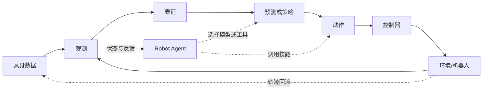
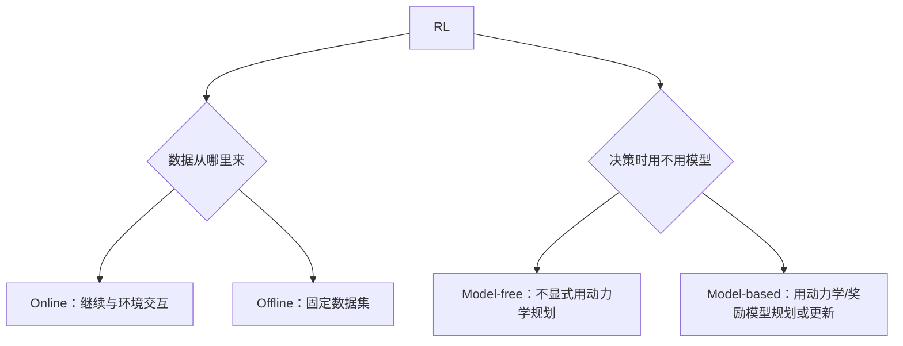
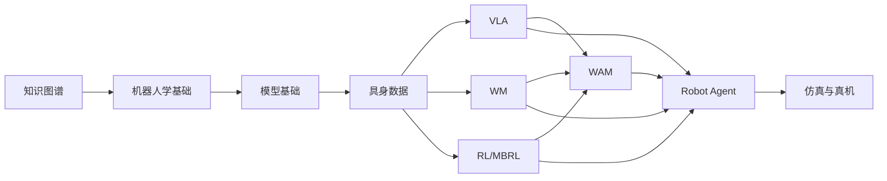

# 🧭 具身智能知识图谱

> 从机器人基础和具身数据出发，先弄清观测、动作、环境和学习目标，再选择 VLA、WM、RL/MBRL、WAM 或 Robot Agent 路线。

**预计阅读**：10 min 
**前置知识**：无 
**下一步**：[机器人学基础](robotics.md) · [模型基础](model-basics.md) · [强化学习基础](reinforcement-learning.md)

机器人看到了什么、要输出什么、数据如何获得，以及模型与 Agent 分别解决哪一段问题。具体公式、算法流程和论文放在独立专题页。

## 1. 完整的具身闭环

- **观测**：相机图像、深度、关节状态、末端位姿、触觉、语言指令和历史信息。
- **表征**：把原始观测变成 token、latent、对象状态或 3D 场景。
- **预测或策略**：预测未来，或者直接根据当前上下文生成动作。
- **动作**：关节位置/速度/力矩、末端位姿增量、技能、离散 token 或动作块。
- **控制器**：做坐标变换、逆运动学、限位、插值、碰撞检查和安全停机。

机器人学、控制器和安全约束通常位于学习模型之外，但它们决定模型输出能否真正执行。相关实践见[机器人学基础](robotics.md)。

## 2. 基本对象

| 对象           | 它解决什么问题                                | 常见输出                                          | 不要把它误认为           |
| -------------- | --------------------------------------------- | ------------------------------------------------- | ------------------------ |
| **VLM**  | 理解图像、文字和任务语义                      | 文本、视觉特征或中间表示                          | 已经能控制机器人的策略   |
| **VLA**  | 从视觉、语言和状态直接生成动作                | 单步动作或 action chunk                           | 必然包含未来预测的 WM    |
| **WM**   | 给定当前状态和动作，预测未来世界              | 未来 latent、视频、对象状态或 3D/4D 场景          | 只做静态 3D 重建的编码器 |
| **RL**   | 用奖励定义“什么行为更好”并改进策略          | value、Q、policy 或动作                           | 一种固定的数据收集方式   |
| **MBRL** | 把动力学/奖励模型用于 rollout、规划或策略更新 | imagined rollout、MPC 或 model-based actor-critic | 所有使用 WM 的系统       |
| **WAM**  | 把未来世界建模与动作生成联合或紧密耦合        | 未来表征与动作的联合输出                          | WM 的第五种空间表示      |
| **具身数据** | 定义并记录任务、观测、动作、标定、结果和来源 | episode、segment、step 与多模态轨迹               | 只要有视频就能训练策略   |
| **Robot Agent** | 在模型与技能之上分解任务、调用工具、验证和恢复 | 子目标、工具调用、记忆、执行状态                  | 高频关节控制器或单个 VLA |

VLA、WM 和 WAM 是模型范式；RL 是学习目标与更新方式；MBRL 是“模型如何参与决策”的用法；具身数据是训练与评测底座；Robot Agent 是运行时编排层。它们可以组合，但不在同一分类层级。

## 3. 六个边界

### 3.1 VLA 与 WM

VLA 主要学习

$$
\pi(a_t \mid o_{\le t}, l),
$$

即根据观测历史 $o_{\le t}$ 和语言/目标条件 $l$ 生成动作。WM 主要学习

$$
p(x_{t+1:t+H} \mid x_t, a_{t:t+H-1}, l),
$$

即动作会带来什么未来。一个 VLA 可以使用 WM 的未来表征作为辅助输入，但直接输出动作并不会自动变成 WM。

### 3.2 WM 与 MBRL

WM 只要能预测未来即可成立。只有当预测模型进一步用于 imagined rollout、MPC、价值估计或策略优化时，才是 MBRL 用法。静态 3D 表征、视频生成或未来预测本身，都不能直接推出存在 MBRL。

### 3.3 VLA 与 WAM

VLA 通常把上下文映射到动作；WAM 还要让“动作导致的未来”进入动作生成或训练约束。WAM 可以是级联结构，也可以在同一个模型中联合生成未来和动作。

### 3.4 Online / Offline 与 Model-free / Model-based

这是两条不同的轴：

因此 PPO 可以是 online model-free，DQN 通常是 online off-policy model-free，Dreamer 属于 online model-based；offline/online 描述数据来源，model-free/model-based 描述决策时是否使用模型。

### 3.5 Robot Agent 与 VLA/WAM

VLA/WAM 决定局部动作或未来条件下的动作生成，Robot Agent 决定何时调用哪个模型或解析技能、如何检查结果、何时恢复或停止。Agent 可以把 VLA 作为接触丰富原语，也可以调用 WAM 做候选未来评估；Agent 的任务级记忆和工具编排不能替代控制器的实时安全约束。

### 3.6 具身数据与训练目标

采集方式不等于训练目标。Ego 视频可以只监督表征或未来预测，也可以经 retarget 生成低置信度伪动作；真机遥操作可监督行为克隆；失败轨迹更适合成功判别、价值、风险或恢复学习。混合数据时必须按来源和置信度启用对应 loss mask，不能把所有轨迹等权当作专家动作。

## 4. 选择入口

| 想解决的问题                                   | 直接进入                                                                  |
| ---------------------------------------------- | ------------------------------------------------------------------------- |
| 坐标、TF、MoveIt 2、控制和真机                 | [机器人学基础](robotics.md)                                                  |
| Transformer、Diffusion、Flow Matching 和动作头 | [模型基础](model-basics.md)                                                  |
| 五类主采集路线、episode/segment/step 标注和训练配比 | [具身数据专题](embodied-data.md)                                           |
| 视觉语言到动作                                 | [VLA 专题](vla.md)                                                           |
| 预测未来视频、latent 或 3D/4D 世界             | [WM 专题](world-model-directions.md)                                         |
| 未来表征与动作联合建模                         | [WAM 专题](wam.md)                                                           |
| 奖励、价值、策略更新和规划                     | [RL / MBRL 专题](mbrl.md) · [强化学习基础](reinforcement-learning.md)          |
| 长时程规划、工具调用、记忆和恢复               | [Robot Agent 专题](robot-agent.md)                                              |
| 论文、代码和 benchmark                         | [论文清单](papers.md) · [代码仓](codebases.md) · [Benchmark 指南](benchmarks.md) |

## 5. 最短学习路径

先掌握共同基础和数据契约，再沿一个模型方向深入；需要长时程任务编排时再接 Robot Agent。研究时始终把观测、动作、时间对齐、坐标系、工具边界和闭环评测写清楚；这些是不同方向之间真正共享的基础。
