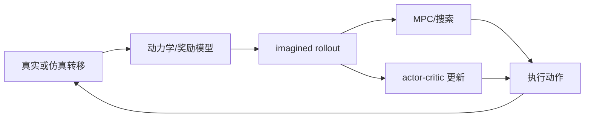

# 🎮 MBRL：用模型辅助决策

> MBRL（Model-based Reinforcement Learning）学习或使用动力学/奖励模型，在模型中想象未来，再用于规划、价值估计或策略更新。

**下一步**：[强化学习基础](reinforcement-learning.md) · [WM 专题](world-model-directions.md) · [MuJoCo 教程](mujoco-tutorial.md)

MBRL 的关键不是模型名字，而是模型是否进入决策闭环。一个只预测视频、只做表征学习或只输出评估分数的系统，不能仅凭这些组件称为 MBRL。

## 1. 最小决策形式

动力学模型可以写成：

$$
\hat s_{t+1}=f_\theta(s_t,a_t),
\qquad
\hat r_t=r_\theta(s_t,a_t).
$$

给定候选动作序列 $a_{t:t+H-1}$，模型产生 imagined rollout：

$$
(\hat s_{t+1},\hat r_t),\ldots,(\hat s_{t+H},\hat r_{t+H-1}),
$$

再用累计回报或风险选择动作：

$$
J(a_{t:t+H-1})
=\sum_{k=0}^{H-1}\gamma^k\hat r_{t+k}
-\lambda\,\mathrm{risk}(\hat s_{t+k}).
$$

## 2. MBRL 的主要用法

| 用法 | 模型怎样参与 | 代表方法 |
| --- | --- | --- |
| MPC | 每次观测后重新采样候选动作，在模型中评估并执行第一步 | PETS、TD-MPC2 |
| Model-based actor-critic | 在 imagined state 上更新 actor 和 critic | Dreamer 系列 |
| 短 rollout 增强 | 用少量模型步扩充真实数据，再交给 model-free 更新 | MBPO |
| 搜索与价值评估 | 用模型展开候选分支，估计价值或动作后果 | MuZero、WorldEval 类方法 |
| 离线 MBRL | 固定数据集学习模型，并对 OOD rollout 做保守约束 | MOPO、MOReL、COMBO |

## 3. 数据从哪里来

在线 MBRL 从环境或真实机器人采集：

```text
观测 s_t
  -> 行为策略 β_t 选择 a_t
  -> 环境返回 r_t、s_{t+1}、终止信息
  -> 写入 replay buffer
  -> 更新 dynamics/reward
  -> imagined rollout 或 MPC
  -> 更新策略并继续采集
```

离线 MBRL 使用固定数据集

$$
\mathcal D=\{(s_t,a_t,r_t,s_{t+1},d_t)\},
$$

不能随意在真实环境中验证数据集外动作，因此要显式处理分布偏移和模型不确定性。

## 4. 与 WM 和 RL 的关系

- **RL** 定义奖励和策略改进问题；**MBRL** 是其中显式使用模型的一类方法。
- **WM** 可以提供未来表征，但只有当它用于 rollout、规划、价值或策略更新时，才承担 MBRL 的角色。
- **Model-free RL** 不代表完全没有神经网络，而是决策时不显式依赖可 rollout 的动力学模型。
- **Online / Offline** 描述数据来源，与 model-free / model-based 是两条独立轴。



## 5. 训练时要检查什么

1. **短期预测**：单步和短 horizon 的状态、奖励、终止误差；
2. **动作敏感性**：替换动作后，模型未来是否有合理差异；
3. **不确定性**：ensemble、概率模型或风险头是否能识别 OOD 状态；
4. **规划收益**：模型 rollout 是否真正提升样本效率或成功率；
5. **误差累积**：增加 rollout horizon 后性能如何变化；
6. **部署成本**：规划延迟、控制频率、重规划间隔和安全约束。

模型内成功率不能替代真实环境评测。真实机器人还要记录控制器、标定、碰撞和急停事件。

## 6. 一个最小实验顺序

```text
1. 在 MuJoCo/Gymnasium 跑通 transition 和 replay buffer
2. 训练单步 dynamics，检查状态与 reward 误差
3. 比较 1、5、10 步 imagined rollout 的漂移
4. 接入随机 shooting 或 MPC，只执行第一个动作
5. 与 SAC/PPO 等 model-free 基线比较环境步数和成功率
6. 再迁移到更复杂仿真或真机，并报告延迟与安全事件
```

常用实现入口：[TD-MPC2](https://github.com/nicklashansen/tdmpc2)、[DreamerV3](https://github.com/danijar/dreamerv3)、[MBPO](https://github.com/jannerm/mbpo)和[代码仓与工具](codebases.md)。
