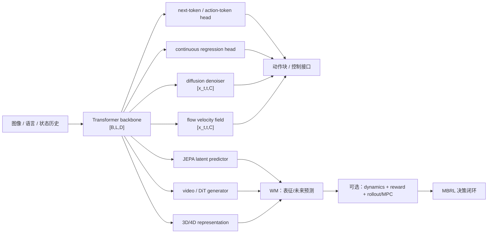

# 模型基础：Transformer、Diffusion 与 Flow Matching

这一页讲四件事：输入是什么，张量怎样流动，训练时预测什么，部署时怎样得到动作或未来。Transformer、diffusion 和 flow matching 的名字可以先放一边，先把这四件事看懂。公式是常见实现的简化写法，具体项目可能换 token 化方式、条件注入位置或采样器。

## 0. 统一记号

| 符号 | 形状/含义 | 在具身任务中的例子 |
| --- | --- | --- |
| $B$ | batch size | 并行轨迹或图像样本数 |
| $L$ | token 序列长度 | 图像 patch、语言 token、历史状态 token |
| $D$ | hidden/channel dimension | Transformer 的隐向量宽度 |
| $T$ / $H$ | 时间窗口或 action horizon | 历史 $T$ 帧、未来 $H$ 步动作 |
| $A$ | 每步动作维度 | 关节、末端位姿 delta 或夹爪维度 |
| $C$ | 条件上下文 | 图像、语言、机器人状态和历史 |

常用张量约定：序列表征为 $X\in\mathbb{R}^{B\times L\times D}$，动作块为 $A_{1:H}\in\mathbb{R}^{B\times H\times A}$。`B`、`L`、`D`、`H`、`A` 必须在实现和实验表中明确，不能只写“输入一段图像、输出动作”。

## 1. Transformer：序列建模骨架

### 1.1 从输入到 token

Transformer 不限定输入必须是文字。图像 patch、视频时空 patch、语言 token、状态向量和离散 action token 都可以先映射到同一个 hidden dimension：

```text
observation / language / state
        -> tokenizer or encoder
        -> embeddings + position/time information
        -> X: [B, L, D]
        -> Transformer blocks
        -> contextual features: [B, L, D]
        -> task head: token logits, action regression, diffusion or flow head
```

位置编码、旋转位置编码（RoPE）或相对位置偏置告诉模型 token 的顺序/时空关系。多模态系统通常还需要 modality/type embedding，区分图像、语言、状态和动作 token。

### 1.2 Self-attention 的张量流

对一个 attention head，输入 $X\in\mathbb{R}^{B\times L\times D}$ 经过线性投影得到：

$$
Q=XW_Q,\qquad K=XW_K,\qquad V=XW_V.
$$

若 head dimension 为 $d_h$，则 $Q,K,V\in\mathbb{R}^{B\times L\times d_h}$，注意力输出为：

$$
\mathrm{Attn}(X)=\mathrm{softmax}\left(\frac{QK^\top}{\sqrt{d_h}}+M\right)V,
$$

其中 $M$ 是 mask。多头注意力把若干 head 的结果拼接后再投影回 $D$ 维。一个标准 block 还包含 residual connection、LayerNorm 和逐 token 的 MLP/FFN：

$$
X' = X + \mathrm{MHA}(\mathrm{LN}(X)),\qquad
X_{out}=X' + \mathrm{FFN}(\mathrm{LN}(X')).
$$

因此输入和输出通常都保持 `[B, L, D]`；变化发生在 head，而不是 Transformer block 本身。

### 1.3 Mask 决定“能看见什么”

- **双向/全注意力**：一个 token 可以读取整个上下文，常见于图像理解、JEPA encoder 或条件编码器。
- **因果 mask**：位置 $i$ 只能读取不晚于 $i$ 的 token，常见于自回归语言/动作 token 生成。
- **混合 mask**：图像和指令 token 可双向互读，而待生成的动作 token 仍按时间因果读取；具体规则必须查看实现。

Mask 是信息流约束，不是训练目标本身。使用 Transformer 不代表模型一定是 next-token，也不代表它一定能生成视频或动作。

### 1.4 常见输出头与目标

1. **Next-token / action-token head**：对每个位置输出词表或动作码本 logits，形状通常为 `[B, L, V]`，用交叉熵训练：

   $$
   \mathcal{L}_{AR}=-\sum_i\log p_\theta(y_i\mid y_{<i},C).
   $$

   连续动作先量化为离散 bin/token；推理时自回归采样或贪心解码。
2. **连续回归 head**：输出 `[B, H, A]` 或 `[B, A]`，用 L1、L2、Huber 或高斯负对数似然拟合动作。简单但在多峰行为上可能产生平均动作。
3. **Diffusion head**：Transformer 提取条件 $C$，另一个网络接收带噪动作 $x_t$ 并预测去噪目标。
4. **Flow-matching head**：Transformer 提取条件 $C$，网络接收路径上的动作 $x_t$ 和时间 $t$，预测速度场 $v_\theta(x_t,t,C)$。

Transformer 是 backbone/表示与条件融合机制；diffusion 和 flow matching 是生成目标与推理路径。三者可以组合，但不是同义词。

## 2. Diffusion：逐步去噪生成动作或未来

### 2.1 前向加噪

以干净动作块 $x_0\in\mathbb{R}^{B\times H\times A}$ 为例，选一个噪声步 $t$ 和噪声 $\epsilon\sim\mathcal{N}(0,I)$，常见 DDPM 参数化为：

$$
x_t=\sqrt{\bar\alpha_t}\,x_0+\sqrt{1-\bar\alpha_t}\,\epsilon.
$$

噪声日程（noise schedule）决定 $\bar\alpha_t$ 如何从接近 1 变到接近 0。训练时通常随机采样 $t$，并让网络根据条件 $C$ 从 $x_t$ 恢复信息。

### 2.2 训练目标

最常见的是噪声预测：

$$
\mathcal{L}_{\epsilon}=\mathbb{E}_{x_0,t,\epsilon}\left[\|\epsilon-\epsilon_\theta(x_t,t,C)\|_2^2\right].
$$

也可以预测原始样本 $x_0$，或预测 $v$-parameterization（在信噪比变化下通常更稳定）。阅读代码时要确认网络输出到底对应 `epsilon`、`x0` 还是 `v`，以及 loss 是否有 timestep/SNR 加权；不能仅凭“diffusion”这个名称推断。

### 2.3 推理：反复执行反向更新

从高斯噪声 $x_T$ 开始，按 $T\rightarrow0$ 的顺序调用去噪网络和 scheduler，得到 $x_0$：

```text
x_T ~ Normal(0, I)
for t = T ... 1:
    prediction = denoiser(x_t, t, condition C)
    x_{t-1} = scheduler_step(prediction, x_t, t)
return x_0[0:H]  # action chunk or future latent
```

在机器人策略中，$x$ 可以是未来 $H$ 步的关节/末端动作，而不是单个动作；执行一小段后重新观测和采样（receding horizon）。采样步数、action horizon、控制频率和端到端延迟应一并报告。

### 2.4 为什么适合连续、多峰动作

同一个观测可能对应多个合理的抓取方向或绕障路径。显式建模条件分布并从噪声采样，通常比单一 L2 回归更能保留多种模式；代价是多步采样、调度器敏感性和更高推理延迟。Diffusion Policy 是机器人动作 chunk 的代表性应用。

## 3. Flow Matching：学习速度场并积分 ODE

### 3.1 路径与条件向量场

Flow matching 不把推理写成一串离散去噪步，而是学习一个随时间变化的向量场，把简单分布传输到数据分布。最直观的直线路径取噪声 $x_0$ 和数据样本 $x_1$：

> 注意：这里的 $x_0$ 表示 flow path 的源噪声；它和上一节 diffusion 中表示“干净动作”的 $x_0$ 只是记号相同，语义不同。

$$
x_t=(1-t)x_0+t x_1,\qquad t\in[0,1],
$$

其目标速度为 $u_t=x_1-x_0$。模型学习：

$$
\mathcal{L}_{FM}=\mathbb{E}_{t,x_0,x_1,C}\left[\|v_\theta(x_t,t,C)-u_t\|_2^2\right].
$$

实际方法可以使用不同 probability path、条件构造和参数化；上式用于解释“预测速度”这一核心机制。

### 3.2 推理：ODE 数值积分

推理从噪声分布采样 $x(0)$，解条件常微分方程：

$$
\frac{d x(t)}{dt}=v_\theta(x(t),t,C),\qquad x(1)\approx x_1.
$$

Euler、Heun 或其他 ODE solver 用有限步近似积分：

```text
x = sample_noise()
for t in solver_grid(0 -> 1):
    x = x + step_size * velocity(x, t, condition C)
return x
```

因此 flow matching 的核心输出是 velocity/向量场，不是 DDPM 意义下的噪声残差；采样步数和 solver 仍会影响速度、稳定性和动作质量。π0 将 flow-based action expert 放在 VLM 条件之后，是具身场景中的重要例子。

### 3.3 与 diffusion 的边界

二者都可以从简单分布生成连续动作，也都能使用 Transformer 条件编码器，但训练/采样的语义不同：diffusion 学习去噪或等价 score 参数化，flow matching 学习路径上的速度场并做 ODE 积分。某些连续时间 diffusion、rectified flow 或蒸馏方法会让边界变得不那么明显；比较论文时应记录实际 loss、路径、solver 和采样步数，而不是只看方法标签。

## 4. 四类动作输出的对照

| 输出机制 | 训练目标 | 推理方式 | 优点 | 主要代价/风险 | 典型位置 |
| --- | --- | --- | --- | --- | --- |
| 离散 next-token | token 交叉熵 | 自回归解码 | 复用语言模型、接口清晰 | 量化误差、序列延迟、动作粒度受 bin 影响 | 离散 action-token VLA |
| 连续回归 | L1/L2/Huber/NLL | 一次前向 | 快、实现简单 | 多峰分布可能平均化，长时程相关性弱 | VLA action head、低延迟控制 |
| Diffusion | 预测 $\epsilon/x_0/v$ 的去噪 loss | 多步反向去噪 | 多模态动作、平滑 action chunk | 采样延迟、scheduler/SNR 敏感 | Diffusion Policy、部分 VLA action head |
| Flow matching | 速度场回归 | ODE solver 积分 | 连续路径、可用少步 solver/蒸馏 | path/solver 选择、速度场误差 | π0 类 flow action expert |

Transformer、diffusion、flow 不是互斥选项：Transformer 往往是 backbone，后面接 token、回归、diffusion 或 flow head。

## 5. 放回 VLA、WM、WAM 和 MBRL



- **VLA**：Transformer 融合视觉、语言和历史，输出 token、回归动作、diffusion action chunk 或 flow action chunk。
- **WM**：Transformer 可以作为 JEPA 的 encoder/predictor、视频生成器（例如 DiT 类 backbone）或 3D/4D 表征组件；控制价值需结合动作条件和下游任务指标评估。
- **WAM**：把未来表征/视频和动作生成联合或级联；需要明确未来生成是在训练期辅助，还是测试期也显式 rollout。
- **MBRL**：只有当学习到的模型被用于 dynamics/reward rollout、MPC、value 或 policy optimization 时，才写成 MBRL。一个 diffusion/video/3D 生成器本身不构成 MBRL。

### 5.1 World Model 的四类表征

世界模型的“输入是图像，输出是未来”还不够具体。实现时要先写清楚预测空间：是在像素空间预测帧，在 latent 空间预测特征，还是在带坐标的 3D/4D 空间预测场景。统一记号如下：

$$
z_t=E_\phi(o_{t-L+1:t}),\qquad
\widehat z_{t+1}=F_\theta(z_t,a_t,\xi_t),\qquad
\widehat o_{t+1}=D_\psi(\widehat z_{t+1}).
$$

解码器 $D_\psi$ 可以省略（例如只关心 JEPA 特征），但动作条件、未来目标和时间对齐不能省略。

#### 像素/视频空间

输入视频通常为 $O\in\mathbb R^{B\times L\times H\times W\times C}$，动作块为 $A\in\mathbb R^{B\times H_a\times d_a}$。模型直接输出未来帧或视频 token：

$$
\widehat O_{t+1:t+H}=G_\theta(O_{t-L+1:t},A_{t:t+H-1},C,\xi).
$$

像素重建、感知和时序损失的示意写法为

$$
\mathcal L_{\mathrm{video}}
=\lambda_1\lVert O-\widehat O\rVert_1
+\lambda_{\mathrm{perc}}\mathcal L_{\mathrm{perc}}
+\lambda_{\mathrm{temp}}\mathcal L_{\mathrm{temp}}.
$$

生成 RGB 不等于学到了可控动力学：必须做 action-conditioned rollout，并检查改变 $A$ 是否会产生可解释的未来差异。World Models、Genie 和 Cosmos Predict2 可作为视频/可交互未来预测的阅读入口；具体实现可能在压缩视频 latent 上训练，再解码回像素。

#### 全局 latent/JEPA 空间

编码器输出 $Z\in\mathbb R^{B\times L\times D_z}$，预测器在 latent 中学习：

$$
\widehat z_{t+1:t+H}=P_\theta(z_{\le t},a_{t:t+H-1}).
$$

JEPA 类目标只要求预测特征接近 target encoder 的特征，不必逐像素重建：

$$
\mathcal L_{\mathrm{pred}}
=d\!\left(\widehat z_{t+1:t+H},
\mathrm{stopgrad}\!\left(E_\phi(o_{t+1:t+H})\right)\right).
$$

如果要在 latent 中进行 MBRL，还要定义 reward/termination head，或者将 latent rollout 交给 value/MPC；否则它仍是预测表征，而不是完整的决策器。V-JEPA 2 适合学习未来可预测表征，PlaNet、Dreamer 和 TD-MPC2 则展示了把 latent dynamics 接到规划或 actor-critic 的方式。

#### 对象中心 latent：LPWM

[LPWM](https://arxiv.org/abs/2603.04553) 将一帧拆成 $M$ 个前景粒子和一个背景粒子：

$$
z_{\mathrm{fg},t}^{m}\in\mathbb R^{6+d_{\mathrm{obj}}},\qquad
z_{\mathrm{bg},t}\in\mathbb R^{d_{\mathrm{bg}}}.
$$

前景粒子的 6 个显式属性是二维位置（2）、尺度（2）、深度排序（1）和透明度（1），其余维度是外观特征。Context/action module 为每个粒子产生 latent action $c_t^m$，动力学模型输出下一帧粒子分布：

$$
p_\xi\!\left(z_{t+1}\mid z_t,c_t^{1:M},l,g\right),
$$

其中 $l$ 是语言条件，$g$ 可以是目标图像。训练目标是时序 VAE 的 ELBO，可概括为重建、KL、透明度稀疏正则和动态先验四项：

$$
\mathcal L_{\mathrm{LPWM}}
=\mathcal L_{\mathrm{rec}}
+\beta_{\mathrm{KL}}\mathcal L_{\mathrm{KL}}
+\beta_{\mathrm{reg}}\mathcal L_{\mathrm{sparse}}
+\beta_{\mathrm{dyn}}\mathcal L_{\mathrm{dyn}}.
$$

这是便于读者理解的合并写法；论文把首帧 static ELBO 和后续帧 dynamic ELBO 分开计算。LPWM 的粒子 action 是模型内部的随机变量，不能直接当成机械臂的关节动作；部署时仍需将真实 $a_t$ 与控制周期、相机视角和任务条件对齐。

#### 3D/4D 空间：GWM

显式 3D 场景可写成 Gaussian primitives 集合：

$$
S_t=\{(\mu_i,\Sigma_i,\alpha_i,c_i)\}_{i=1}^{N},
\qquad \mu_i\in\mathbb R^3,\quad \Sigma_i\in\mathbb R^{3\times3}.
$$

动作条件预测和相机渲染为

$$
\widehat S_{t+1}=F_\theta(S_t,a_t),\qquad
\widehat I_{t+1}=\mathcal R(\widehat S_{t+1};K,T^W_C).
$$

[GWM](https://arxiv.org/abs/2508.17600) 用 latent DiT 和 3D VAE 在紧凑 latent 中预测 Gaussian primitives 的传播，再用 Gaussian Splatting 重建/渲染未来场景。它同时展示了动作条件 3D 视频预测、imitation learning 表征和作为 neural simulator 支持 MBRL 三种用法。复现时要固定相机内外参、初始 3D 场景、动作时间间隔和渲染视角；静态 3DGS 或 VGGT 只能作为表示/重建前端，不能凭此声称已有世界模型。

#### 4D occupancy：体素或 triplane 的未来场景

把场景离散为 occupancy 网格时，状态可写成

$$
V_t\in\{0,1,\ldots,C\}^{X\times Y\times Z},
$$

其中 0 是空闲，其他值是占据类别。模型可以同时预测未来场景和自车/相机位姿：

$$
\widehat V_{t+1:t+H},\widehat p_{t+1:t+H}
=F_\theta(V_{t-L+1:t},p_{t-L+1:t},u_{t:t+H-1}).
$$

`u_t` 不一定是机械臂关节动作，也可能是车辆控制量、目标轨迹或下一时刻位姿。OccWorld 使用离散 scene token 和时空 Transformer 预测 occupancy 与 ego trajectory；DOME 使用时空 diffusion 和轨迹重采样增强可控性；PreWorld 把 2D 监督、3D occupancy 和 4D forecasting 放在同一训练链路；Delta-Triplane Transformers 预测 triplane 的增量而不是每次生成完整网格，SparseWorld 则用稀疏动态查询降低计算量。它们适合学习空间占据的演化、碰撞检查和规划，但不应直接当成机械臂控制器。

#### 持续 3D latent：把自运动和环境运动分开

对于单目或少视角视频，可以维护一个带坐标的 3D latent，而不是每一步生成完整 RGB。抽象写法是

$$
z_t^{3D}=E_\phi(o_{t-L+1:t},T^W_{C,t-L+1:t}),\qquad
\widehat z_{t+1}^{3D}=F_\theta(z_t^{3D},\Delta T_t,\xi_t),
$$

其中 $T^W_C$ 是相机外参，$\Delta T_t$ 是估计的相机自运动。FR3D 的核心是预测持久的 3D latent，并将自运动与场景自身变化解耦；这类模型能检查未来跨视角重建和几何一致性，但若没有真实机器人动作输入，$\Delta T_t$ 只是运动代理，不能自动等同于控制接口。

#### 3D belief 与可交互场景

3D-Belief 维护多个可能的 3D 场景假设，并随着新观测进行 belief update；WorldAct 则把静态生成的世界拆成对象级几何、可编辑部件和背景，使场景能进行碰撞感知的交互。实现时要显式记录假设索引 $k$：

$$
\{S_t^{(k)},w_t^{(k)}\}_{k=1}^{K},\qquad
S_{t+1}^{(k)}\sim F_\theta(S_t^{(k)},a_t,\xi_t),
$$

其中 $w_t^{(k)}$ 是第 $k$ 个场景假设的权重。只有当 $a_t$ 真正进入状态转移并用未来观测或任务结果验证时，这种 belief 才能称为动作条件 WM；仅有可导航或可编辑的 3D 场景仍属于场景生成/交互表示。

#### 其他 WM 设计：时间模型和条件接口

同一个表示空间可以使用完全不同的时间模型。比较论文时要把“预测什么”与“怎么预测”分开。

**离散 token 自回归（IRIS）**：先用离散 VAE 得到 $q_t$，再让因果 Transformer 预测

$$
p_\theta(q_{t+1}\mid q_{\leq t},a_{\leq t}),
\qquad
\mathcal L_{\mathrm{AR}}=-\sum_t\log p_\theta(q_{t+1}\mid q_{\leq t},a_{\leq t}).
$$

推理时把预测 token 解码为下一观测，再编码后继续 rollout。结构清楚、适合少量交互数据，但离散压缩和逐步误差会限制长时程预测。

**像素 diffusion（DIAMOND）**：对历史帧、动作和带噪未来帧做条件去噪，采样得到多种未来。它能保留较多视觉细节，但采样慢；评测不能只看 FVD/LPIPS，还要检查动作改变时未来是否按预期改变。

**语言条件（Dynalang）**：语言既可以描述任务，也可以描述“环境怎么运行”。后一种语言与视觉历史共同进入预测器：

$$
\widehat z_{t+1}=F_\theta(z_{\leq t},a_t,l_t).
$$

实验时要区分任务指令和动力学描述，检查语言是否真正帮助未见环境泛化。

**学习型物理模拟器（GNS）**：用粒子位置、速度和材料属性构成图节点，通过 message passing 预测加速度或位移：

$$
h_i^{(k+1)}=\Phi\!\left(h_i^{(k)},\sum_{j\in\mathcal N(i)}\Psi(h_i^{(k)},h_j^{(k)},e_{ij})\right).
$$

GNS 是动力学模拟器，不是视觉 WM；接入机器人还需要图像/RGB-D 编码器，以及从 action 到节点受力或边界条件的接口。

**Digital twin 和人类视频迁移**：DreMa 把显式 3D 场景与物理模拟器组合成可反事实执行的数字孪生；DreamDojo 从大规模人类视频学习连续 latent action，再用少量机器人数据校准。latent action 不能直接当成关节或末端动作。

**自主探索与共同迭代**：PlayWorld 用机器人 autonomous play 收集成功、失败和接触丰富的数据；World-VLA-Loop 让更新后的策略轨迹回流，继续校准预测未来帧和 reward 的 WM。实验需记录数据版本，否则无法区分模型改进与数据量增加的贡献。

**JEPA + diffusion（JEDI）**：直接在联合 embedding 中用 diffusion denoising 学习未来 latent，避免单独预训练 latent 与动力学目标脱节；仍需用真实任务的长时程 rollout 验证控制相关信息是否保留。

**因果/结构化 WM（Causal-JEPA）**：把 mask 从图像 patch 提升到对象 latent，强迫模型利用对象间上下文来补全被遮挡状态。它在训练时制造结构化的部分可观测和近似干预：模型应利用接触和实体关系预测未来，而不是依赖背景纹理。验证时重点看反事实/干预预测和规划效率。

**动作跟随与安全验证（WorldEcho）**：对同一初始状态施加专家和 off-expert action，比较预测的视觉变化、物体或末端的 $SE(3)$ 轨迹以及真实未来；再用风险/进度 head 和确定性 safety shield 过滤候选 action chunk。这个方向把“生成得像不像”改成“是否真的按动作执行”。

**长期记忆（ReWorld）**：短期 attention 负责当前动作跟随，少量全局 head 或位姿索引的 landmark bank 负责访问很久以前的观测。部署时要记录 KV cache、记忆条目的位姿/时间和检索规则，才能区分生成误差与记忆检索错误。

**不确定性与模型可信度（PETS）**：用 ensemble dynamics 和 trajectory sampling 产生多个未来假设，并在规划时传播预测方差。机器人应用应把不确定性和碰撞、接触、越界等安全约束分开报告；概率预测本身不是安全保证，保证通常来自独立的 deterministic shield 或 fallback。

**其他可组合方向**：DayDreamer 把同一套 latent dynamics 和 imagined rollout 放到真实机器人在线学习；SlotFormer/FOCUS 先发现对象 slot，再预测对象关系或把预测误差变成探索奖励；IRASim 在视频 Transformer 内按帧注入动作，FlowDreamer 先预测 3D scene flow 再生成 RGB-D；ViTacWorld 把触觉作为与视觉并列的未来目标；H-WM 用逻辑子目标连接高层规划和低层视觉预测；WorldEval/WorldGym 把 WM 当作策略评测环境；Robot-Factored WM 则用控制器、运动学和 URDF 渲染机器人几何，让模型主要学习物体响应。它们改变的是数据闭环、条件接口或用途，不是新的统一“第五种”表示空间。详见 [WM 其他方向](world-model-directions.md)。

#### 对照表

| 预测空间 | 典型张量 | 目标 | 适合验证 | 常见误区 |
| --- | --- | --- | --- | --- |
| 像素/视频 | $[B,L,H,W,C]$ 或视频 token | 未来帧/视频 | 外观、遮挡、视频反事实 | 画面逼真不等于动力学正确 |
| 全局 latent/JEPA | $[B,L,D_z]$ | future feature | 可预测性、迁移和低成本 rollout | latent 可能丢接触/几何 |
| 对象中心 latent/LPWM | $[B,M,6+d_{obj}]$ + background | 粒子属性和随机动态 | 对象交互、目标条件和可解释性 | 粒子 action 不等于真实控制量 |
| 3D/4D/GWM | $N$ 个 primitive 或点/体素集合 | 未来几何、外观和位姿 | 深度、视角变化和空间一致性 | 标定错误会伪装成模型误差 |
| 4D occupancy | $[B,L,X,Y,Z]$ 或稀疏/triplane token | 占据、语义和自车位姿演化 | occupancy mIoU、规划误差、长时程一致性 | 体素内存大，位姿误差会污染未来 |
| 持续 3D latent | 带坐标的 point-map/feature map | 自运动与环境运动解耦 | 跨视角重建、深度和动态一致性 | 没有真实动作时不能声称控制可用 |
| 3D belief/scene | $K$ 个场景假设及权重 | 观测更新、对象编辑或交互动作 | 未观测区域、碰撞和任务成功率 | 场景可交互不等于已学到动力学 |

统一训练/测试顺序是：采集带时间戳的 $(o_t,a_t)$ → 编码或重建当前状态 → 用真实未来监督 action-conditioned predictor → 做 $H$ 步 open-loop rollout → 只执行短 action chunk 并重新观测。把预测器接入 MPC、value 或 policy optimization 后，才进入 MBRL 闭环。

## 6. 读代码和做实验的检查单

1. 记录每个模块的输入/输出 shape：是否是 `[B,L,D]`、`[B,H,A]` 或 `[B,L,V]`？
2. 对 Transformer，确认 tokenizer、位置编码、attention mask、KV cache 和 action head。
3. 对 diffusion，确认噪声日程、`t` 的范围、预测参数化（epsilon/x0/v）、scheduler 和采样步数。
4. 对 flow matching，确认 probability path、velocity target、时间采样、ODE solver 和积分步数。
5. 对机器人闭环，固定 action horizon、控制频率、receding-horizon 规则、归一化统计和安全限幅。
6. 同时报告生成质量/预测误差、任务成功率、延迟、显存和恢复能力。

## 7. 基础论文

- [Attention Is All You Need](https://arxiv.org/abs/1706.03762)：Transformer 与 self-attention 的原始定义。
- [Denoising Diffusion Probabilistic Models](https://arxiv.org/abs/2006.11239)：DDPM 前向加噪、反向去噪和变分目标。
- [Flow Matching for Generative Modeling](https://arxiv.org/abs/2210.02747)：条件向量场与 probability path 的训练框架。
- [Scalable Diffusion Models with Transformers (DiT)](https://arxiv.org/abs/2212.09748)：Transformer 作为扩散生成 backbone 的代表。
- [Diffusion Policy](https://arxiv.org/abs/2303.04137)：连续机器人动作 chunk 的 diffusion policy。
- [π0](https://arxiv.org/abs/2410.24164)：VLM 条件下的 flow-based action expert。
- [GWM: Towards Scalable Gaussian World Models for Robotic Manipulation](https://arxiv.org/abs/2508.17600)：动作条件的 3D Gaussian 未来状态预测与 neural simulator。
- [Latent Particle World Models](https://arxiv.org/abs/2603.04553)：对象中心粒子、latent action 和自监督随机动力学。
- [OccWorld](https://arxiv.org/abs/2311.16038)：3D occupancy token 与时空 Transformer 的世界演化预测。
- [DOME](https://arxiv.org/abs/2410.10429)：可控的 diffusion occupancy world model。
- [PreWorld](https://arxiv.org/abs/2502.07309)：视觉中心的 3D occupancy、4D forecasting 与规划。
- [Delta-Triplane Transformers](https://arxiv.org/abs/2503.07338)：预测 triplane 增量的高效 4D occupancy WM。
- [RoboOccWorld](https://arxiv.org/abs/2505.05512)：面向室内机器人的 3D occupancy scene evolution 预测。
- [FR3D](https://arxiv.org/abs/2606.18250)：解耦自运动的未来动态 3D 重建。
- [PhysMani](https://arxiv.org/abs/2607.01938)：物理约束的 3D Gaussian 动力学与动态操作策略。
- [3D-Belief](https://arxiv.org/abs/2605.11367)：显式维护不确定性的 3D belief world model。
- [IRIS](https://arxiv.org/abs/2209.00588)：离散 VAE + 自回归 Transformer 的少样本世界模型。
- [DIAMOND](https://arxiv.org/abs/2405.12399)：像素 diffusion 世界模型与模型内 RL。
- [Dynalang](https://arxiv.org/abs/2308.01399)：语言条件的多模态 latent WM。
- [Learning to Simulate Complex Physics with Graph Networks](https://arxiv.org/abs/2002.09405)：粒子图物理模拟器。
- [Dream to Manipulate](https://arxiv.org/abs/2412.14957)：Gaussian 场景与物理模拟器组合的机器人 digital twin。
- [DreamDojo](https://arxiv.org/abs/2602.06949)：从人类视频学习 latent action 的机器人 WM。
- [PlayWorld](https://arxiv.org/abs/2603.09030)：从机器人自主探索学习操作 WM。
- [World-VLA-Loop](https://arxiv.org/abs/2602.06508)：WM 与 VLA 策略共同迭代的闭环训练。
- [JEDI](https://arxiv.org/abs/2605.13013)：JEPA 与 diffusion 结合的在线 MBRL 世界模型。
