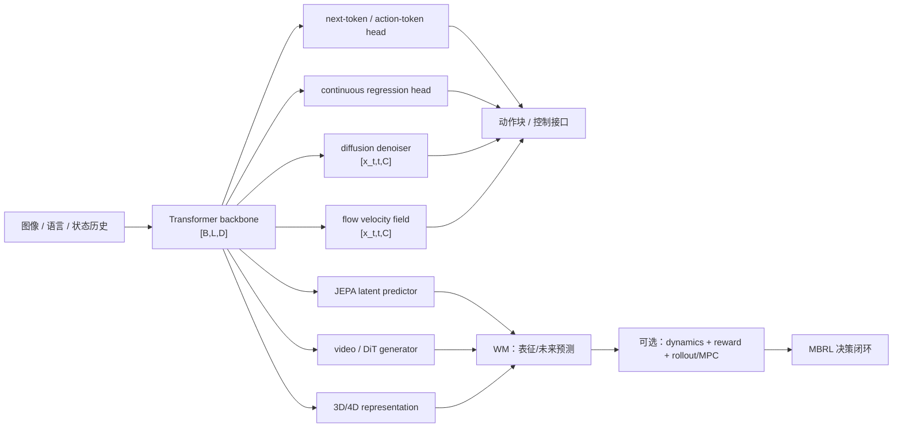

# 模型基础：Transformer、Diffusion 与 Flow Matching

> 🧠 先掌握序列建模和生成模型，再理解 VLA、WM 与 WAM 的动作接口。

**预计阅读**：25 min  
**前置知识**：Python、深度学习、张量和概率基础  
**下一步**：[VLA 与动作策略](papers.md) · [WM 专题](world-model-directions.md) · [强化学习基础](reinforcement-learning.md)

**本文路线**：统一记号 → Transformer → Diffusion → Flow Matching → VLA/WM/WAM 接口

输入是什么，张量怎样流动，训练时预测什么，部署时怎样得到动作或未来。公式是常见实现的简化写法，具体项目可能换 token 化方式、条件注入位置或采样器。

## 0. 统一记号

| 符号          | 形状/含义                 | 在具身任务中的例子                     |
| ------------- | ------------------------- | -------------------------------------- |
| $B$         | batch size                | 并行轨迹或图像样本数                   |
| $L$         | token 序列长度            | 图像 patch、语言 token、历史状态 token |
| $D$         | hidden/channel dimension  | Transformer 的隐向量宽度               |
| $T$ / $H$ | 时间窗口或 action horizon | 历史$T$ 帧、未来 $H$ 步动作        |
| $A$         | 每步动作维度              | 关节、末端位姿 delta 或夹爪维度        |
| $C$         | 条件上下文                | 图像、语言、机器人状态和历史           |

常用张量约定：序列表征为 $X\in\mathbb{R}^{B\times L\times D}$，动作块为 $A_{1:H}\in\mathbb{R}^{B\times H\times A}$。`B`、`L`、`D`、`H`、`A` 必须在实现和实验表中明确，不能只写“输入一段图像、输出动作”。

## 1. Transformer：序列建模骨架

### 1.1 从输入到 token

Transformer 不限定输入必须是文字。图像 patch、视频时空 patch、语言 token、状态向量和离散 action token 都可以先映射到同一个 hidden dimension：

```text
observation / language / state
        -> tokenizer or encoder
        -> embeddings + position/time information
        -> X: [B, L, D]
        -> Transformer blocks
        -> contextual features: [B, L, D]
        -> task head: token logits, action regression, diffusion or flow head
```

位置编码、旋转位置编码（RoPE）或相对位置偏置告诉模型 token 的顺序/时空关系。多模态系统通常还需要 modality/type embedding，区分图像、语言、状态和动作 token。

### 1.2 Self-attention 的张量流

对一个 attention head，输入 $X\in\mathbb{R}^{B\times L\times D}$ 经过线性投影得到：

$$
Q=XW_Q,\qquad K=XW_K,\qquad V=XW_V.
$$

若 head dimension 为 $d_h$，则 $Q,K,V\in\mathbb{R}^{B\times L\times d_h}$，注意力输出为：

$$
\mathrm{Attn}(X)=\mathrm{softmax}\left(\frac{QK^\top}{\sqrt{d_h}}+M\right)V,
$$

其中 $M$ 是 mask。多头注意力把若干 head 的结果拼接后再投影回 $D$ 维。一个标准 block 还包含 residual connection、LayerNorm 和逐 token 的 MLP/FFN：

$$
X' = X + \mathrm{MHA}(\mathrm{LN}(X)),\qquad
X_{out}=X' + \mathrm{FFN}(\mathrm{LN}(X')).
$$

因此输入和输出通常都保持 `[B, L, D]`；变化发生在 head，而不是 Transformer block 本身。

### 1.3 Mask 决定“能看见什么”

- **双向/全注意力**：一个 token 可以读取整个上下文，常见于图像理解、JEPA encoder 或条件编码器。
- **因果 mask**：位置 $i$ 只能读取不晚于 $i$ 的 token，常见于自回归语言/动作 token 生成。
- **混合 mask**：图像和指令 token 可双向互读，而待生成的动作 token 仍按时间因果读取；具体规则必须查看实现。

Mask 是信息流约束，不是训练目标本身。使用 Transformer 不代表模型一定是 next-token，也不代表它一定能生成视频或动作。

### 1.4 常见输出头与目标

1. **Next-token / action-token head**：对每个位置输出词表或动作码本 logits，形状通常为 `[B, L, V]`，用交叉熵训练：

   $$
   \mathcal{L}_{AR}=-\sum_i\log p_\theta(y_i\mid y_{<i},C).
   $$

   连续动作先量化为离散 bin/token；推理时自回归采样或贪心解码。
2. **连续回归 head**：输出 `[B, H, A]` 或 `[B, A]`，用 L1、L2、Huber 或高斯负对数似然拟合动作。简单但在多峰行为上可能产生平均动作。
3. **Diffusion head**：Transformer 提取条件 $C$，另一个网络接收带噪动作 $x_t$ 并预测去噪目标。
4. **Flow-matching head**：Transformer 提取条件 $C$，网络接收路径上的动作 $x_t$ 和时间 $t$，预测速度场 $v_\theta(x_t,t,C)$。

Transformer 是 backbone/表示与条件融合机制；diffusion 和 flow matching 是生成目标与推理路径。三者可以组合，但不是同义词。

## 2. Diffusion：逐步去噪生成动作或未来

### 2.1 前向加噪

以干净动作块 $x_0\in\mathbb{R}^{B\times H\times A}$ 为例，选一个噪声步 $t$ 和噪声 $\epsilon\sim\mathcal{N}(0,I)$，常见 DDPM 参数化为：

$$
x_t=\sqrt{\bar\alpha_t}\,x_0+\sqrt{1-\bar\alpha_t}\,\epsilon.
$$

噪声日程（noise schedule）决定 $\bar\alpha_t$ 如何从接近 1 变到接近 0。训练时通常随机采样 $t$，并让网络根据条件 $C$ 从 $x_t$ 恢复信息。

### 2.2 训练目标

最常见的是噪声预测：

$$
\mathcal{L}_{\epsilon}=\mathbb{E}_{x_0,t,\epsilon}\left[\|\epsilon-\epsilon_\theta(x_t,t,C)\|_2^2\right].
$$

也可以预测原始样本 $x_0$，或预测 $v$-parameterization（在信噪比变化下通常更稳定）。阅读代码时要确认网络输出到底对应 `epsilon`、`x0` 还是 `v`，以及 loss 是否有 timestep/SNR 加权；不能仅凭“diffusion”这个名称推断。

### 2.3 推理：反复执行反向更新

从高斯噪声 $x_T$ 开始，按 $T\rightarrow0$ 的顺序调用去噪网络和 scheduler，得到 $x_0$：

```text
x_T ~ Normal(0, I)
for t = T ... 1:
    prediction = denoiser(x_t, t, condition C)
    x_{t-1} = scheduler_step(prediction, x_t, t)
return x_0[0:H]  # action chunk or future latent
```

在机器人策略中，$x$ 可以是未来 $H$ 步的关节/末端动作，而不是单个动作；执行一小段后重新观测和采样（receding horizon）。采样步数、action horizon、控制频率和端到端延迟应一并报告。

### 2.4 为什么适合连续、多峰动作

同一个观测可能对应多个合理的抓取方向或绕障路径。显式建模条件分布并从噪声采样，通常比单一 L2 回归更能保留多种模式；代价是多步采样、调度器敏感性和更高推理延迟。Diffusion Policy 是机器人动作 chunk 的代表性应用。

## 3. Flow Matching：学习速度场并积分 ODE

### 3.1 路径与条件向量场

Flow matching 不把推理写成一串离散去噪步，而是学习一个随时间变化的向量场，把简单分布传输到数据分布。最直观的直线路径取噪声 $x_0$ 和数据样本 $x_1$：

> 注意：这里的 $x_0$ 表示 flow path 的源噪声；它和上一节 diffusion 中表示“干净动作”的 $x_0$ 只是记号相同，语义不同。

$$
x_t=(1-t)x_0+t x_1,\qquad t\in[0,1],
$$

其目标速度为 $u_t=x_1-x_0$。模型学习：

$$
\mathcal{L}_{FM}=\mathbb{E}_{t,x_0,x_1,C}\left[\|v_\theta(x_t,t,C)-u_t\|_2^2\right].
$$

实际方法可以使用不同 probability path、条件构造和参数化；上式用于解释“预测速度”这一核心机制。

### 3.2 推理：ODE 数值积分

推理从噪声分布采样 $x(0)$，解条件常微分方程：

$$
\frac{d x(t)}{dt}=v_\theta(x(t),t,C),\qquad x(1)\approx x_1.
$$

Euler、Heun 或其他 ODE solver 用有限步近似积分：

```text
x = sample_noise()
for t in solver_grid(0 -> 1):
    x = x + step_size * velocity(x, t, condition C)
return x
```

因此 flow matching 的核心输出是 velocity/向量场，不是 DDPM 意义下的噪声残差；采样步数和 solver 仍会影响速度、稳定性和动作质量。π0 将 flow-based action expert 放在 VLM 条件之后，是具身场景中的重要例子。

### 3.3 与 diffusion 的区别

二者都可以从简单分布生成连续动作，也都能使用 Transformer 条件编码器，但训练/采样的语义不同：diffusion 学习去噪或等价 score 参数化，flow matching 学习路径上的速度场并做 ODE 积分。某些连续时间 diffusion、rectified flow 或蒸馏方法会让区别变得不那么明显；比较论文时应记录实际 loss、路径、solver 和采样步数，而不是只看方法标签。

## 4. 四类动作输出的对照

| 输出机制        | 训练目标                           | 推理方式        | 优点                           | 主要代价/风险                           | 典型位置                               |
| --------------- | ---------------------------------- | --------------- | ------------------------------ | --------------------------------------- | -------------------------------------- |
| 离散 next-token | token 交叉熵                       | 自回归解码      | 复用语言模型、接口清晰         | 量化误差、序列延迟、动作粒度受 bin 影响 | 离散 action-token VLA                  |
| 连续回归        | L1/L2/Huber/NLL                    | 一次前向        | 快、实现简单                   | 多峰分布可能平均化，长时程相关性弱      | VLA action head、低延迟控制            |
| Diffusion       | 预测$\epsilon/x_0/v$ 的去噪 loss | 多步反向去噪    | 多模态动作、平滑 action chunk  | 采样延迟、scheduler/SNR 敏感            | Diffusion Policy、部分 VLA action head |
| Flow matching   | 速度场回归                         | ODE solver 积分 | 连续路径、可用少步 solver/蒸馏 | path/solver 选择、速度场误差            | π0 类 flow action expert              |

Transformer、diffusion、flow 不是互斥选项：Transformer 往往是 backbone，后面接 token、回归、diffusion 或 flow head。

## 5. 放回 VLA、WM、WAM 和 MBRL



- **VLA**：Transformer 融合视觉、语言和历史，输出 token、回归动作、diffusion action chunk 或 flow action chunk。
- **WM**：Transformer 可以作为 JEPA 的 encoder/predictor、视频生成器（例如 DiT 类 backbone）或 3D/4D 表征组件；控制价值需结合动作条件和下游任务指标评估。
- **WAM**：把未来表征/视频和动作生成联合或级联；需要明确未来生成是在训练期辅助，还是测试期也显式 rollout。
- **MBRL**：只有当学习到的模型被用于 dynamics/reward rollout、MPC、value 或 policy optimization 时，才写成 MBRL。一个 diffusion/video/3D 生成器本身不构成 MBRL。

### 5.1 VLA：从视觉和语言得到动作

VLA（Vision-Language-Action）通常把图像、语言和机器人状态送入同一个条件模型，再由动作头输出控制量。基本数据流可以写成：

```text
image history       -> vision encoder  -> visual tokens
language instruction -> text encoder   -> language tokens
robot state          -> state projector -> state tokens
                                      -> multimodal Transformer
                                      -> action head
                                      -> action chunk [B,H,A]
```

这里的 `H` 是一次预测的动作步数，`A` 是每步动作维度。动作可以是关节位置、关节速度、末端位姿增量、夹爪状态，也可以是离散 action token。工程上要额外记录动作坐标系、单位、控制频率、归一化统计和实际执行延迟。

#### VLA 的输入和输出

给定历史窗口 `K`，常见输入可写成：

```text
O[t-K+1:t] : [B,K,V,H_img,W_img,C]   # V 个相机视角
L          : [B,L_txt]              # 语言 token
S[t]       : [B,D_state]            # 可选关节/末端状态
```

视觉和语言 token 通常先投影到同一维度 `D`，拼接后得到 `X in R^(B x L x D)`。动作头有三种常见形式：

| 动作头            | 输出                         | 训练目标                        | 适用场景                               |
| ----------------- | ---------------------------- | ------------------------------- | -------------------------------------- |
| 离散 action token | `[B,L_a,V_a]`              | token 交叉熵                    | 复用自回归语言模型，动作粒度由码本决定 |
| 连续回归          | `[B,H,A]`                  | L1、L2、Huber 或 NLL            | 低延迟控制，结构简单                   |
| diffusion/flow    | 带噪动作或速度场 `[B,H,A]` | 去噪 loss 或 flow matching loss | 多峰动作和平滑 action chunk            |

VLA 的“语言”可以只用于任务条件，也可以与视觉 token 深度融合。读代码时要确认语言 token 是否参与 action head，而不是看到模型有语言输入就默认它学到了语言条件控制。

#### VLA 的训练和推理

常见训练分三步：

1. 视觉/语言 backbone 预训练，学习通用表征。
2. 用机器人示范 `(observation, instruction, action)` 做行为克隆或 flow/diffusion action training。
3. 可选地用 RL、偏好优化或失败数据做后训练。

推理时通常只执行动作块的前 `S` 步，重新观察后再预测：

```text
observe O[t-K+1:t], state[t], instruction
predict action chunk a[t:t+H-1]
execute a[t:t+S-1]
repeat
```

`S` 是 stride，不一定等于 `H`。如果 `S < H`，这就是 receding-horizon 执行；报告成功率时应同时报告 `H`、`S`、控制频率和端到端延迟。

### 5.2 WAM：让未来预测约束动作

WAM（World Action Model）不是单独的一种 backbone，而是把世界预测和动作生成放进同一个训练或推理闭环。它至少要回答两个问题：预测什么未来，以及这个未来怎样改变动作。

一个通用的联合写法是：

```text
z[t] = E(o[t-K+1:t])
future = F_world(z[t], a[t:t+H-1], language)
action = F_action(z[t], future, language)
```

其中 `future` 可以是未来视频、latent、对象粒子、flow、occupancy、触觉或接触状态。关键不是系统中出现了一个 future head，而是 future 分支是否对动作生成提供可检查的约束。

#### 两种基本架构

**级联 WAM** 先预测未来，再由动作模块读取未来：

```text
observation + language -> world predictor -> future representation
future representation + observation -> action head -> action chunk
```

它容易拆开调试，也能把冻结的 WM 接到已有 VLA；缺点是前一阶段的预测误差会传到动作模块，且动作可能只把 future 当作旁路特征。

**联合 WAM** 让动作和未来在同一 Transformer 或 DiT 中共同建模：

```text
observation + language + action/future tokens
                       -> shared backbone
                       -> action head + future head
```

联合模型可以用动作预测约束 future，也可以用 future prediction 约束 action。实现时要写清楚 attention mask，尤其是动作 token 是否能偷看真实未来，以及训练时的 teacher forcing 是否造成部署信息泄漏。

#### WAM 的一个训练目标

设真实未来表示为 `y[t+1:t+H]`，动作块为 `a[t:t+H-1]`，则可用：

```text
L_WAM = lambda_a L_action
      + lambda_f L_future
      + lambda_c L_coupling
      + lambda_r L_reward/value
```

其中：

- `L_action`：动作回归、action-token、diffusion 或 flow matching loss。
- `L_future`：像素、latent、slot、flow、occupancy 或触觉预测 loss。
- `L_coupling`：检查生成动作对应的未来是否比替代动作更接近真实后果，例如 inverse dynamics、action consistency 或 ranking loss。
- `L_reward/value`：可选的成功、进度、终止和风险预测。

失败轨迹不能简单丢掉。失败动作不适合作为 imitation target，但它造成的未来、碰撞、滑移或任务倒退可以作为 consequence 和 risk supervision。若训练集只有成功示范，WAM 很容易在错误动作下仍预测成功。

#### WAM 的运行时检查

读 WAM 论文或代码时，至少确认以下几点：

| 问题       | 要查什么                                                                        |
| ---------- | ------------------------------------------------------------------------------- |
| 未来表示   | 未来视频、latent、粒子、3D/4D、触觉还是 value？形状和时间跨度是多少？           |
| 动作接口   | 关节、末端 `SE(3)`、夹爪、action chunk 还是 latent action？是否能落到控制器？ |
| 未来的用途 | 训练期辅助 loss、测试期 rollout、候选动作排序还是 MPC？                         |
| 时间关系   | chunk 内是否双向，chunk 间是否因果？动作请求到真正接管之间有多少延迟？          |
| 反事实证据 | 同一初始状态输入不同动作时，未来是否按动作改变？是否覆盖失败动作？              |
| 部署代价   | denoising/ODE 步数、KV cache、control Hz、显存和真实机器人延迟。                |

训练期使用 future supervision、推理期不再生成 future 的方法，仍可称为带 world supervision 的 policy；但不能把它描述成测试时显式想象的 WAM。相反，只有视频生成而不输出动作或不影响动作选择的模型，仍是 WM 或视频生成器。

### 5.3 World Model 的四类表征

WM 的表示谱系、论文比较、数据字段和闭环评价见 [WM 专题](world-model-directions.md)。实现时先写清楚预测空间，以及动作是否真正进入状态转移。

$$
z_t=E_\phi(o_{t-L+1:t}),\qquad
\widehat z_{t+1}=F_\theta(z_t,a_t,\xi_t),\qquad
\widehat o_{t+1}=D_\psi(\widehat z_{t+1}).
$$

解码器 $D_\psi$ 可以省略，但动作条件、未来目标和时间对齐不能省略。

#### 像素/视频空间

直接预测未来帧或视频 token：

$$
\widehat O_{t+1:t+H}=G_\theta(O_{t-L+1:t},A_{t:t+H-1},C,\xi).
$$

常见目标是像素、感知或时序损失：

$$
\mathcal L_{\mathrm{video}}
=\lambda_1\lVert O-\widehat O\rVert_1
+\lambda_{\mathrm{perc}}\mathcal L_{\mathrm{perc}}
+\lambda_{\mathrm{temp}}\mathcal L_{\mathrm{temp}}.
$$

生成 RGB 不等于学到了可控动力学。要用不同动作做 rollout，检查未来是否随动作改变。具体论文和实现见 WM 专题。

#### 全局 latent/JEPA 空间

编码器输出 latent，预测器学习未来特征：

$$
\widehat z_{t+1:t+H}=P_\theta(z_{\le t},a_{t:t+H-1}).
$$

JEPA 类目标让预测特征接近 target encoder 的特征，不要求逐像素重建：

$$
\mathcal L_{\mathrm{pred}}
=d\!\left(\widehat z_{t+1:t+H},
\mathrm{stopgrad}\!\left(E_\phi(o_{t+1:t+H})\right)\right).
$$

若要用于 MBRL，还需 reward/termination head，并将 latent rollout 接到 value、MPC 或 actor-critic。只有预测表征而没有决策接口时，不应称为完整 MBRL。

#### 对象中心 latent：LPWM

[LPWM](https://arxiv.org/abs/2603.04553) 把观测拆成对象粒子和背景粒子，再预测粒子属性与随机动态：

$$
z_{\mathrm{fg},t}^{m}\in\mathbb R^{6+d_{\mathrm{obj}}},\qquad
z_{\mathrm{bg},t}\in\mathbb R^{d_{\mathrm{bg}}}.
$$

粒子可以包含位置、尺度、深度排序、透明度和外观特征：

$$
p_\xi\!\left(z_{t+1}\mid z_t,c_t^{1:M},l,g\right),
$$

其中 $l$ 是语言条件，$g$ 是可选目标图像。LPWM 的粒子 action 是模型内部变量，不能直接当成机械臂关节动作。

$$
\mathcal L_{\mathrm{LPWM}}
=\mathcal L_{\mathrm{rec}}
+\beta_{\mathrm{KL}}\mathcal L_{\mathrm{KL}}
+\beta_{\mathrm{reg}}\mathcal L_{\mathrm{sparse}}
+\beta_{\mathrm{dyn}}\mathcal L_{\mathrm{dyn}}.
$$

部署时仍需把真实 $a_t$ 与控制周期、相机视角和任务条件对齐。

#### 3D/4D 空间：GWM

显式 3D 场景可以用点、occupancy、SDF 或 Gaussian primitives 表示。例如 Gaussian 状态为：

$$
S_t=\{(\mu_i,\Sigma_i,\alpha_i,c_i)\}_{i=1}^{N},
\qquad \mu_i\in\mathbb R^3,\quad \Sigma_i\in\mathbb R^{3\times3}.
$$

动作条件预测和相机渲染为

$$
\widehat S_{t+1}=F_\theta(S_t,a_t),\qquad
\widehat I_{t+1}=\mathcal R(\widehat S_{t+1};K,T^W_C).
$$

[GWM](https://arxiv.org/abs/2508.17600) 是动作条件 3D Gaussian WM 的例子。静态 3DGS 或 VGGT 只能作为表示/重建前端，不能凭此声称已有世界模型。

#### 4D occupancy：体素或 triplane 的未来场景

occupancy WM 把场景表示成体素、triplane 或稀疏 token：

$$
V_t\in\{0,1,\ldots,C\}^{X\times Y\times Z},
$$

模型可以同时预测未来占据和相机/自车位姿：

$$
\widehat V_{t+1:t+H},\widehat p_{t+1:t+H}
=F_\theta(V_{t-L+1:t},p_{t-L+1:t},u_{t:t+H-1}).
$$

`u_t` 可以是机械臂动作、车辆控制量或目标轨迹。它们适合空间占据预测和碰撞检查，但不应直接当成机械臂控制器。

#### 其他常见形态

- **持续 3D latent**：维护带坐标的场景特征，并把相机自运动与环境变化分开。没有真实机器人动作时，位姿变化只是运动代理。
- **3D belief**：维护多个场景假设及其权重，随着新观测更新。只有动作真正进入转移并经过未来观测验证，才是动作条件 WM。
- **符号和物理状态**：预测子目标、接触、力、碰撞或终止状态，常与视频或 latent 分支并用。
- **长期记忆与不确定性**：用 KV、landmark 或 ensemble 保留历史和多种未来假设，服务长程规划与风险评估。

### 5.4 WM 表示对照表

| 预测空间 | 典型张量 | 主要用途 | 需要额外检查 |
| --- | --- | --- | --- |
| 像素/视频 | `[B,L,H,W,C]` 或视频 token | 可视化未来、生成 rollout | 画面逼真不等于动作正确 |
| 全局 latent | `[B,L,D_z]` | 低成本预测、MPC、value | latent 是否保留接触和几何 |
| 对象中心 latent | `[B,M,D_obj]` | 对象交互和组合泛化 | slot 身份、遮挡、粒子 action 接口 |
| 3D/4D | 点、Gaussian、occupancy 或 flow | 空间预测、碰撞和可达性 | 坐标系、深度、标定和实时性 |

统一流程是：采集带时间戳的 `(o[t], a[t])`，编码当前状态，用真实未来监督 predictor，做多步 rollout，再执行短 action chunk 并重新观测。只有当预测器进入 MPC、value 或 policy optimization，才形成 MBRL 闭环。

## 6. 基础论文

- [Attention Is All You Need](https://arxiv.org/abs/1706.03762)：Transformer 与 self-attention 的原始定义。
- [Denoising Diffusion Probabilistic Models](https://arxiv.org/abs/2006.11239)：DDPM 前向加噪、反向去噪和变分目标。
- [Flow Matching for Generative Modeling](https://arxiv.org/abs/2210.02747)：条件向量场与 probability path 的训练框架。
- [Scalable Diffusion Models with Transformers (DiT)](https://arxiv.org/abs/2212.09748)：Transformer 作为扩散生成 backbone 的代表。
- [Diffusion Policy](https://arxiv.org/abs/2303.04137)：连续机器人动作 chunk 的 diffusion policy。
- [π0](https://arxiv.org/abs/2410.24164)：VLM 条件下的 flow-based action expert。
- [RT-2](https://arxiv.org/abs/2307.15818)：将视觉语言模型迁移到机器人动作 token 预测，适合理解 VLA 的基本接口。
- [OpenVLA](https://arxiv.org/abs/2406.09246)：开源视觉语言动作模型，适合对照视觉 token、语言条件和连续动作解码。
- [World Action Models survey](https://arxiv.org/abs/2605.12090)：从未来表征、动作耦合和运行时角度整理 WAM。
- [Fast-WAM](https://arxiv.org/abs/2603.16666)：观察训练期 world supervision 如何与推理期高效动作生成结合。
- [GWM: Towards Scalable Gaussian World Models for Robotic Manipulation](https://arxiv.org/abs/2508.17600)：动作条件的 3D Gaussian 未来状态预测与 neural simulator。
- [Latent Particle World Models](https://arxiv.org/abs/2603.04553)：对象中心粒子、latent action 和自监督随机动力学。
- [OccWorld](https://arxiv.org/abs/2311.16038)：3D occupancy token 与时空 Transformer 的世界演化预测。
- [DOME](https://arxiv.org/abs/2410.10429)：可控的 diffusion occupancy world model。
- [PreWorld](https://arxiv.org/abs/2502.07309)：视觉中心的 3D occupancy、4D forecasting 与规划。
- [Delta-Triplane Transformers](https://arxiv.org/abs/2503.07338)：预测 triplane 增量的高效 4D occupancy WM。
- [RoboOccWorld](https://arxiv.org/abs/2505.05512)：面向室内机器人的 3D occupancy scene evolution 预测。
- [FR3D](https://arxiv.org/abs/2606.18250)：解耦自运动的未来动态 3D 重建。
- [PhysMani](https://arxiv.org/abs/2607.01938)：物理约束的 3D Gaussian 动力学与动态操作策略。
- [3D-Belief](https://arxiv.org/abs/2605.11367)：显式维护不确定性的 3D belief world model。
- [IRIS](https://arxiv.org/abs/2209.00588)：离散 VAE + 自回归 Transformer 的少样本世界模型。
- [DIAMOND](https://arxiv.org/abs/2405.12399)：像素 diffusion 世界模型与模型内 RL。
- [Dynalang](https://arxiv.org/abs/2308.01399)：语言条件的多模态 latent WM。
- [Learning to Simulate Complex Physics with Graph Networks](https://arxiv.org/abs/2002.09405)：粒子图物理模拟器。
- [Dream to Manipulate](https://arxiv.org/abs/2412.14957)：Gaussian 场景与物理模拟器组合的机器人 digital twin。
- [DreamDojo](https://arxiv.org/abs/2602.06949)：从人类视频学习 latent action 的机器人 WM。
- [PlayWorld](https://arxiv.org/abs/2603.09030)：从机器人自主探索学习操作 WM。
- [World-VLA-Loop](https://arxiv.org/abs/2602.06508)：WM 与 VLA 策略共同迭代的闭环训练。
- [JEDI](https://arxiv.org/abs/2605.13013)：JEPA 与 diffusion 结合的在线 MBRL 世界模型。
