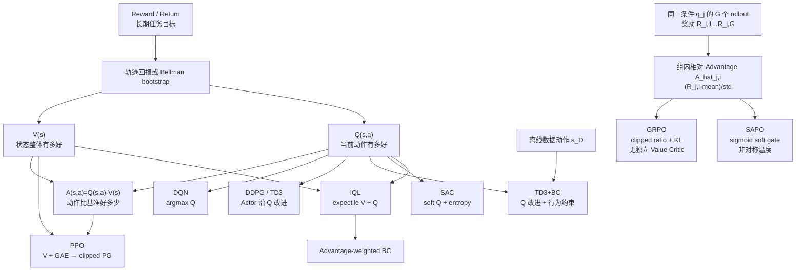
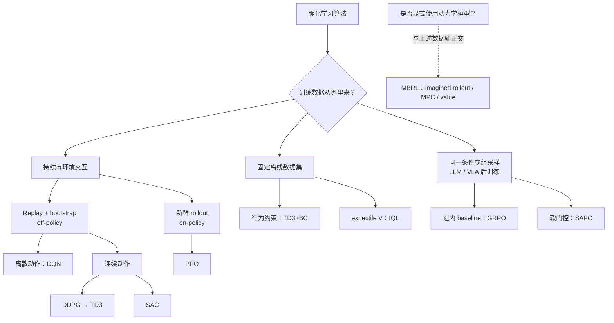

# 强化学习基础：从 V、Q、A 到经典算法、GRPO 与 SAPO

> 🎮 从单步转移和数据来源出发，理解 RL、MBRL 以及策略后训练。

**预计阅读**：35 min
**前置知识**：Python、概率、神经网络和基本机器人接口
**下一步**：[MuJoCo 教程](mujoco-tutorial.md) · [机器人学基础](robotics.md) · [Benchmark 指南](benchmarks.md)

**本文路线**：MDP → 价值函数 → 数据与训练范式 → 经典算法 → GRPO/SAPO → 机器人闭环

数据从哪里来？学的是 V、Q 还是策略？目标值怎么做出来？价值信息怎样改策略？它怎样处理估计误差和数据偏移？

本文覆盖 DQN、DDPG、TD3、TD3+BC、SAC、PPO、IQL、GRPO 和 SAPO。前七个主要用于经典控制或 offline RL，GRPO/SAPO 主要放在语言模型和 VLA 的后训练里讲。想看它们和世界模型的关系，先看[知识图谱](knowledge-map.md)；想找代码，看[代码仓与工具](codebases.md)；想按顺序读论文，看[论文清单](papers.md)。

## 0. 统一阅读框架

| 层次   | 要回答的问题                                   | 关键对象                                                        |
| ------ | ---------------------------------------------- | --------------------------------------------------------------- |
| 任务   | 智能体看见什么、能做什么、奖励什么？           | observation、action、reward、termination                        |
| 数据   | 训练时是否继续与环境交互？数据由哪个策略产生？ | online/offline、on-policy/off-policy                            |
| 估计   | 没有人工价值标签时，怎样估计长期回报？         | return、Monte Carlo、TD、Bellman bootstrap                      |
| 策略   | 价值信息怎样转化为动作或参数更新？             | `argmax`、policy gradient、weighted BC、group-relative update |
| 稳定性 | 如何缓解高估、目标漂移或分布外动作？           | replay、target network、double critic、行为约束                 |

一条实用的阅读顺序是：先理解 MDP、return 和 V/Q/A，再理解 TD 与训练范式，最后比较具体算法的价值目标和策略改进规则。

## 1. 强化学习的基本对象

### 1.1 交互与 MDP

标准交互步骤为：

```text
状态/观测 s_t --策略选择 a_t--> 环境或机器人
环境返回即时奖励 r_t 和下一状态/观测 s_{t+1}
记录转移 z_t = (s_t, a_t, r_t, s_{t+1}, d_t, b_t)
```

这里，$s_t$ 是时刻 $t$ 的状态或观测，$a_t$ 是实际执行的动作，$r_t$ 是执行动作后得到的即时奖励，$s_{t+1}$ 是下一状态或观测；$d_t\in\{0,1\}$ 是 **bootstrap 终止标记**，只有任务真正终止时才取 1；$b_t\in\{0,1\}$ 是 **轨迹边界标记**，只要下一步发生 reset 就取 1。因而时间上限处通常有 $b_t=1,d_t=0$。若只讨论核心 Bellman 更新，可省略 $b_t$，把转移简写为 $(s_t,a_t,r_t,s_{t+1},d_t)$。

一个 Markov Decision Process（MDP）通常写作 $(S,A,P,R,\gamma)$：

| 符号              | 含义     | 具身任务中需要明确的内容                       |
| ----------------- | -------- | ---------------------------------------------- |
| $S$             | 状态空间 | 图像、本体状态、力觉、历史窗口是否足以支持决策 |
| $A$             | 动作空间 | 关节位置/速度/力矩，或末端位姿增量与夹爪命令   |
| $P(s'\mid s,a)$ | 状态转移 | 机器人动力学、接触、控制器和环境共同造成的演化 |
| $R(s,a,s')$     | 奖励函数 | 成功、进度、碰撞、能耗、平滑性与安全代价       |
| $\gamma$        | 折扣因子 | 未来回报相对当前回报的重要程度                 |

真实状态通常不可完全观测，此时策略实际接收的是 observation $o_t$，可能需要历史、RNN 或 belief state。工程文档仍应明确区分环境内部 state 和策略输入 observation。

### 1.2 Reward 与 Return

Reward 是单步反馈，return 是从当前时刻开始的长期累计反馈：

$$
G_t=\sum_{k=0}^{\infty}\gamma^k r_{t+k}
=r_t+\gamma r_{t+1}+\gamma^2r_{t+2}+\cdots.
$$

价值函数估计的是 return 的条件期望，而不是即时 reward。稀疏成功奖励、稠密 shaping reward 和安全惩罚会改变优化行为；实验中应同时报告原始任务成功率，避免只用 shaped return 掩盖任务失败。

### 1.3 Policy

- 随机策略：$\pi(a\mid s)$ 表示在状态 $s$ 下选择动作 $a$ 的概率或密度。
- 确定性策略：$a=\mu(s)$，同一状态在无外部噪声时映射到同一动作。
- 隐式策略：没有独立 Actor，而由 $\mathrm{arg\,max}_a Q(s,a)$ 定义动作，例如 DQN。

## 2. V、Q、A：价值函数的统一语言

### 2.1 定义与关系

状态价值评价状态的整体前景：

$$
V^\pi(s)=\mathbb{E}_\pi[G_t\mid s_t=s].
$$

动作价值多指定了当前动作：

$$
Q^\pi(s,a)=\mathbb{E}_\pi[G_t\mid s_t=s,a_t=a].
$$

优势函数衡量动作相对当前策略基准的好坏：

$$
A^\pi(s,a)=Q^\pi(s,a)-V^\pi(s).
$$

三者满足：

$$
V^\pi(s)=\mathbb{E}_{a\sim\pi(\cdot\mid s)}[Q^\pi(s,a)],\qquad
Q^\pi(s,a)=V^\pi(s)+A^\pi(s,a).
$$

只有在最优或贪心关系下，才有 $V^*(s)=\max_a Q^*(s,a)$。对一般随机策略，$V^\pi$ 是按策略对 $Q^\pi$ 求期望，不是取最大值。

### 2.2 同一符号在不同算法中的语义

| 场景      | 价值对象              | 语义                                                   |
| --------- | --------------------- | ------------------------------------------------------ |
| 策略评估  | $V^\pi,Q^\pi$       | 评价固定策略$\pi$ 的预期回报                         |
| 最优控制  | $V^*,Q^*$           | 评价最优行为能达到的回报；DQN 接近这一语义             |
| 最大熵 RL | soft$V$, soft $Q$ | 回报中同时考虑策略熵；SAC 使用这一语义                 |
| IQL       | expectile$V$        | 数据动作$Q$ 的非对称回归基准，不是普通均值 $V^\pi$ |

“没有独立网络”不等于数学对象不存在。例如 PPO 不训练任意动作可查询的 $Q$ 网络，但 $Q^\pi=V^\pi+A^\pi$ 仍成立。

## 3. 价值监督信号从哪里来

环境通常只直接提供转移 $(s,a,r,s',d)$，不会提供 $Q$ 或 $V$ 标签。长期价值需要从完整轨迹回报或 Bellman 关系中估计。

### 3.1 Monte Carlo 与 TD

完整 rollout 后，可以用观测到的 $G_t$ 监督 $V(s_t)$ 或 $Q(s_t,a_t)$。Monte Carlo 目标直观、无 bootstrap 偏差，但要等待轨迹结束且方差较高。

TD 方法使用下一状态的当前价值估计构造目标：

$$
Q^\pi(s_t,a_t)=\mathbb{E}[r_t+\gamma(1-d_t)V^\pi(s_{t+1})].
$$

Bootstrap 能更快复用局部转移，但目标依赖当前估计，可能产生偏差和误差传播。经验回放、目标网络和双 Critic 都是在控制这一训练闭环中的不同不稳定源。

### 3.2 稀疏奖励传播

```text
s0 --r=0--> s1 --r=0--> s2 --r=1--> terminal
Q(s2,a2) ≈ 1
Q(s1,a1) ≈ 0 + 0.9 × 1   = 0.9
Q(s0,a0) ≈ 0 + 0.9 × 0.9 = 0.81
```

价值学习可理解为把未来奖励沿时间传播到更早的状态和动作。传播速度取决于轨迹覆盖、更新次数、n-step 长度和函数逼近能力。

### 3.3 终止与时间截断

任务真正终止时 $d_t=1$，未来价值应置零；仅因时间上限而切断轨迹时，通常有 $b_t=1,d_t=0$，仍应 bootstrap。把两种情况合并成同一个标记会系统性低估时间上限附近的价值。

同时记录 $b_t$ 与 $d_t$ 是为了满足两种不同需求：$b_t$ 在**数据组织上**切断轨迹，使 reset 后的样本属于新 episode；$d_t$ 在**价值学习上**决定是否保留 bootstrap。例如时间上限处仍计算 $r_t+\gamma V(s_{t+1})$，却不能把 reset 后的新初始状态接到同一条 GAE 递推中。若环境绝不会在任务完成前 reset，或数据已提供等价的折扣与边界信息，则可省略 $b_t$。

## 4. 理解算法前必须区分的训练范式

| 维度         | 类别                     | 典型算法或含义                                               |
| ------------ | ------------------------ | ------------------------------------------------------------ |
| 动作空间     | 离散 / 连续              | DQN 主要用于离散；TD3、SAC 常用于连续；PPO 可覆盖两者        |
| 策略数据关系 | on-policy / off-policy   | PPO 近似 on-policy；DQN、TD3、SAC 用 replay，属于 off-policy |
| 交互方式     | online / offline         | online 持续收集新数据；TD3+BC、IQL 主要学习固定数据集        |
| 策略形式     | 隐式 / 确定性 / 随机     | DQN 隐式；DDPG/TD3 确定性；SAC/PPO 通常随机                  |
| 是否建模环境 | model-free / model-based | 是否显式用动力学/奖励模型做 rollout、规划或策略优化          |

`on-policy/off-policy` 描述更新数据和目标策略的关系，`online/offline` 描述训练时能否继续交互，`model-free/model-based` 描述是否显式利用环境模型。三者不是同一条分类轴。

连续动作不能逐一枚举，DDPG、TD3 和 SAC 因此训练 Actor 来生成高价值动作。Off-policy 算法通常还使用：

- 经验回放：随机采样历史转移，降低连续轨迹相关性并复用数据。
- 目标网络：用缓慢变化的参数构造 Bellman target，例如 $\bar\theta\leftarrow\tau_{\mathrm{P}}\theta+(1-\tau_{\mathrm{P}})\bar\theta$，其中 $\tau_{\mathrm{P}}\in(0,1]$ 是 Polyak 更新系数。

以下统一使用数学符号。$B$ 表示 minibatch 大小，$N$ 表示并行环境数，$T$ 表示 rollout 长度，$A$ 表示连续动作维度，$B_q$ 表示条件数量，$G$ 表示每个条件的成组样本数，$L$ 表示补齐后的最大序列长度。无上横线的参数表示在线网络，上横线表示目标网络；上标 $\mathrm{old}$ 表示采样策略快照，上标 $\mathrm{ref}$ 表示参考策略；粗体表示批量张量，$\mathcal D$ 表示固定数据集。状态 $s_t$ 也可以是观测 $o_t$：在具身任务中，它常是由图像、机器人本体状态、语言指令和历史帧组成的字典，而不一定是一条向量。

### 4.1 单步转移与 replay/offline batch

DQN、DDPG、TD3、TD3+BC、SAC 和 IQL 的最小完整转移记录为

$$
z_t=(s_t,a_t,r_t,s_{t+1},d_t,b_t).
$$

从数据源采样 $B$ 条转移得到 minibatch $\mathcal B=\{z_{t_i}\}_{i=1}^{B}$，公式中的六个单步变量分别沿 batch 维堆叠如下：

| 单步符号    | 批量符号       | 含义与典型形状                                                                           |
| ----------- | -------------- | ---------------------------------------------------------------------------------------- |
| $s_t$     | $\mathbf S$  | 当前状态/观测，形状为$[B,*S]$ 或由多个 $[B,\ldots]$ 张量组成的字典                   |
| $a_t$     | $\mathbf A$  | 动作；DQN 的$\mathbf A$ 为离散索引 $[B]$，连续控制为浮点张量 $[B,A]$               |
| $r_t$     | $\mathbf R$  | 标量奖励$[B,1]$；第 $h$ 个奖励分项记为 $r_t^{(h)}$，批量形式为 $\mathbf R^{(h)}$ |
| $s_{t+1}$ | $\mathbf S'$ | 下一状态/观测，形状与$\mathbf S$ 对应；自动 reset 时必须取 reset 前的最终观测          |
| $d_t$     | $\mathbf d$  | bootstrap 终止标记$[B,1]$；任务真正终止时为 1，否则为 0                                |
| $b_t$     | $\mathbf b$  | 轨迹边界标记$[B,1]$；发生 reset 时为 1，时间上限处通常满足 $b_t=1,d_t=0$             |

训练时再由 $d_t$ 派生 Bellman bootstrap mask $m_t:=1-d_t$，批量形式为 $\mathbf m:=1-\mathbf d$；$m_t$ 不属于 $z_t$ 的原始环境字段。可选元数据包括 episode 标识 $e_t$、任务标识 $u_t$ 和安全代价 $c_t$；时间步已经由下标 $t$ 表示。它们仅用于分组、审计或明确定义的约束目标。

若只讲核心 Bellman 更新，可省略 $b_t$，把转移简写为 $(s_t,a_t,r_t,s_{t+1},d_t)$。若使用 n-step return，还应存储实际累计步数 $n_t$ 或折扣 $\gamma^{n_t}$，以及第 $n_t$ 步后的状态与 $d_{t+n_t}$。

### 4.2 PPO rollout batch

对第 $t$ 条 PPO rollout 转移，计算所需字段为

$$
x_t=(s_t,a_t,r_t,s_{t+1},d_t,b_t,
\ell_t^{\mathrm{old}},v_t^{\mathrm{old}},v_{t+1}^{\mathrm{old}}).
$$

实现时可以复用相邻位置，但必须正确处理 reset：

- 当 $b_t=0$ 时，第 $t$ 条转移的 $s_{t+1}$ 正好是 rollout 下一位置的策略输入，因此 $v_{t+1}^{\mathrm{old}}$ 可由价值数组向前平移一位得到。
- 当 $b_t=1$ 时，$s_{t+1}$ 必须是 reset **之前**的最终观测；reset 后的新初始观测记为 $s_{t+1}^{\mathrm{reset}}$，它是下一 episode 的策略输入，不能替代当前转移的 bootstrap 状态。此时应单独保留最终观测及其价值。
- rollout 在 $T$ 步处人为切段但任务未终止时，也要额外计算 $v_T^{\mathrm{old}}=V_{\psi_{\mathrm{old}}}(s_T)$；若 $d_t=1$，该下一状态价值会被 $1-d_t$ 置零，可直接存为 0。

计算 GAE 后再派生 Advantage $\hat A_t$、价值目标 $\hat V_t$ 和有效位置掩码 $M_t$，通常展平为 $[TN,\ldots]$ 后切 minibatch。各符号定义如下：

- $\ell_t^{\mathrm{old}}$：采样动作 $a_t$ 时，行为策略对该动作给出的对数概率（连续动作时为对数概率密度）

  $$
  \ell_t^{\mathrm{old}}:=\log\pi_{\theta_{\mathrm{old}}}(a_t\mid s_t).
  $$

  离散动作从 categorical 分布取对应动作的 log-prob；连续动作通常把各动作维度求和，并包含 `tanh` 等动作变换的密度修正。更新 Actor 时当前策略计算 $\ell_t^\theta:=\log\pi_\theta(a_t\mid s_t)$，于是
  $$
  \rho_t(\theta)=\exp\!\left(\ell_t^\theta-\ell_t^{\mathrm{old}}\right).
  $$

  即 PPO clip 使用的新旧策略概率比。
- $v_t^{\mathrm{old}}$：采样时 Value Critic 对当前状态未来折扣回报的预测

  $$
  v_t^{\mathrm{old}}:=V_{\psi_{\mathrm{old}}}(s_t).
  $$

  相应地，$v_{t+1}^{\mathrm{old}}:=V_{\psi_{\mathrm{old}}}(s_{t+1})$。二者都不是 $r_t$ 或真实 return；它们用于 TD residual、GAE 和可选的 value clipping。
- $\hat A_t$：由奖励、$v_t^{\mathrm{old}}$ 与 bootstrap mask 计算的 GAE。
- $\hat V_t:=\hat A_t+v_t^{\mathrm{old}}$：Value Critic 的回归目标。
- $M_t\in\{0,1\}$：有效位置掩码；padding 或无效时间步取 0。

上标 $\mathrm{old}$ 表示“产生当前 rollout 的网络版本”。同一批数据训练多个 epoch 时，$\ell_t^{\mathrm{old}}$ 与 $v_t^{\mathrm{old}}$ 始终不变。

### 4.3 GRPO/SAPO grouped sequence batch

第 $j$ 个条件下的第 $i$ 个样本补齐到长度 $L$，形成 $[B_q,G,L]$ 张量：

| 符号                                                                                           | 典型批量形状     | 含义                                                                                                                         |
| ---------------------------------------------------------------------------------------------- | ---------------- | ---------------------------------------------------------------------------------------------------------------------------- |
| $q_j$                                                                                        | $[B_q,\ldots]$ | 第$j$ 个 prompt、任务指令或绑定了初始观测的条件                                                                            |
| $y_{j,i,t}$                                                                                  | $[B_q,G,L]$    | 第$i$ 个输出在位置 $t$ 的 token、action token 或 action chunk                                                            |
| $L_{j,i}$                                                                                    | $[B_q,G]$      | 样本的有效长度                                                                                                               |
| $M_{j,i,t}\in\{0,1\}$                                                                        | $[B_q,G,L]$    | 响应/动作有效位置掩码；prompt、padding 或无效动作取 0                                                                        |
| $R_{j,i}$                                                                                    | $[B_q,G]$      | 样本总奖励；第$h$ 个奖励分项记为 $R_{j,i}^{(h)}$                                                                         |
| $\ell_{j,i,t}^{\mathrm{old}}:=\log\pi_{\theta_{\mathrm{old}}}(y_{j,i,t}\mid q_j,y_{j,i,<t})$ | $[B_q,G,L]$    | 生成策略对已采样位置的 log-prob                                                                                              |
| $\ell_{j,i,t}^{\theta}:=\log\pi_\theta(y_{j,i,t}\mid q_j,y_{j,i,<t})$                        | $[B_q,G,L]$    | 当前策略训练时重算的 log-prob                                                                                                |
| $\ell_{j,i,t}^{\mathrm{ref}}:=\log\pi_{\mathrm{ref}}(y_{j,i,t}\mid q_j,y_{j,i,<t})$          | $[B_q,G,L]$    | 启用参考策略 KL 时的参考 log-prob                                                                                            |
| $\rho_{j,i,t}=\exp(\ell_{j,i,t}^{\theta}-\ell_{j,i,t}^{\mathrm{old}})$                       | $[B_q,G,L]$    | token/动作级新旧策略概率比                                                                                                   |
| $\hat A_{j,i,t}$                                                                             | $[B_q,G,L]$    | 位置级 Advantage；仅有 outcome reward 时由组内奖励得到$\hat A_{j,i}$，再令所有有效位置共享 $\hat A_{j,i,t}=\hat A_{j,i}$ |

其中 $q_j$ 本身就是组标识。安全代价可记为 $C_{j,i}$，失败类别与终止原因作为审计元数据。对 VLA，必须明确 $q_j$ 绑定的指令、观测与初始条件，并定义 $y_{j,i,t}$ 对应 action token、action chunk 还是连续动作密度。

## 5. 七种经典控制算法、GRPO 与 SAPO

### 5.1 DQN：离散动作的 value-based RL

DQN 的训练数据来自智能体与环境的交互，而不是预先存在的 $Q$ 值标签。令 $\mathcal A$ 表示有限离散动作集合，$|\mathcal A|$ 表示动作数，$\beta_t(a\mid s)$ 表示第 $t$ 步实际收集数据的**行为策略**。先固定一个确定性的并列决策规则 $a_{\mathrm g}(s)$：对 $\mathrm{arg\,max}_{a\in\mathcal A}Q_{\theta_t}(s,a)$ 出现并列时，按预先约定的顺序选一个动作。常用的 $\epsilon_{\mathrm g}$-greedy 行为策略为

$$
\beta_t(a\mid s)=
\frac{\epsilon_{\mathrm g}}{|\mathcal A|}
+(1-\epsilon_{\mathrm g})
\mathbf 1\!\left[a=a_{\mathrm g}(s)\right],
$$

其中 $\epsilon_{\mathrm g}\in[0,1]$ 是随机探索概率，$\theta_t$ 是采样时在线 $Q$ 网络的参数，$\mathbf 1[\cdot]$ 是条件成立时取 1、否则取 0 的指示函数。智能体从 $a_t\sim\beta_t(\cdot\mid s_t)$ 取动作并执行，环境返回 $r_t$、$s_{t+1}$、$d_t$ 和 $b_t$，随后把转移 $z_t=(s_t,a_t,r_t,s_{t+1},d_t,b_t)$ 写入 replay buffer $\mathcal R$。训练数据就是从 $\mathcal R$ 中随机抽出的历史转移；buffer 初期可以先用随机策略或高探索率的 $\epsilon_{\mathrm g}$-greedy 策略填充。

DQN 是 **off-policy**：产生数据的是带随机探索的行为策略 $\beta_t$，而学习目标对应的目标策略是贪心策略

$$
\pi_Q(s)=\mathrm{arg\,max}_{a\in\mathcal A}Q(s,a).
$$

Bellman target 直接评价下一状态下的最大动作价值，而不要求下一动作继续服从产生该条数据的 $\beta_t$。此外，replay 中的样本可能由更早时刻 $k<t$ 的网络参数 $\theta_k$ 所对应的行为策略产生，当前网络仍可反复使用它们。这正是 off-policy 的核心，而不是“数据不来自环境”。因此，标准 DQN 通常是**在线交互收集数据、离策略复用数据**；如果只给一个固定数据集，也可以计算同样的 TD loss，但普通 DQN 容易对数据覆盖之外的动作产生过高估计，不能因此直接视为稳健的 offline RL 算法。

目标网络用于构造监督信号：

$$
y_t=r_t+\gamma m_t\max_{a'}Q_{\bar\theta}(s_{t+1},a'),\qquad
L_Q=\mathbb{E}_{z_t\sim\mathcal R}[(Q_\theta(s_t,a_t)-y_t)^2].
$$

它没有独立 Actor；评估策略通常是 $a^*=\mathrm{arg\,max}_a Q_\theta(s,a)$。`max` 容易挑中被噪声高估的动作，Double DQN 因而用在线网络选动作、目标网络评价动作。

#### 算法流程

1. **初始化**：创建在线 $Q_\theta$、目标 $Q_{\bar\theta}$ 和 replay buffer $\mathcal R$；令 $\bar\theta\leftarrow\theta$。
2. **由行为策略采样动作**：输入当前状态 $s_t$，从 $a_t\sim\beta_t(\cdot\mid s_t)$ 采样；也就是以概率 $\epsilon_{\mathrm g}$ 从 $\mathcal A$ 均匀随机选动作，否则选择 $\mathrm{arg\,max}_{a\in\mathcal A}Q_{\theta_t}(s_t,a)$。这里的 $\beta_t$ 负责产生数据，不是最终要学习的贪心策略 $\pi_Q$。
3. **环境交互并记录字段**：执行离散动作索引 $a_t$；环境返回奖励 $r_t$、下一状态 $s_{t+1}$、bootstrap 终止标记 $d_t$ 和轨迹边界标记 $b_t$，将 $z_t=(s_t,a_t,r_t,s_{t+1},d_t,b_t)$ 写入 $\mathcal R$。可另存 episode 标识 $e_t$ 和任务标识 $u_t$，但 DQN 的 TD 更新无需保存行为动作概率 $\beta_t(a_t\mid s_t)$。
4. **从历史数据采样并构造 target**：从 $\mathcal R$ 随机取 $B$ 个转移，它们可以来自不同时间、不同探索率和不同旧网络参数；堆叠为 $\mathbf S:[B,*S]$、离散索引 $\mathbf A:[B]$、奖励 $\mathbf R:[B,1]$、下一状态 $\mathbf S':[B,*S]$、终止标记 $\mathbf d:[B,1]$ 和边界标记 $\mathbf b:[B,1]$。用 $\mathbf A$ gather 出 $Q_\theta(\mathbf S,\mathbf A)$，并以 $\mathbf m=1-\mathbf d$ 构造 target；普通 DQN 用目标网络直接取 $\max Q$，Double DQN 用在线网络选下一动作、目标网络评价该动作。这个贪心 backup 与采样时的 $\beta_t$ 不同，因此属于 off-policy 更新。
5. **更新在线网络**：最小化 TD error，只对 $Q_\theta$ 反向传播，target 必须停止梯度。
6. **同步目标网络**：每隔若干步硬复制参数，或使用 Polyak 软更新；逐步降低 $\epsilon_{\mathrm g}$。
7. **评估**：关闭随机探索并使用 greedy action，按固定 seed 报告回报和成功率。

### 5.2 DDPG：连续动作的确定性 Actor-Critic

DDPG 用 Actor $\mu_\phi(s)$ 近似连续动作的 $\mathrm{arg\,max}$，并用 Critic 评价状态动作对：

$$
y_t=r_t+\gamma m_tQ_{\bar\theta}(s_{t+1},\mu_{\bar\phi}(s_{t+1})),
$$

$$
L_Q=\mathbb{E}[(Q_\theta(s_t,a_t)-y_t)^2],\qquad
L_\mu=-\mathbb{E}[Q_\theta(s_t,\mu_\phi(s_t))].
$$

它维护在线 Actor/Critic 及对应目标副本。训练时通常给行为动作加入探索噪声；评估时关闭噪声。DDPG 对 Critic 误差、高估和超参数较敏感，实践中常以 TD3 作为更稳健的确定性基线。

#### 算法流程

1. **初始化**：创建在线 Actor $\mu_\phi$、Critic $Q_\theta$、对应目标网络和 replay buffer，并把在线参数复制给目标网络。
2. **收集并保存转移**：用 $a_t=\mu_\phi(s_t)+\epsilon_t^{\mathrm{exp}}$ 与环境交互，其中 $\epsilon_t^{\mathrm{exp}}$ 表示探索噪声；裁剪后保存 $(s_t,a_t,r_t,s_{t+1},d_t,b_t)$。动作 $a_t\in\mathbb R^A$，Critic 使用实际执行的裁剪后动作。
3. **采样批次并构造 Critic target**：读取 $\mathbf S:[B,*S]$、$\mathbf A:[B,A]$、$\mathbf R:[B,1]$、$\mathbf S':[B,*S]$、$\mathbf d,\mathbf b:[B,1]$。由目标 Actor 生成 $\mathbf A'=\mu_{\bar\phi}(\mathbf S')$，再以 $\mathbf m=1-\mathbf d$ 计算 $\mathbf y=\mathbf R+\gamma\mathbf mQ_{\bar\theta}(\mathbf S',\mathbf A')$；replay 无需保存动作概率。
4. **更新 Critic**：最小化 $Q_\theta(s,a)$ 与停止梯度的 $y$ 之间的 TD loss。
5. **更新 Actor**：最小化 $-\mathbb E[Q_\theta(s,\mu_\phi(s))]$，梯度穿过 Critic 的动作输入传回 Actor，但此步不更新 Critic 参数。
6. **软更新目标网络**：分别更新目标 Actor 与目标 Critic；然后继续交互和训练。
7. **评估**：关闭探索噪声，直接执行 $\mu_\phi(s)$。

### 5.3 TD3：稳定 DDPG

TD3 在 DDPG 上加入三项改进：

1. 双 Critic，并在 target 中取较小值，缓解过估计。
2. 延迟更新 Actor 和目标网络，让 Critic 先获得更稳定的估计。
3. 对目标动作加入截断噪声，平滑 Critic 对窄峰动作的估计。

$$
\tilde a_{t+1}=\mathrm{clip}\!\left(
\mu_{\bar\phi}(s_{t+1})+\mathrm{clip}(\epsilon^{\mathrm{targ}},-c,c),
a_{\min},a_{\max}\right),
$$

$$
y_t=r_t+\gamma m_t\min_{i=1,2}Q_{\bar\theta_i}(s_{t+1},\tilde a_{t+1}).
$$

其中 $\epsilon^{\mathrm{targ}}$ 是 target policy smoothing 噪声，$c>0$ 是噪声截断幅度，$a_{\min},a_{\max}$ 是合法动作边界。该噪声与收集数据时的探索噪声 $\epsilon_t^{\mathrm{exp}}$ 用途不同，不能混为同一个开关。

#### 算法流程

1. **初始化**：创建一个在线 Actor、两个独立在线 Critic、三者的目标副本和 replay buffer。
2. **收集并保存转移**：给在线 Actor 动作加入探索噪声 $\epsilon_t^{\mathrm{exp}}$，执行裁剪后的连续动作，并保存 $(s_t,a_t,r_t,s_{t+1},d_t,b_t)$；其中 $a_t$ 是实际执行动作。
3. **采样批次并平滑目标动作**：读取 $\mathbf S:[B,*S]$、$\mathbf A:[B,A]$、$\mathbf R:[B,1]$、$\mathbf S':[B,*S]$、$\mathbf d,\mathbf b:[B,1]$；给目标 Actor 的下一动作加入已截断的独立噪声 $\epsilon^{\mathrm{targ}}$，再把结果裁剪到 $[a_{\min},a_{\max}]$，得到 $\widetilde{\mathbf A}'$。该噪声是训练时派生量，不属于 replay。
4. **构造保守 target**：两个目标 Critic 都评价 $\widetilde{\mathbf A}'$，以 $\mathbf m=1-\mathbf d$ 计算 $\mathbf y=\mathbf R+\gamma\mathbf m\min_iQ_{\bar\theta_i}(\mathbf S',\widetilde{\mathbf A}')$。
5. **更新双 Critic**：每个训练步分别最小化两个 Critic 的 TD loss，保持独立参数和独立误差。
6. **延迟更新策略**：令 $K_{\mathrm{delay}}$ 表示 Actor 更新间隔；每完成 $K_{\mathrm{delay}}$ 个 Critic 更新步，才用 $-Q_1(s,\mu(s))$ 更新 Actor，并软更新全部目标网络。
7. **评估**：关闭探索噪声和目标平滑噪声，只执行在线 Actor 的确定性动作。

### 5.4 TD3+BC：给离线策略改进加入行为约束

直接在固定数据上运行 TD3 时，Actor 可能利用 Critic 在数据外动作上的错误高值。TD3+BC 在 Actor 目标中加入行为克隆约束：

$$
L_{\mathrm{actor}}=-\lambda_Q\,\mathbb{E}[Q_\theta(s_t,\pi_\phi(s_t))]
+\mathbb{E}[\|\pi_\phi(s_t)-a_{t,\mathcal D}\|^2],
\qquad
\lambda_Q=\frac{\alpha}{\mathbb{E}[|Q_\theta(s_t,a_{t,\mathcal D})|]+\varepsilon_Q}.
$$

其中 $a_{t,\mathcal D}$ 是离线数据在 $s_t$ 上记录的动作，$\alpha>0$ 是价值项的基础权重，$\varepsilon_Q>0$ 防止归一化分母为零，$\lambda_Q$ 是实际乘在 Q 项上的权重；$\pi_\phi$ 和 $Q_\theta$ 分别表示当前 Actor 与 Critic。不同实现也会直接固定 $\lambda_Q$，但必须明确是否做 Q 尺度归一化，否则两项的相对权重不可比。

#### 算法流程

1. **准备并校验固定数据**：加载 $\mathcal D=\{(s_t,a_t,r_t,s_{t+1},d_t,b_t)\}$；连续动作 $a_t\in\mathbb R^A$。校验动作边界、终止语义与缺失字段，计算状态/动作归一化统计；可用 $e_t,u_t$ 做切分和审计，训练期间不再向环境收集数据。
2. **初始化**：创建 TD3 的 Actor、双 Critic 及目标网络。
3. **采样数据动作**：取 $\mathbf S:[B,*S]$、数据动作 $\mathbf A_{\mathcal D}:[B,A]$、$\mathbf R:[B,1]$、$\mathbf S':[B,*S]$、$\mathbf d,\mathbf b:[B,1]$；Critic 只在 $(\mathbf S,\mathbf A_{\mathcal D})$ 上接受直接监督，BC 项也使用同一个 $\mathbf A_{\mathcal D}$。
4. **更新双 Critic**：沿用 TD3 的目标 Actor、target smoothing 和 clipped double Q，以 $\mathbf m=1-\mathbf d$ 构造 $\mathbf y$ 并更新两个 Critic。
5. **延迟更新 Actor**：同时最大化 $Q(s_t,\pi(s_t))$ 并最小化 $\|\pi(s_t)-a_{t,\mathcal D}\|^2$；按实现规则归一化 $Q$ 项的尺度。
6. **软更新目标网络**：延迟 Actor 更新后同步目标 Actor 和两个目标 Critic。
7. **离线评估与闭环评估**：先检查数据动作上的损失和预测分布，再按独立环境协议评估策略；除非明确进入 offline-to-online 阶段，否则评估轨迹不回流训练。

### 5.5 SAC：最大熵随机 Actor-Critic

SAC 优化回报与策略熵之和。现代连续动作版本通常维护一个随机 Actor、两个在线 Critic 和两个目标 Critic：

$$
a_{t+1}'\sim\pi_\phi(\cdot\mid s_{t+1}),
$$

$$
y_t=r_t+\gamma m_t\left[\min_iQ_{\bar\theta_i}(s_{t+1},a_{t+1}')
-\alpha\log\pi_\phi(a_{t+1}'\mid s_{t+1})\right],
$$

$$
L_\pi=\mathbb{E}_{a\sim\pi_\phi(\cdot\mid s_t)}
[\alpha\log\pi_\phi(a\mid s_t)-\min_iQ_{\theta_i}(s_t,a)].
$$

温度 $\alpha$ 控制探索与回报的权衡，可固定或自动调节。SAC 的 Critic 学习 soft $Q$，不能直接当作仅累计环境 reward 的普通 $Q$。

#### 算法流程

1. **初始化**：创建随机 Actor、两个独立在线 Critic、两个目标 Critic、replay buffer；设置固定 $\alpha$ 或可训练的 $\log\alpha$。
2. **收集并保存转移**：Actor 输出动作分布参数，通过重参数化采样并执行连续动作，保存 $(s_t,a_t,r_t,s_{t+1},d_t,b_t)$；SAC 是 off-policy，replay 不必保存采样时的动作 log-prob。
3. **采样批次并构造 soft target**：读取 $\mathbf S:[B,*S]$、$\mathbf A:[B,A]$、$\mathbf R:[B,1]$、$\mathbf S':[B,*S]$、$\mathbf d,\mathbf b:[B,1]$。当前 Actor 在 $\mathbf S'$ 上重新采样 $\mathbf A'$，并计算 $\ell_\phi':=\log\pi_\phi(\mathbf A'\mid\mathbf S'):[B,1]$；以 $\mathbf m=1-\mathbf d$ 构造 $\mathbf y=\mathbf R+\gamma\mathbf m[\min_iQ_{\bar\theta_i}(\mathbf S',\mathbf A')-\alpha\ell_\phi']$。$\mathbf A'$ 与 $\ell_\phi'$ 都是训练时派生量。
4. **更新双 Critic**：分别最小化两个 soft Q 的 TD loss。
5. **更新 Actor**：在当前状态重新采样 $a\sim\pi_\phi(\cdot\mid s)$，最小化 $\alpha\log\pi_\phi(a\mid s)-\min_iQ_{\theta_i}(s,a)$。
6. **更新温度**：若启用自动调温，更新 $\alpha$ 使策略熵接近 target entropy。
7. **更新目标 Critic**：对两个目标 Critic 做 Polyak 软更新；SAC 通常没有目标 Actor。
8. **评估**：使用策略分布的均值或确定性变换动作，关闭额外探索采样，并记录熵与回报。

### 5.6 PPO：用 Advantage 约束策略梯度更新

PPO 用当前策略收集 rollout，以 Value Critic 和 generalized advantage estimation（GAE）估计优势：

PPO 的 **loss 计算单位是单个时间位置 $t$**，但该位置的 $\hat A_t$ 依赖一段连续 rollout 中从 $t$ 往后的奖励与价值，因此采样和 Advantage 计算不能只看一个孤立 timestep。实践中通常用 $N$ 个并行环境各收集 $T$ 步，形成 $N\times T$ 个位置；rollout 不必覆盖完整 episode。若第 $T$ 步只是采样片段结束而非任务终止，就用 $v_T^{\mathrm{old}}$ bootstrap；若中间发生任务终止，则在相应 $d_t=1$ 处停止 bootstrap。

这里有三个不能混淆的长度：

| 符号                | 含义                                                 | 能否调整                                                     |
| ------------------- | ---------------------------------------------------- | ------------------------------------------------------------ |
| $\Delta t$        | 环境/控制时间步长，例如每 50 ms 输出一次动作         | 不能随意改；改变它会改变动力学、控制频率、奖励尺度和折扣语义 |
| $T$               | 每个并行环境在一次 PPO 更新前收集的 rollout 长度     | 可以作为超参数调整，不要求等于 episode 长度                  |
| $B_{\mathrm{mb}}$ | 将$NT$ 个有效位置展平后，每个优化 minibatch 的大小 | 可以调整，但应与$NT$、优化 epoch 数和显存共同设计          |

因此，“timestep 可以自由设定”需要分情况：索引 $t$ 只是序列位置；rollout 长度 $T$ 可以调；物理时间步长 $\Delta t$ 不能在不重新定义环境的情况下任意改变。对 VLA/action chunk，策略的一次决策还可能连续执行 $H$ 个底层控制步，此时应先定义策略步长 $\Delta t_{\pi}=H\Delta t_{\mathrm{ctrl}}$，并按策略步而不是底层控制步计算动作概率与 PPO ratio。

$$
\delta_t=r_t+\gamma(1-d_t)v_{t+1}^{\mathrm{old}}-v_t^{\mathrm{old}},
$$

$$
\hat A_t=\delta_t+\gamma\lambda(1-b_t)\hat A_{t+1}.
$$

其中 $\delta_t$ 是单步 TD residual，$\lambda\in[0,1]$ 是 GAE 的衰减系数；$1-b_t$ 防止 Advantage 跨越 reset 边界传播。

新旧策略的概率比为

$$
\rho_t(\theta)=\frac{\pi_\theta(a_t\mid s_t)}
{\pi_{\theta_{\mathrm{old}}}(a_t\mid s_t)}
=\exp(\ell_t^\theta-\ell_t^{\mathrm{old}}),
$$

clipped objective 为

$$
J^{CLIP}(\theta)=\mathbb{E}\left[
\min\left(\rho_t\hat A_t,
\mathrm{clip}(\rho_t,1-\epsilon_{\mathrm{clip}},1+\epsilon_{\mathrm{clip}})\hat A_t\right)
\right].
$$

其中 $\epsilon_{\mathrm{clip}}>0$ 是 PPO 概率比的裁剪半宽。

$\hat A_t>0$ 时提高已执行动作的概率，$\hat A_t<0$ 时降低概率。标准 PPO 训练 Actor 与 $V$ Critic，不训练可查询任意 $(s,a)$ 的独立 $Q$ 网络；行为策略信息通常以冻结的 $\pi_{\theta_{\mathrm{old}}}$ 或缓存的 $\ell_t^{\mathrm{old}}$ 表示。

#### 算法流程

1. **冻结行为策略信息**：把当前 Actor 复制为行为策略 $\pi_{\theta_{\mathrm{old}}}$，并准备保存每个动作的 $\ell_t^{\mathrm{old}}$。
2. **收集新 rollout 并固化字段**：用 $N$ 个并行环境采集 $T$ 步，保存 $x_t=(s_t,a_t,r_t,s_{t+1},d_t,b_t,\ell_t^{\mathrm{old}},v_t^{\mathrm{old}},v_{t+1}^{\mathrm{old}})$ 所需的数据。对 $b_t=0$ 的位置可通过数组平移复用下一状态与价值；对 $b_t=1$ 的位置必须另存 reset 前的最终观测及其价值；片段末端若未终止也要计算 bootstrap value。离散动作形状通常为 $[T,N]$，连续动作为 $[T,N,A]$，还可保存 $e_t$ 与安全代价 $c_t$。
3. **计算 GAE 与训练字段**：以 $d_t$ 控制 bootstrap、以 $b_t$ 切断跨 reset 的递推，由 rollout 派生 $\hat A_t:[T,N]$、$\hat V_t:[T,N]$ 与 $M_t:[T,N]$，并通常在 $M_t=1$ 的位置标准化 $\hat A_t$。
4. **更新 Actor**：展平有效的 $TN$ 个位置并切 minibatch，读取 $(s_t,a_t,\ell_t^{\mathrm{old}},\hat A_t,M_t)$；当前 Actor 重算 $\ell_t^\theta$ 与策略熵，再计算 $\rho_t=\exp(\ell_t^\theta-\ell_t^{\mathrm{old}})$ 并最大化 clipped objective。
5. **更新 Value Critic**：minibatch 读取 $(s_t,\hat V_t,v_t^{\mathrm{old}},M_t)$，当前 Critic 重算 $V_\psi(s_t)$ 并拟合 $\hat V_t$；实现可使用 value clipping，并控制 policy loss、value loss 与 entropy 的权重。
6. **重复有限轮优化**：对同一批 rollout 训练若干 epoch，同时监控 approximate KL、clip fraction 和 entropy，避免策略更新过大。
7. **丢弃旧批次并重新采样**：PPO 不把历史 rollout 长期放入 replay buffer；更新后重新收集与新策略匹配的数据。
8. **评估**：使用 greedy/mean action 或明确的评估采样规则，独立于训练环境统计成功率和回报。

### 5.7 IQL：不查询策略数据外动作的离线 RL

IQL 在固定数据集上学习双 $Q$、expectile $V$ 和 Actor。其 $Q$ target 不需要从当前策略采样下一动作：

$$
y_t^Q=r_t+\gamma m_tV_\psi(s_{t+1}).
$$

$V$ 用数据动作的目标 $Q$ 做非对称 expectile regression。令

$$
u_t=\min_iQ_{\bar\theta_i}(s_t,a_t)-V_\psi(s_t),
$$

则

$$
L_V=\mathbb{E}[|\tau-\mathbb{1}(u_t<0)|u_t^2].
$$

策略只拟合数据动作，但用 Advantage 给高价值动作更大权重：

$$
A_t=\min_iQ_{\bar\theta_i}(s_t,a_t)-V_\psi(s_t),
$$

$$
L_\pi=-\mathbb{E}
[\min(\exp(\beta A_t),w_{\max})\log\pi_\phi(a_t\mid s_t)].
$$

其中 $\tau\in(0,1)$ 是 expectile 水平，$\beta>0$ 控制 Advantage 权重的尖锐程度，$w_{\max}>0$ 是防止权重爆炸的上限；这里用 $\min(\cdot,w_{\max})$ 表示只设置上界。

IQL 的关键不是对数据外动作显式“取保守最小值”，而是避免在 Bellman backup 中查询当前策略产生的 OOD 动作，并在策略改进时只重加权数据动作。

#### 算法流程

1. **准备固定数据集**：加载并校验 $\mathcal D=\{(s_t,a_t,r_t,s_{t+1},d_t,b_t)\}$，再归一化状态/连续动作；可保留 $e_t,u_t$ 做切分与覆盖度审计，训练阶段不让当前策略产生新动作写回数据集。
2. **初始化**：创建双 $Q$ Critic、目标 $Q$、expectile $V_\psi$ 和 Actor。
3. **采样批次并更新 $V$**：读取 $\mathbf S:[B,*S]$、数据动作 $\mathbf A_{\mathcal D}:[B,A]$、$\mathbf R:[B,1]$、$\mathbf S':[B,*S]$、$\mathbf d,\mathbf b:[B,1]$；用停止梯度的 $\min_iQ_{\bar\theta_i}(\mathbf S,\mathbf A_{\mathcal D})$ 与 $V_\psi(\mathbf S)$ 的残差计算 expectile loss。批次不需要当前 Actor 的动作或动作概率。
4. **更新双 $Q$**：以 $\mathbf m=1-\mathbf d$ 构造 $\mathbf y_Q=\mathbf R+\gamma\mathbf mV_\psi(\mathbf S')$，分别更新两个 Critic；backup 中不查询 Actor 产生的下一动作。
5. **计算相对优势**：在数据动作上计算 $A_t=\min_iQ_{\bar\theta_i}(s_t,a_t)-V_\psi(s_t)$。
6. **更新 Actor**：把 $\exp(\beta A)$ 截断后作为权重，执行 Advantage-weighted behavior cloning；Actor 仍只拟合数据支持内的动作。
7. **更新目标 $Q$**：用 Polyak 平均同步两个目标 Critic。
8. **评估**：检查权重分布是否塌缩或爆炸，再用独立环境评估；评估转移默认不参与训练。

### 5.8 GRPO：用组内相对奖励代替 Value Critic

Group Relative Policy Optimization（GRPO）是 PPO 的一种变体，最初用于语言模型的 RL 后训练。对第 $j$ 个条件 $q_j$，旧策略采样一组输出 $\{y_{j,1},\ldots,y_{j,G}\}$，奖励模型或可验证奖励给出 $\mathbf R_j=\{R_{j,1},\ldots,R_{j,G}\}$。在 outcome supervision 下，组相对 Advantage 可写为：

$$
\hat A_{j,i,t}=\hat A_{j,i}=
\frac{R_{j,i}-\mathrm{mean}(\mathbf R_j)}
{\mathrm{std}(\mathbf R_j)+\varepsilon_{\mathrm{std}}}.
$$

其中 $\varepsilon_{\mathrm{std}}>0$ 是数值稳定项；组内标准差接近零时，该组几乎不提供相对排序信号。仅有 outcome reward 时，同一输出中的 token 共享这个 Advantage。令 token 级新旧策略概率比为

$$
\rho_{j,i,t}(\theta)=
\frac{\pi_\theta(y_{j,i,t}\mid q_j,y_{j,i,<t})}
{\pi_{\theta_{\mathrm{old}}}(y_{j,i,t}\mid q_j,y_{j,i,<t})}
=\exp(\ell_{j,i,t}^{\theta}-\ell_{j,i,t}^{\mathrm{old}}),
$$

GRPO 原文使用下列逐 token 非负 KL 估计量：

$$
D_{j,i,t}^{\mathrm{KL}}
=\exp\!\left(\ell_{j,i,t}^{\mathrm{ref}}-\ell_{j,i,t}^{\theta}\right)
-\left(\ell_{j,i,t}^{\mathrm{ref}}-\ell_{j,i,t}^{\theta}\right)-1.
$$

于是其核心目标是 PPO 式 clipped surrogate 加参考策略 KL 正则：

$$
J_{GRPO}(\theta)=\mathbb E_j\left[
\frac{1}{G}\sum_{i=1}^{G}\frac{1}{L_{j,i}}\sum_{t=1}^{L_{j,i}}
\left(
\min\left(\rho_{j,i,t}\hat A_{j,i,t},
\mathrm{clip}(\rho_{j,i,t},1-\epsilon_{\mathrm{clip}},1+\epsilon_{\mathrm{clip}})\hat A_{j,i,t}\right)
-\beta D_{j,i,t}^{\mathrm{KL}}
\right)
\right].
$$

其中 $\epsilon_{\mathrm{clip}}>0$ 是策略概率比的裁剪半宽，$\beta\ge 0$ 是参考策略 KL 正则的权重。

与 PPO 相比，GRPO 不训练单独的 Value/Critic，而用同一输入下多个候选结果的组内分数估计 baseline。这样能减少大模型后训练的显存和计算负担，但代价是每个输入必须生成多个可比较样本，并且更新质量高度依赖奖励质量、组大小与组内方差。当组内奖励几乎相同时，归一化需要数值稳定项，学习信号也会很弱。

在具身任务中，可以把“同一问题的多个回答”类比为“同一指令与可比初始条件下的多条动作 rollout”。但这只是可研究的迁移方式：环境随机性、初始状态差异、长时程 credit assignment 和真机采样成本都可能破坏组内可比性。GRPO 不能因为省去 Critic 就自动替代 PPO、SAC 或 offline RL 基线。

原始定义与公式见 [DeepSeekMath](https://arxiv.org/abs/2402.03300)。

#### 算法流程

1. **准备策略与任务**：从 SFT 策略初始化 $\pi_\theta$，建立行为策略快照 $\pi_{\theta_{\mathrm{old}}}$ 和通常冻结的参考策略 $\pi_{\mathrm{ref}}$；准备 prompts、任务指令或初始条件。
2. **成组采样并固化字段**：对每个条件 $q_j$，从 $\pi_{\theta_{\mathrm{old}}}$ 采样 $G$ 个输出/rollout；保存 $y_{j,i,t}$、$M_{j,i,t}$、$\ell_{j,i,t}^{\mathrm{old}}$ 三个 $[B_q,G,L]$ 张量和长度 $L_{j,i}:[B_q,G]$。具身任务的 $q_j$ 必须绑定指令、观测、初始状态及随机种子或场景参数，使同组结果可比。
3. **计算并记录奖励**：为每个样本保存总奖励 $R_{j,i}:[B_q,G]$，以及可选的奖励分项 $R_{j,i}^{(h)}$、安全代价 $C_{j,i}$ 和失败类型；$R_{j,i}$ 的合成规则必须固定。
4. **构造组相对 Advantage**：对同一 $q_j$ 下的 $R_{j,1:G}$ 减均值、除以标准差，得到 $\hat A_{j,i}:[B_q,G]$，再令有效位置共享 $\hat A_{j,i,t}=\hat A_{j,i}$；当组内方差接近零时加入数值稳定项或跳过无信息组。
5. **计算策略比和 KL**：当前策略在 $(q_j,y_{j,i,1:L})$ 上重算 $\ell_{j,i,t}^{\theta}$，并计算 $\rho_{j,i,t}=\exp(\ell_{j,i,t}^{\theta}-\ell_{j,i,t}^{\mathrm{old}})$；若启用参考策略 KL，再由 $\ell_{j,i,t}^{\mathrm{ref}}$ 构造 $D_{j,i,t}^{\mathrm{KL}}$。所有逐位置损失均乘 $M_{j,i,t}$。
6. **更新策略**：在固定的 group batch 上进行有限轮 minibatch 优化，最大化 clipped surrogate 并施加 KL 惩罚；GRPO 不更新独立 Value/Critic。
7. **刷新旧策略并重新采样**：完成本轮更新后令 $\theta_{\mathrm{old}}\leftarrow\theta$，再对新任务条件生成下一批 group rollouts，避免长期复用过旧的策略数据。
8. **评估与审计**：报告任务成功率/可验证奖励、组内奖励方差、KL、输出或轨迹长度、采样成本和 reward hacking；VLA 还应报告控制延迟与安全事件。

### 5.9 SAPO：用软门控替代硬裁剪

Soft Adaptive Policy Optimization（SAPO）是面向 LLM 强化学习后训练的 group-based policy optimization 方法。在论文设定中，它沿用成组采样、组相对 Advantage 和 token 级新旧策略重要性比，但不再使用 PPO/GRPO 的分段硬裁剪，而是用温度控制的 sigmoid 门控平滑缩小偏离旧策略的更新。

令 $\rho_{j,i,t}(\theta)$ 为条件 $q_j$ 下第 $i$ 个输出、第 $t$ 个 token 的新旧策略概率比，SAPO 的目标写为：

$$
\mathcal{J}_{\mathrm{SAPO}}(\theta)
=\mathbb{E}_j\left[
\frac{1}{G}\sum_{i=1}^{G}\frac{1}{L_{j,i}}
\sum_{t=1}^{L_{j,i}}
f_{j,i,t}\!\left(\rho_{j,i,t}(\theta)\right)\hat A_{j,i,t}
\right].
$$

其中软门控函数和温度选择为：

$$
f_{j,i,t}(x)=
\sigma\!\left(\tau_{j,i,t}(x-1)\right)\frac{4}{\tau_{j,i,t}},
\qquad
\tau_{j,i,t}=
\begin{cases}
\tau_{\mathrm{pos}}, & \hat A_{j,i,t}>0,\\
\tau_{\mathrm{neg}}, & \hat A_{j,i,t}\le 0.
\end{cases}
$$

对目标求导后，逐 token 梯度可写为：

$$
\nabla_\theta\mathcal J_{\mathrm{SAPO}}
=\mathbb E_j\!\left[
\frac1G\sum_{i=1}^G\frac1{L_{j,i}}
\sum_{t=1}^{L_{j,i}}
w_{j,i,t}(\theta)\,\rho_{j,i,t}(\theta)\,
\nabla_\theta\log\pi_\theta(y_{j,i,t}\mid q_j,y_{j,i,<t})
\hat A_{j,i,t}
\right].
$$

其中额外的软门控权重为：

$$
w_{j,i,t}(\theta)=4p_{j,i,t}(\theta)\left(1-p_{j,i,t}(\theta)\right),
\qquad
p_{j,i,t}(\theta)=
\sigma\!\left(\tau_{j,i,t}(\rho_{j,i,t}(\theta)-1)\right).
$$

$w_{j,i,t}$ 在 $\rho_{j,i,t}=1$ 时等于 1，偏离 1 时平滑衰减；完整梯度系数是 $w_{j,i,t}\rho_{j,i,t}\hat A_{j,i,t}$，不能只看 $w_{j,i,t}$。因子 $4/\tau$ 使软门控在 on-policy 点具有与未裁剪策略梯度一致的局部尺度。与 hard clip 在越界一侧直接产生零梯度相比，SAPO 形成连续的 soft trust region。

论文采用 $\tau_{\mathrm{neg}}>\tau_{\mathrm{pos}}$：较大的温度使负 Advantage token 的梯度随 off-policy 程度更快衰减。其动机是，大词表中降低一个已采样 token 的概率会把概率质量分散到大量未采样 token，负向更新更容易放大噪声。温度大小不是通用常数，必须结合模型、batch、更新轮数和 ratio 分布调节。

SAPO 原始结果针对语言/多模态生成模型。迁移到 VLA 时，需要先定义 token、action chunk 或连续动作密度的概率比，并验证软门控是否真的改善闭环成功率、稳定性和采样效率；不能仅凭其在 LLM/MoE 上的动机推断具身控制收益。

原始定义与公式见 [Soft Adaptive Policy Optimization](https://arxiv.org/abs/2511.20347)。

#### 算法流程

1. **准备策略与任务**：从 SFT 策略初始化当前策略 $\pi_\theta$ 和行为策略快照 $\pi_{\theta_{\mathrm{old}}}$；准备 prompts、VLM/VLA 指令或可比初始条件。
2. **成组采样并固化字段**：对每个条件 $q_j$ 从 $\pi_{\theta_{\mathrm{old}}}$ 生成 $G$ 个输出/rollout，保存 $(y_{j,i,1:L},L_{j,i},M_{j,i,1:L},\ell_{j,i,1:L}^{\mathrm{old}})$。VLA 的 $q_j$ 还应绑定指令、观测、可比初始状态和环境随机性。
3. **评分并构造 Advantage**：保存 $R_{j,i}:[B_q,G]$，并可另存奖励分项 $R_{j,i}^{(h)}$、安全代价 $C_{j,i}$ 和失败类型；按明确的 group/batch 归一化规则得到 $\hat A_{j,i}:[B_q,G]$，再定义有效位置上的 $\hat A_{j,i,t}$。核心 SAPO 目标不要求 $\ell_{j,i,t}^{\mathrm{ref}}$，只有另加 KL 正则时才需要它。
4. **计算重要性比**：当前策略重算 $\ell_{j,i,t}^{\theta}$，与固化的 $\ell_{j,i,t}^{\mathrm{old}}$ 得到 $\rho_{j,i,t}=\exp(\ell_{j,i,t}^{\theta}-\ell_{j,i,t}^{\mathrm{old}})$；以 $M_{j,i,t}$ 排除 prompt、padding 和无效动作，同时监控 $\rho$ 与 $\log\rho$ 的分布。
5. **选择非对称温度**：正 Advantage 使用 $\tau_{\mathrm{pos}}$，非正 Advantage 使用通常更大的 $\tau_{\mathrm{neg}}$。
6. **计算软门控目标**：用 $M_{j,i,t}f_{j,i,t}(\rho_{j,i,t})\hat A_{j,i,t}$ 替代 clipped surrogate，聚合有效位置并更新策略；监控完整梯度系数 $w_{j,i,t}\rho_{j,i,t}\hat A_{j,i,t}$，论文设定不需要独立 Value/Critic。
7. **刷新旧策略并重新采样**：完成有限轮 minibatch 更新后令 $\theta_{\mathrm{old}}\leftarrow\theta$，再生成下一批 group rollouts。
8. **评估与审计**：报告任务奖励/成功率、ratio 方差、软门控权重、正负 Advantage 更新占比、entropy、训练崩溃点和 reward hacking；VLA 还要报告控制延迟与安全事件。

## 6. 横向比较

### 6.1 价值量与策略形式

| 算法   | $Q$            | $V$                              | $A$           | Policy                                          | 主要数据方式           |
| ------ | ---------------- | ---------------------------------- | --------------- | ----------------------------------------------- | ---------------------- |
| DQN    | 单$Q$          | $\max Q$ 隐式得到                | 不显式          | `argmax Q` / $\epsilon_{\mathrm{g}}$-greedy | online, off-policy     |
| DDPG   | 单$Q$          | $Q(s,\mu(s))$ 隐式得到           | 不显式          | 确定性 Actor                                    | online, off-policy     |
| TD3    | 双$Q$          | 由 Actor 和$\min Q$ 隐式得到     | 不显式          | 确定性 Actor                                    | online, off-policy     |
| TD3+BC | 双$Q$          | 同 TD3                             | 不显式          | 确定性 Actor + BC                               | offline                |
| SAC    | 双 soft$Q$     | 由$Q-\alpha\log\pi$ 隐式得到     | 不显式          | 随机 Actor                                      | online, off-policy     |
| PPO    | 无独立$Q$ 网络 | 显式$V$ Critic                   | 用 GAE 计算     | 随机 Actor                                      | online, on-policy      |
| IQL    | 双$Q$          | expectile$V$                     | $Q-V$         | Advantage-weighted BC                           | offline                |
| GRPO   | 无$Q$ 网络     | 无 Value Critic；组均值作 baseline | 组内归一化奖励  | 序列策略 / VLA 策略                             | grouped policy rollout |
| SAPO   | 无$Q$ 网络     | 论文设定无 Value Critic            | 组/批归一化奖励 | 序列策略 / VLA 策略                             | grouped policy rollout |

### 6.2 下一状态价值与策略改进

| 算法   | 核心 target / 估计                                              | 价值如何改变策略                                   |
| ------ | --------------------------------------------------------------- | -------------------------------------------------- |
| DQN    | $r+\gamma m\max_{a'}Q_{\bar\theta}(s',a')$                    | 直接选最高$Q$ 的离散动作                         |
| DDPG   | $r+\gamma mQ_{\bar\theta}(s',\mu_{\bar\phi}(s'))$             | Actor 沿$Q$ 梯度更新                             |
| TD3    | $r+\gamma m\min_iQ_{\bar\theta_i}(s',\tilde a')$              | 延迟最大化$Q_{\theta_1}(s,\mu_\phi(s))$          |
| TD3+BC | Critic 基本沿用 TD3                                             | $Q$ 最大化与动作 MSE 共同约束                    |
| SAC    | $r+\gamma m(\min_iQ_{\bar\theta_i}-\alpha\log\pi_\phi)$       | 同时提高 soft$Q$ 并保持熵                        |
| PPO    | rollout +$v_t^{\mathrm{old}}$ → $\delta_t$ → $\hat A_t$ | 按$\hat A_t$ 调整概率并裁剪 $\rho_t$           |
| IQL    | $r+\gamma mV_\psi(s')$                                        | $\exp(\beta A)$ 加权模仿数据动作                 |
| GRPO   | $R_{j,1:G}$ → $\hat A_{j,i,t}$                             | 裁剪$\rho_{j,i,t}$ + $D_{j,i,t}^{\mathrm{KL}}$ |
| SAPO   | $\hat A_{j,i,t}$ + $\rho_{j,i,t}$                           | $f_{j,i,t}(\rho)$ 软门控 + 正负非对称温度        |

### 6.3 任务选型

| 条件                                                         | 优先考虑         | 说明                                          |
| ------------------------------------------------------------ | ---------------- | --------------------------------------------- |
| 离散动作且允许持续交互                                       | DQN / Double DQN | 结构清晰，可直接输出全部动作价值              |
| 连续动作、确定性控制基线                                     | TD3              | 通常比 DDPG 稳定                              |
| 连续动作、重视探索与样本复用                                 | SAC              | 随机最大熵策略，off-policy                    |
| 并行仿真采样充足、需要通用策略梯度                           | PPO              | 实现成熟，支持离散和连续动作                  |
| 固定连续控制数据集、需要简洁基线                             | TD3+BC           | 直接加入行为约束                              |
| 固定数据集、希望筛选高价值行为                               | IQL              | expectile$V$ + Advantage-weighted BC        |
| LLM/VLA 后训练，可对同一条件多次采样且有可靠评分             | GRPO             | 无独立 Critic，用组内相对奖励更新策略         |
| LLM/VLM/VLA 成组后训练，token ratio 方差较高或硬裁剪损失信号 | SAPO             | 用连续软门控平滑抑制 off-policy 更新          |
| 教学或算法消融                                               | DDPG             | 适合理解确定性 Actor-Critic，不一定是最强基线 |

算法名称不能代替实验设计。具身任务至少还要根据动作空间、奖励可得性、交互预算、数据覆盖、控制延迟、安全约束和真机风险做选择。

## 7. 记忆图

### 图 1：奖励怎样变成策略更新



记忆锚点：DQN 用 $Q$ **选动作**；DDPG/TD3/SAC 用 $Q$ **训练 Actor**；TD3+BC 额外用 $a_{t,\mathcal D}$ **限制 Actor 偏离离线数据**；PPO 用 $V$ 和 GAE **估计 Advantage**；IQL 用 $Q-V$ **加权模仿数据动作**；GRPO 用**同组相对奖励 + hard clip**；SAPO 用**同组相对奖励 + soft gate**。

### 图 2：按数据来源定位算法



PPO、GRPO 与 SAPO 都比较新旧策略概率：PPO 学习 $V(s)$ 并用 GAE，再使用 hard clip；GRPO 用同组奖励统计量替代 Value Critic，并保留 token-level hard clip；SAPO 沿用 group-based Advantage，但把硬裁剪换成带正负非对称温度的 token-level soft gate。MBRL 是另一条正交轴，可以与 online、offline 或 grouped rollout 组合。

理解新算法时，始终回到五个问题：数据从哪里来、价值对象是什么、target 怎样构造、策略怎样改进、估计误差和分布偏移怎样受控。
