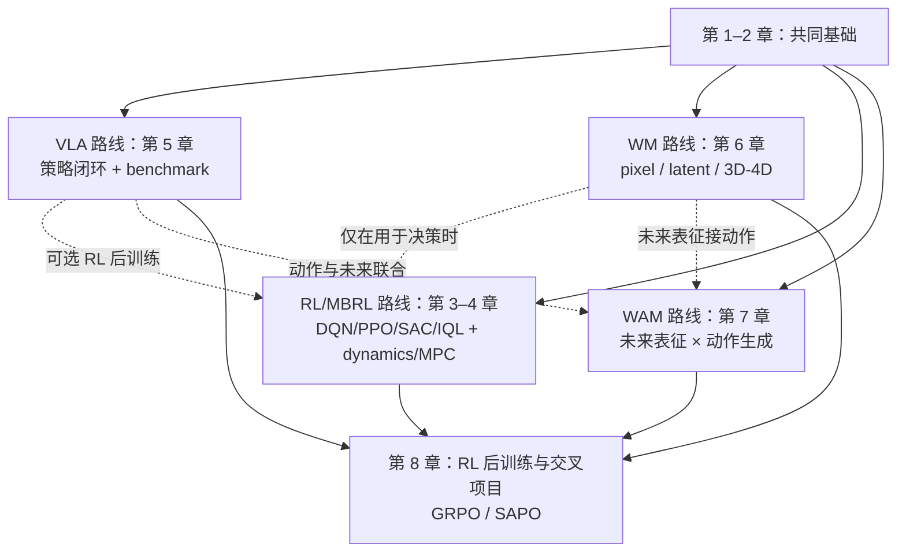

# 具身智能章节式学习路线

> 🧭 按章节从机器人基础走到 VLA、World Model、RL/MBRL 和 WAM。

**预计阅读**：15 min  
**前置知识**：Python、基础深度学习  
**下一步**：[机器人学基础](robotics.md) · [模型基础](model-basics.md)

**本文路线**：基础接口 → 模型与数据 → RL/MBRL → VLA → WM/WAM → 综合实践

不用严格从第 1 章读到第 8 章。先读共同基础，再按自己的研究问题选择路线；遇到不懂的概念，回来查对应章节即可。

## 总览

| 章节    | 主题                                | 路线      |
| ------- | ----------------------------------- | --------- |
| 第 1 章 | MDP、机器人学与控制接口             | 共同基础  |
| 第 2 章 | 模型基础、动作策略与 benchmark 协议 | 共同基础  |
| 第 3 章 | Model-free RL：Online 与 Offline    | RL/MBRL   |
| 第 4 章 | Model-based RL（MBRL）              | RL/MBRL   |
| 第 5 章 | VLM → VLA                          | VLA       |
| 第 6 章 | World Model：像素、latent 与 3D/4D  | WM        |
| 第 7 章 | WAM 与 Fast-WAM                     | WAM/交叉  |
| 第 8 章 | RL 后训练与综合项目                 | 交叉/可选 |

## 实操路线与依赖

第 1–2 章是共同基础。之后可以按目标并行推进：想做 RL 就走第 3–4 章，想做 VLA 就走第 5 章，想做世界模型就走第 6 章。

## 第 1 章｜MDP、机器人学与控制接口

### 项目链接

- [Modern Robotics](https://modernrobotics.northwestern.edu/)：运动学、动力学和控制教材。
- [ModernRobotics](https://github.com/NxRLab/ModernRobotics)：教材配套实现。
- [Pinocchio](https://github.com/stack-of-tasks/pinocchio)：刚体运动学、动力学和自动微分。
- [MoveIt 2 Humble Tutorials](https://github.com/moveit/moveit2_tutorials/tree/humble)：官方 RViz 2 quickstart、规划和执行示例。
- [ROS 2 geometry2 Humble examples](https://github.com/ros2/geometry2/tree/humble/examples_tf2_py)：官方 TF2 Python 广播和监听示例。
- [MuJoCo](https://github.com/google-deepmind/mujoco)：接触动力学仿真。
- [MuJoCo 仿真教程](mujoco-tutorial.md)：从常见的 URDF 资产入口过渡到 MJCF，运行仿真循环并接入 Gymnasium。
- [CleanRL MuJoCo PPO](https://github.com/vwxyzjn/cleanrl/blob/master/cleanrl/ppo_continuous_action.py)：用一个 Gymnasium 连续动作 PPO 文件跑通训练循环。
- [Isaac Sim 仿真教程](isaac-sim-tutorial.md)：导入 URDF 到 USD 场景，读取 Articulation/传感器并了解 Isaac Lab。
- [XPolicyLab 教程](xpolicylab-tutorial.md)：用统一的策略适配器、websocket 服务和 debug 后端连接 RoboDojo。
- [ROS 2 Humble 文档](https://docs.ros.org/en/humble/)：节点、topic、TF/tf2 和工具链；本仓库机器人学章节统一以 Ubuntu 22.04 + ROS 2 Humble 为基线。
- [MoveIt 2 Humble 文档](https://moveit.picknik.ai/humble/index.html)：URDF/SRDF、Planning Scene、规划与轨迹执行。
- [机器人学基础](robotics.md)：将 TF、`rclpy`、RViz 2、MoveIt 2 和控制接口串成一个可排查的闭环。

## 第 2 章｜模型基础、动作策略与 benchmark

### 项目链接

- [模型基础](model-basics.md)：Transformer、diffusion、flow matching 与 DiT。
- [Transformers](https://github.com/huggingface/transformers)：Transformer backbone 与多模态模型接口。
- [Diffusers](https://github.com/huggingface/diffusers)：diffusion、scheduler 和 DiT 工具链。
- [Flow Matching](https://github.com/facebookresearch/flow_matching)：probability path、velocity field 和 ODE 采样。
- [DiT](https://github.com/facebookresearch/DiT)：Transformer diffusion backbone。
- [Diffusion Policy](https://github.com/real-stanford/diffusion_policy)：连续动作 chunk 策略。
- [OpenPI](https://github.com/Physical-Intelligence/openpi)：π0/π0.5 开源实现。
- [GR00T N1](https://arxiv.org/abs/2503.14734)、[SmolVLA](https://arxiv.org/abs/2506.01844)、[MolmoAct](https://arxiv.org/abs/2508.07917)：分别看人形基础模型、小模型低延迟部署和空间动作推理。

## 第 3 章｜Model-free RL：Online 与 Offline

先阅读[强化学习基础](reinforcement-learning.md)，用数据来源、价值对象、bootstrap target、策略改进和稳定性机制这五个问题统一理解 DQN、DDPG、TD3、TD3+BC、SAC、PPO 与 IQL；GRPO/SAPO 放在第 8 章的基础模型/VLA 后训练语境中学习。

### 项目链接

- [Gym](https://github.com/openai/gym)：经典 Gym 环境 API（维护状态以仓库说明为准）。
- [Gymnasium](https://github.com/Farama-Foundation/Gymnasium)：统一环境 API。
- [Stable-Baselines3](https://github.com/DLR-RM/stable-baselines3)：PPO、SAC、DQN 等实现。
- [CleanRL](https://github.com/vwxyzjn/cleanrl)：PPO、SAC、DQN 等单文件实现。
- [d3rlpy](https://github.com/takuseno/d3rlpy)：IQL、CQL 等 offline RL 实现与数据接口。
- [Implicit Q-Learning](https://github.com/ikostrikov/implicit_q_learning)：IQL 参考实现。
- [Minari](https://github.com/Farama-Foundation/Minari)：离线轨迹数据 API。

## 第 4 章｜Model-based RL（MBRL）

### 项目链接

- [TD-MPC2](https://github.com/nicklashansen/tdmpc2)：潜空间动力学、价值学习与 MPC。
- [DreamerV3](https://github.com/danijar/dreamerv3)：latent dynamics、imagined rollout 与 actor-critic。
- [World Models](https://worldmodels.github.io/)：latent dynamics + controller 的经典项目。
- [PlaNet](https://github.com/google-research/planet)：潜空间动力学与规划。
- [DMControl](https://github.com/google-deepmind/dm_control)：连续控制与 MBRL 环境。
- [ManiSkill](https://github.com/haosulab/ManiSkill)：GPU 并行操作环境。
- [Isaac Sim 仿真教程](isaac-sim-tutorial.md)：理解 Isaac Sim 场景、传感器与脚本生命周期。
- [Isaac Lab](https://github.com/isaac-sim/IsaacLab)：建立在 Isaac Sim 之上的机器人学习框架。

## 第 5 章｜从 VLM 到 VLA

### 项目链接

- [OpenVLA](https://github.com/openvla/openvla)：开源 VLA 基线与推理/微调代码。
- [OpenVLA-OFT](https://github.com/moojink/openvla-oft)：OpenVLA 的优化微调与推理实现。
- [OpenPI](https://github.com/Physical-Intelligence/openpi)：π0/π0.5 开源实现。
- [StarVLA](https://github.com/starVLA/starVLA)：模块化 VLA 研究平台。
- [LIBERO](https://github.com/Lifelong-Robot-Learning/LIBERO)：语言条件操作评测。
- [CALVIN](https://github.com/mees/calvin)：长时程语言条件操作评测。

## 第 6 章｜World Model：像素、latent 与 3D/4D

### 项目链接

- [V-JEPA 2](https://github.com/facebookresearch/vjepa2)：JEPA latent predictive learning。
- [LPWM](https://github.com/taldatech/lpwm)：对象中心 latent particles、粒子级 latent action 和随机动力学。
- [Cosmos Predict2](https://github.com/nvidia-cosmos/cosmos-predict2)：视频世界模型与 physical AI 生成。
- [GWM](https://github.com/Gaussian-World-Model/gaussianwm)：动作条件的 3D Gaussian world model 与 neural simulator。
- [VGGT](https://github.com/facebookresearch/vggt)：多视图几何与 3D 场景表示。
- [3D Gaussian Splatting](https://github.com/graphdeco-inria/gaussian-splatting)：可渲染 3D 场景表示。
- [OccWorld](https://github.com/wzzheng/OccWorld)：3D occupancy token 与未来场景/ego trajectory 预测。
- [SparseWorld](https://github.com/MSunDYY/SparseWorld)：稀疏 4D occupancy world model，适合看效率和长时程预测。
- [HY-World 2.0](https://github.com/Tencent-Hunyuan/HY-World-2.0)：多模态生成可导航 3D 世界的完整工程入口。
- [PhysMani](https://github.com/vLAR-group/PhysMani)：物理约束 3D Gaussian 动力学与动态操作策略。
- [IRIS](https://github.com/eloialonso/iris)：离散 VAE + 自回归 Transformer 世界模型。
- [DIAMOND](https://github.com/eloialonso/diamond)：像素 diffusion 世界模型与模型内 RL。
- [Dynalang](https://github.com/jlin816/dynalang)：语言条件 latent WM。
- [GNS](https://github.com/google-deepmind/deepmind-research/tree/master/learning_to_simulate)：图网络物理模拟器。
- [DriveDreamer](https://github.com/JeffWang987/DriveDreamer)：真实驾驶场景 diffusion WM。
- [DayDreamer](https://arxiv.org/abs/2206.14176)：真实机器人在线 WM/MBRL，观察少量真实交互如何进入 imagined rollout。
- [SlotFormer](https://slotformer.github.io/) 和 [FOCUS](https://arxiv.org/abs/2307.02427)：对象 slot 动力学与对象中心探索。
- [IRASim](https://arxiv.org/abs/2406.14540) 和 [FlowDreamer](https://arxiv.org/abs/2505.10075)：细粒度动作-帧对齐与显式 3D scene flow。
- [ViTacWorld](https://vitacworld.github.io/)：视觉-触觉动作条件 WM。
- [WorldEval](https://worldeval.github.io/) 和 [WorldGym](https://arxiv.org/abs/2506.00613)：用 WM 做策略 rollout 和部署前评测。
- [WM 其他方向](world-model-directions.md)：统一记录输入、动作、预测目标、时间跨度、决策接口和证据。

## 第 7 章｜WAM 与 Fast-WAM

### 项目链接

- [FastWAM](https://github.com/yuantianyuan01/FastWAM)：WAM 训练与推理代码。
- [Awesome-WAM](https://github.com/OpenMOSS/Awesome-WAM)：WAM 论文和项目索引。
- [V-JEPA 2](https://github.com/facebookresearch/vjepa2)：未来表征参考实现。
- [Cosmos Predict2](https://github.com/nvidia-cosmos/cosmos-predict2)：视频未来生成参考实现。
- 近期继续看 [Zero-WAM](https://arxiv.org/abs/2608.26103)、[WAM-TTT](https://arxiv.org/abs/2607.06988) 和 [GlanceWAM](https://arxiv.org/abs/2608.23927)：它们分别对应人类视频上下文、测试时记忆适配和异步未来想象。

## 第 8 章｜RL 后训练与综合项目

先比较 PPO 的 Value Critic + GAE、GRPO 的组内相对 Advantage + hard clip，以及 SAPO 的 group-based Advantage + soft gate。GRPO/SAPO 用于 VLA 时，要验证同组 rollout 是否具有可比任务条件、奖励是否可靠、动作概率比是否定义正确，以及成组采样成本是否可接受，不能直接假设 LLM 后训练收益会迁移到具身闭环。

### 项目链接

- [DeepSeekMath](https://arxiv.org/abs/2402.03300)：GRPO 的原始定义、group-relative Advantage、clip 与 KL 正则。
- [Soft Adaptive Policy Optimization](https://arxiv.org/abs/2511.20347)：SAPO 的 sigmoid soft gate 与正负非对称温度。
- [RLinf](https://github.com/RLinf/RLinf)：VLA/基础模型 RL 后训练基础设施。
- [StarVLA](https://github.com/starVLA/starVLA)：模块化 VLA 基座。
- [LIBERO](https://github.com/Lifelong-Robot-Learning/LIBERO)、[ManiSkill](https://github.com/haosulab/ManiSkill)、[RoboTwin 2.0](https://github.com/RoboTwin-Platform/RoboTwin)：操作评测环境。
- [bimanual-vla](https://github.com/SUNNYsyy2005/bimanual-vla)：双臂真机部署入口。
- 近期机器人策略后训练可对照 [Q-Planning](https://arxiv.org/abs/2608.21204)、[ARLI](https://arxiv.org/abs/2608.23831)、[PAC-ACT](https://arxiv.org/abs/2607.09590) 和 [GRAFT](https://arxiv.org/abs/2608.27079)，重点看失败数据、action chunk 和推理延迟怎么进入 RL。
