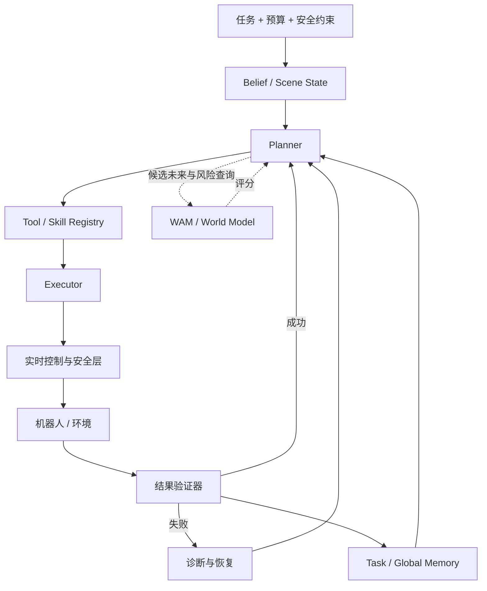

# 🧠 Robot Agent：规划、工具、记忆与恢复

> Robot Agent 在策略模型和控制器之上处理任务分解、工具调用、结果验证、记忆与失败恢复。

**预计阅读**：20 min<br>
**前置知识**：VLA、WAM、机器人动作格式与闭环控制<br>
**下一步**：[VLA 专题](vla.md) · [WAM 专题](wam.md) · [具身数据专题](embodied-data.md)

Robot Agent 读取任务和环境状态，把长时程目标拆成可以执行的子目标，然后选择 VLA、WAM 或解析技能。每次执行后，它还要判断环境是否按预期发生变化，失败时决定重试、恢复、重规划或停止。

这种编排层不等于一个更大的 VLA，也不能接管实时控制和硬件安全。下文以 [RPent（Recursive Physical Agent）](https://github.com/RLinf/RPent) 为主框架，并通过 [Harness VLA](https://arxiv.org/abs/2607.08448) 说明冻结 VLA 如何成为可重试的接触丰富原语。接口、安全门禁、训练配比和评测矩阵中超出公开项目的部分，均属于本仓库给出的工程建议。

## 1. RPent 式分层



[RPent 的公开 README](https://github.com/RLinf/RPent)把 perception、reasoning、memory、execution 和 self-evolution 组织成 service-oriented、standardized、composable 的 physical-agent 框架。部署时，低频任务推理和高频控制应当分开。planner 决定做什么、调用哪个工具以及何时停止，控制器则负责每个控制周期内的稳定执行。

| 层 | 主要职责 | 最小输出 |
| --- | --- | --- |
| Belief / Perception | 融合 RGB-D、机器人状态、历史和不确定性 | 对象、位姿、可供性、置信度、时间戳 |
| Planner | 任务分解、工具选择、重规划、预算和停止判断 | subgoal、工具名、参数、预期结果 |
| Tool Registry | 暴露 VLA、WAM、感知、导航、解析运动和夹爪技能 | 类型化 schema、前后置条件、超时、错误码 |
| Executor | 参数 grounding、动作 chunk 调度、中断和状态回传 | 执行状态、实际动作、观测窗口、错误码 |
| Evaluator | 用环境谓词和传感器证据验证是否真的改变环境 | 成功/部分成功/失败、置信度和证据 |
| Memory | 保存可追溯的成功轨迹、失败模式和适用范围 | task memory、global rules、版本和来源 |

## 2. 一次工具调用怎样形成验证闭环

```text
当前 belief + 子目标
  → 检查工具前置条件
  → grounding 到当前对象、坐标和机器人状态
  → 安全层批准并执行
  → 返回实际动作、观测、耗时和错误码
  → evaluator 检查预期后置条件
  → 成功则推进；失败则诊断、恢复或停止
```

工具接口需要写清输入输出类型、允许的坐标系、动作与观测频率、前置和后置条件、最大执行时间、可中断点、幂等性、资源锁、安全等级与错误码。`RPC completed` 只表示调用结束，并不表示对象已经抓住，更不表示整个任务成功。

起步时不需要追求很大的技能库。`detect / move_to / pick / VLA_ACT / rotate / release / inspect / finish / safe_stop` 已足以搭建基本闭环。若现有工具在固定预算内无法表达某类任务，而且新工具能在 held-out 任务上复用，再考虑扩充。

## 3. Harness VLA：把冻结 VLA 变成可重试原语

Harness VLA 的 arXiv 摘要和公开项目给出了一个具体分工：冻结的 VLA 处理局部、接触丰富的阶段，固定解析原语处理 grounding、staging、transport、navigation 和 release。系统从任务执行轨迹、全局成功规则与失败模型中学习这些原语何时适用，并不依靠不断增加技能数量。

按这一分工复现时，可以依次检查：

1. VLA 权重保持冻结，同时明确 `VLA_ACT` 的观测窗口、动作 chunk、停止条件和重试语义。
2. 每次执行都根据当前 RGB-D 与机器人状态重新 grounding，不直接回放参考场景中的坐标。
3. 记录任务特定轨迹、可迁移的成功规则、失败类别和恢复结果。
4. 对照无记忆、仅任务记忆、任务加全局记忆，以及不允许恢复的版本。

Harness VLA 是 RPent 上的一个公开案例，RPent 本身并不限于 VLA。WAM、感知服务、解析原语、仿真器和真机后端也可以接入同一框架。

## 4. WAM 在 Agent 中的明确用途

WAM 在 Agent 中更适合作为未来与风险查询服务，而不是普通动作工具。常见用法有四种：

- 候选动作筛选：预测 planner 或 VLA 所提动作 chunk 的结果，再按目标进展、碰撞和不确定性排序。
- 失败预演：执行高风险动作前模拟接触、遮挡或不可恢复状态，据此换技能或安全停止。
- 恢复规划：从失败后的 belief 预测短期可达状态，比较重新抓取、撤退、换视角和重新定位。
- 信息价值评估：判断移动相机、触摸或物体探测能否减少当前的关键不确定性。

评测时要把所有 WAM 查询计入预算。只有当预测误差在当前分布上可控时，这些结果才适合用于动作选择。若预测不确定性很高，系统应主动获取观测或回退到保守控制，不能让 planner 把模型想象当成事实。

## 5. 主动感知与 belief 更新

遮挡、指代歧义、抓取状态未知或目标状态不可见时，Agent 可以调用 `look_at / move_camera / inspect_gripper / tactile_probe / rescan` 等工具补充信息。每次主动感知都要对应一个明确问题，并设置停止条件：

- 哪个变量还不确定，它是否会改变下一步工具选择；
- 哪种观测能够降低这一不确定性；
- 新观测与旧 belief 冲突时如何更新状态；
- 获得这些信息是否值得额外的时间、动作和安全成本。

评测时单独统计感知调用次数、belief 校准误差，以及主动感知对成功率和时延的净贡献。

## 6. 记忆生命周期与污染控制

一条记忆不能只有自然语言总结，否则很难验证它来自哪次执行、适用于什么条件。记录中应包含任务与场景指纹、对象和本体、工具序列、关键观测、预期与实际后置条件、成败证据、恢复结果、适用范围、来源 run、模型和代码版本及时间。

```text
候选轨迹
  → 结果验证
  → 去重与冲突检测
  → 写入隔离区
  → held-out 回放/复核
  → 晋升为 task memory 或 global rule
  → 监控失效、降权、过期或删除
```

常见污染有三种：失败轨迹被误写为成功，特定场景坐标被提炼成通用规则，评测任务或人工答案泄漏进 memory。训练、开发和测试使用的 memory 应彼此隔离，检索结果也要带上来源与置信度。规则只有在多个对象、布局或任务模板上通过验证后，才能晋升为 global memory。

## 7. 实时安全层、watchdog 与急停

LLM 或 planner 的输出不能绕过机器人安全约束。安全层独立运行，负责：

- 关节、末端速度/加速度/力矩和工作空间限制；
- 自碰撞、环境碰撞、禁入区和人机距离检查；
- 通信心跳、观测新鲜度、控制超时和动作序列号；
- action chunk 的可中断点、保守撤退姿态和掉电/断联策略；
- 硬件急停、软件急停和恢复前人工确认机制。

watchdog 一旦发现 planner 无响应、重复调用、时间戳过旧、执行器异常或安全边界触发，就应停止执行或切换到已验证的安全控制器。Agent 的事后反思无法替代实时保护。

## 8. 训练 Agent 需要什么轨迹

Agent 数据适合按一次决策转移组织：`belief → subgoal/tool call → execution evidence → evaluator label → recovery/next belief`。记录中还要保留调用预算和墙钟时间。除了成功轨迹，错误工具、错误 grounding、部分成功、超时、主动感知和恢复同样有训练价值。

planner 或 evaluator 训练可以从以下比例起步：目标本体成功轨迹 25%，跨本体成功轨迹 10%，仿真扰动 15%，失败与恢复 25%，完整 Agent 调用轨迹 25%。这组比例是工程建议，不是 Harness VLA 报告中的训练设置。后续应根据 held-out 工具选择准确率、结果验证校准、恢复率和真机闭环成功率调整。VLA 与 WM 的统一数据配比见 [具身数据专题](embodied-data.md)。

## 9. 公平基线与调用预算

为了判断收益来自哪里，可以比较以下系统：

| 基线 | 用途 |
| --- | --- |
| Frozen VLA only | 判断 Agent 相比局部策略的真实增益 |
| VLA + 固定人工技能序列 | 区分任务分解收益与自适应重规划收益 |
| Stateless Agent | 测量 planner/工具编排本身的作用 |
| Agent + Task Memory | 测量任务内轨迹复用 |
| Agent + Task + Global Memory | 测量跨任务规则是否泛化 |
| Agent + WAM / Active Perception | 分别测量想象和信息获取的边际收益 |

所有基线使用同一个 VLA checkpoint、环境 seed、初始状态分布、成功谓词和安全限制。最大环境步、Agent turn、VLA 调用、WAM rollout、感知调用、token 或推理预算及墙钟时间也要保持一致。若这些预算不同，更高成功率可能只是来自更多重试或更长推理。

主要指标包括任务成功率和部分成功率、恢复成功率、首次成功前调用数、平均与 P95 墙钟时间、planner 与 VLA 延迟、工具错误率、evaluator 校准、安全事件、急停率，以及 memory 命中后的扰动泛化增益。汇总结果之外，还应按任务、对象、布局、操作者和失败类别分层报告。

## 10. 实操里程碑

1. 在 LIBERO、RoboCasa 或 RoboTwin 跑通冻结 VLA，并分离环境、VLA server 和 Agent process。
2. 实现类型化工具注册表、执行后验证、统一错误码、调用日志和固定预算。
3. 加入失败分类与安全恢复，先测试不使用 memory 的闭环。
4. 引入隔离的 task memory，再加入通过晋升门禁的 global memory。
5. 接入 WAM 查询或主动感知。每轮只增加一个组件，并做对应消融。
6. 在线反思、策略后训练和自动技能扩展放在最后。真机上线前完成 watchdog、急停和故障注入测试。

## 11. 项目与阅读入口

- [RPent](https://github.com/RLinf/RPent)：physical-agent 主框架与代码入口。
- [RPent Documentation](https://rpent.readthedocs.io/en/latest/)：planner、环境、benchmark 和真机配置。
- [Harness VLA Paper](https://arxiv.org/abs/2607.08448)：冻结 VLA、固定解析原语、任务执行轨迹、全局成功规则和失败模型。
- [Harness VLA Project](https://harnessvla.github.io/)：项目说明与结果入口。

更多项目见[代码仓](codebases.md)，概念关系见[知识图谱](knowledge-map.md)。数据组织、局部策略和未来预测分别参阅[具身数据](embodied-data.md)、[VLA](vla.md)与[WAM](wam.md)。
