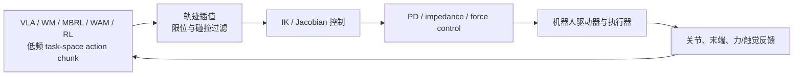

# 机器人学基础：从坐标系到真机闭环

VLA、World Model、MBRL、WAM 和 RL 最终都要落到一个具体机器人上。机器人学负责把视觉/语言/状态转换成**可执行、可约束、可测量**的运动：定义坐标系和状态，计算运动学与动力学，选择控制接口，并在真机上处理标定、延迟和安全边界。

## 1. 最小知识链

| 层级 | 核心对象 | 最小问题 | 与 VLA/WM/WAM/RL 的关系 |
| --- | --- | --- | --- |
| 几何与坐标系 | frame、齐次变换、SE(3) | 这个位姿是在哪个坐标系表达的？ | 统一图像、末端、基座和目标的表示 |
| 正/逆运动学 | $x=f(q)$、$q=f^{-1}(x)$ | 关节状态能否到达目标位姿？ | 将 task-space action 转成关节参考 |
| 微分运动学 | Jacobian $J(q)$ | 末端速度如何映射到关节速度？ | 速度控制、奇异性和可达性检查 |
| 动力学 | $M(q)\ddot q+C(q,\dot q)+g(q)=\tau$ | 需要多大力/力矩，接触会怎样？ | WM 的动作条件预测、MBRL 规划/价值、力控 |
| 轨迹与控制 | interpolation、PD、impedance | 如何平滑、稳定地执行 action chunk？ | 把低频策略输出变成高频控制命令 |
| 感知与标定 | proprioception、camera calibration、hand-eye | 观测和机器人是否在同一几何关系中？ | sim-to-real、视觉伺服、真机复现 |
| 安全与部署 | workspace、limit、collision、E-stop | 失败时如何停住并恢复？ | 真机闭环的硬约束，不由策略自行保证 |

推荐教材与工具：

- 本章统一以 [Ubuntu 22.04](https://releases.ubuntu.com/22.04/) + [ROS 2 Humble](https://docs.ros.org/en/humble/) + [MoveIt 2 Humble](https://moveit.picknik.ai/humble/index.html) 为基线。其他 ROS 2 发行版的包名、参数和 API 可能不同，不能直接套用本章命令。
- [Modern Robotics](https://modernrobotics.northwestern.edu/)：运动学、动力学、轨迹和控制的统一教材与视频。
- [ModernRobotics 仓库](https://github.com/NxRLab/ModernRobotics)：教材配套的 Python/MATLAB 实现。
- [Pinocchio](https://github.com/stack-of-tasks/pinocchio)：刚体运动学、动力学和解析/自动微分接口。

### 1.1 可以直接拿来跑的开源组合

目前没有一个官方仓库同时把 TF、RViz 2、MoveIt 2、URDF、控制器和所有依赖做成一个 Humble 极简工程。最稳妥的做法是组合官方示例，并固定分支：

| 目标 | 现成项目 | 先跑什么 |
| --- | --- | --- |
| TF2 广播/监听 | [geometry2 `examples_tf2_py`](https://github.com/ros2/geometry2/tree/humble/examples_tf2_py) | `ros2 launch examples_tf2_py broadcasters.launch.xml`，再运行 `dynamic_broadcaster`、`static_broadcaster` 或 `frame_dumper` |
| RViz 2 + MoveIt 2 | [moveit2_tutorials `humble`](https://github.com/moveit/moveit2_tutorials/tree/humble) | [RViz quickstart](https://github.com/moveit/moveit2_tutorials/tree/humble/doc/tutorials/quickstart_in_rviz)，按文档启动 demo launch |
| 机器人模型和配置 | [moveit_resources `ros2`](https://github.com/moveit/moveit_resources/tree/ros2) | 先用 Panda 资源确认 URDF、SRDF、planning group 和 RViz 显示 |
| 控制器连接 | [ros2_control_demos `humble`](https://github.com/ros-controls/ros2_control_demos/tree/humble) | 在规划成功后再接 `ros2_control`，不要把控制器问题和 TF/规划问题混在一起 |

这四个仓库分别负责坐标变换、可视化/规划、机器人资源和控制器示例。先用 `geometry2` 验证 TF 树，再用 MoveIt quickstart 验证 RViz 和规划，最后才接真实驱动。

## 2. 坐标系与 SE(3)

用 $T^A_B\in SE(3)$ 表示“坐标系 B 在坐标系 A 中的位姿”：

$$
T^A_B = \begin{bmatrix}R^A_B & p^A_B\\0 & 1\end{bmatrix},\qquad
T^A_C = T^A_B T^B_C.
$$

实践中必须明确：

1. 相机是 eye-in-hand 还是 eye-to-hand；
2. 动作是基座系、末端系还是相机系的 delta；
3. 旋转使用 rotation matrix、axis-angle、quaternion 还是 Euler angle；
4. 左/右手系、单位（m/mm、rad/deg）和时间戳是否一致。

坐标系错误通常表现为“策略看起来有反应，但方向、旋转或抓取位置系统性错误”，不能只靠重新训练解决。

## 3. TF/tf2（ROS 2 Humble）：让坐标系随时间可查询

### 3.1 理论

ROS 2 Humble 中的 TF（Transform）不是一张静态图片，而是一棵带时间戳的坐标树。每个发布者提供父坐标系到子坐标系的变换，tf2 再沿树查询任意两帧之间的变换。常见链路是：

~~~text
world/map -> odom -> base_link
                         -> camera_link -> camera_optical_frame
                         -> shoulder -> ... -> tool0
~~~

- `world`/`map`：全局地图或任务参考系；
- `odom`：连续但会漂移的里程计系；
- `base_link`：机器人本体基座；
- `camera_optical_frame`：相机光学坐标系，轴方向遵循相机约定；
- `tool0`/`ee_link`：末端工具或执行器参考系。

若已知 $T^A_B$ 和 $T^B_C$，则

$$
T^A_C=T^A_B T^B_C,\qquad
T^B_A=(T^A_B)^{-1}.
$$

tf2 查询的是**带时间的变换**。请求时刻 $t$ 的变换只能由缓存中相邻时间戳插值或外推得到；时间戳过旧、未来时间或树中断都会导致 extrapolation / lookup 错误。因此，传感器消息、机器人状态和动作都应携带时间戳，不能只依赖“当前最新位姿”。

静态关系（例如 `base_link -> camera_link` 的安装外参）应作为 static transform 发布；动态关系（例如 `odom -> base_link`、关节链）应由里程计、定位或 robot_state_publisher 发布。TF 树必须保持单父节点，不能同时让两个节点发布同一条动态边。

### 3.2 命令行实践

先确认 ROS 2 Humble 环境和节点（以下命令默认已执行 `source /opt/ros/humble/setup.bash`）：

~~~bash
ros2 topic list | grep tf
ros2 topic echo /tf --once
ros2 topic echo /tf_static --once
ros2 run tf2_tools view_frames
ros2 run tf2_ros tf2_echo base_link tool0
~~~

`view_frames` 生成的报告用于检查断链、重复发布者、更新频率和缓存延迟；`tf2_echo A B` 的方向是“查询 B 在 A 中的位姿”，不要只看数值而忘记确认查询方向。

### 3.3 RViz 2：把 ROS 2 状态画出来

#### 它负责什么

RViz 2 可以理解成 ROS 2 的“观察窗口”。它读取 topic，再按照 TF 把机器人、坐标系和传感器画到同一个三维场景里。它不会替你做物理仿真、运动规划，也不会直接控制电机：规划交给 MoveIt 2，执行交给 `ros2_control` 和机器人驱动。

最先要设置的是 **Fixed Frame**，也就是“整个画面以哪个坐标系为准”。移动机器人一般选 `map` 或 `odom`，机械臂一般选 `base_link`。这个 frame 不存在，或者 TF 接不上，RViz 就会报红、模型不显示，或者数据看起来不动。

#### 启动与保存配置

以下命令默认已执行 `source /opt/ros/humble/setup.bash`：

~~~bash
ros2 run rviz2 rviz2
# 使用已有配置启动；路径替换为你的 .rviz 文件
ros2 run rviz2 rviz2 -d ~/ros2_ws/src/my_robot_description/rviz/robot.rviz
~~~

打开后按这个顺序做：

1. 在左侧 **Global Options** 里设置 `Fixed Frame`。
2. 点 **Add**，先加 `TF` 和 `RobotModel`，确认坐标树和机器人模型正常。
3. 再按需要加 `Image`、`PointCloud2`、`LaserScan` 或 `Marker/MarkerArray`，并选对 `Topic`。
4. 如果有数据但画面为空，检查消息的 `frame_id` 和 QoS；这两个不匹配时，RViz 收不到或无法放置数据。
5. 用 **File -> Save Config As** 保存配置，下次用 `-d` 直接打开。

#### 与 TF、MoveIt 2 配合

TF 调试时，先启动发布 TF 的驱动、`robot_state_publisher` 或静态变换节点，再打开 RViz 2：

~~~bash
ros2 run rviz2 rviz2
~~~

在 `TF` Display 中展开树，确认 `base_link -> camera_link -> camera_optical_frame` 和末端链是连通的；在 `RobotModel` Display 中检查模型方向、关节姿态和位置。模型能显示，只说明消息到了，不代表坐标一定正确。

使用 MoveIt 2 的演示启动文件时，RViz 2 通常会随 launch 一起启动：

~~~bash
ros2 launch <your_moveit_config> demo.launch.py
~~~

在 RViz 的 **MotionPlanning** 面板中选好 Planning Group，拖动末端的交互标记设置目标位姿，先点 **Plan** 看轨迹，再决定是否点 **Execute**。执行前确认 Planning Frame、末端 link、当前关节状态、障碍物和控制器都正确。只点 **Plan** 不会动真机，点 **Execute** 才会发送轨迹。

#### 常见问题排查

- **Fixed Frame does not exist**：先运行 `ros2 run tf2_tools view_frames`，检查 frame 名字和 TF 根节点。
- **RobotModel 不显示**：检查 `robot_description`、URDF 和 `robot_state_publisher`。
- **传感器画面为空**：先用 `ros2 topic echo <topic> --once` 看 topic 有没有数据，再查 QoS 和 `frame_id`。
- **模型抖动或跳变**：检查是否有两个节点在发同一条 TF、时间戳是否正常，以及 `odom -> base_link` 到底由谁发布。
- **MotionPlanning 无法规划**：先确认 TF、关节状态、SRDF 的 planning group、Planning Scene 和控制器，最后再调规划器参数。

### 3.4 Python 查询示例

#### rclpy 是什么

`rclpy` 是 ROS 2 的 Python 客户端库。它把 Python 程序接入 ROS 2 的通信和执行系统：

| 对象 | 作用 |
| --- | --- |
| `rclpy.init()` / `rclpy.shutdown()` | 初始化和释放 ROS 2 Python 运行时；每个进程通常各调用一次 |
| `Node` | ROS 2 节点基类，承载日志、参数、发布者、订阅者、服务、动作和定时器 |
| `create_timer(period, callback)` | 注册按周期触发的回调；回调不应长时间阻塞 |
| `rclpy.spin(node)` | 把节点交给 executor，持续处理订阅、定时器、服务和 action 回调 |
| `rclpy.time.Time()` | 表示时间查询请求；在 tf2 中传入零时间通常表示查询最新可用变换 |
| `Duration` | 表示超时时长或时间间隔，例如 TF 查询最多等待 0.2 秒 |

`rclpy` 只负责 ROS 2 Python 节点的生命周期和回调调度；坐标变换缓存与查询由 `tf2_ros.Buffer` 负责，监听器 `TransformListener` 负责接收 TF 消息。因此下面的程序是“定时器触发查询”，不是主动轮询网络。

下面示例展示 tf2 的典型异步查询结构，具体消息类型和节点初始化按你的包调整：

~~~python
import rclpy
from rclpy.duration import Duration
from rclpy.node import Node
from tf2_ros import Buffer, TransformListener

class TfProbe(Node):
    def __init__(self):
        super().__init__("tf_probe")
        self.buffer = Buffer()
        self.listener = TransformListener(self.buffer, self)
        self.timer = self.create_timer(0.1, self.tick)

    def tick(self):
        try:
            tf = self.buffer.lookup_transform(
                "base_link", "tool0", rclpy.time.Time(),
                timeout=Duration(seconds=0.2),
            )
            p = tf.transform.translation
            self.get_logger().info(f"tool0: {p.x:.3f}, {p.y:.3f}, {p.z:.3f}")
        except Exception as exc:
            self.get_logger().warn(f"TF lookup failed: {exc}")

rclpy.init()
rclpy.spin(TfProbe())
rclpy.shutdown()
~~~

实践排查顺序：先确认帧名拼写，再确认树是否连通，再确认时间戳是否落在 buffer 范围内，最后才检查外参数值。相机数据进入策略前，通常要把点或位姿从 `camera_optical_frame` 变换到 `base_link` 或 `world`，并记录使用的查询时刻。

## 4. MoveIt 2（ROS 2 Humble）：从目标位姿到可执行轨迹

### 4.0 Humble 环境准备

在 Ubuntu 22.04 上安装 ROS 2 Humble 后，安装本章所需的 TF、RViz、MoveIt 2 和控制器工具：

~~~bash
source /opt/ros/humble/setup.bash
sudo apt update
sudo apt install ros-humble-tf2-tools ros-humble-rviz2 \
  ros-humble-moveit ros-humble-ros2-control \
  ros-humble-ros2-controllers
ros2 run moveit_setup_assistant moveit_setup_assistant
~~~

工作空间构建后，还要在每个新终端重新加载 Humble 和工作空间：

~~~bash
source /opt/ros/humble/setup.bash
source ~/ros2_ws/install/setup.bash
~~~

### 4.1 理论结构

MoveIt 2 Humble 不是单一 IK 函数，而是一条规划与执行管线：

~~~text
目标位姿/关节目标
    -> TF + 当前关节状态
    -> IK / 约束检查
    -> Planning Scene（机器人 + 障碍物）
    -> 采样式或优化式规划器
    -> 时间参数化与速度/加速度约束
    -> ros2_control 控制器
    -> 轨迹执行与反馈
~~~

核心输入是当前状态、目标状态、机器人模型和碰撞世界；核心输出不是“瞬时动作”，而是一条带时间的 `JointTrajectory`。规划成功不等于执行成功：控制器可能拒绝轨迹、通信可能超时，或真实碰撞模型与规划场景不一致。

URDF 描述机器人链接、关节、惯性、视觉和碰撞几何；SRDF 描述 MoveIt 语义信息，例如 planning group、末端执行器、禁碰对和默认姿态。两者缺一不可：URDF 能被加载不代表 MoveIt 已经知道“哪组关节是机械臂”和“哪个 link 是末端”。

### 4.2 配置与最小启动

用 MoveIt Setup Assistant 基于 URDF 生成配置包后，至少检查：

- planning group 是否包含正确的关节和末端 link；
- kinematics.yaml 的 IK 插件和求解参数；
- joint_limits.yaml 的速度、加速度和 jerk 限制；
- planning pipelines（OMPL、Pilz 或其他规划器）及其参数；
- controllers.yaml 中的轨迹控制器名称、关节顺序和 action 接口；
- SRDF 的禁碰对是否只屏蔽了确实不会碰撞的 link。

先启动仿真或真机驱动，再启动 `move_group` 和 RViz：

~~~bash
ros2 launch <your_moveit_config> demo.launch.py
ros2 topic list
ros2 control list_controllers
ros2 action list | grep trajectory
~~~

不同配置包的 launch 文件名可能是 `demo.launch.py`、`move_group.launch.py` 或自定义名称；以该包 README 为准。RViz 中应同时看到机器人当前状态、规划场景和目标位姿，否则先不要调规划器参数。

### 4.3 C++ 规划实践（Humble）

MoveIt 2 Humble 的主流、文档齐全的接口是 C++ 的 `moveit::planning_interface::MoveGroupInterface`。下面是调用逻辑示例；实际节点还需创建 `rclcpp::Node`、执行器和参数配置：

~~~cpp
// ROS 2 Humble / MoveIt 2 Humble 调用逻辑（省略节点与 executor 初始化）
moveit::planning_interface::MoveGroupInterface move_group(node, "arm");
move_group.setPoseReferenceFrame("base_link");
move_group.setEndEffectorLink("tool0");
move_group.setPoseTarget(target_pose);

moveit::planning_interface::MoveGroupInterface::Plan plan;
const auto result = move_group.plan(plan);
if (result != moveit::core::MoveItErrorCode::SUCCESS) {
  throw std::runtime_error("planning failed");
}

move_group.execute(plan);
move_group.clearPoseTargets();
~~~

目标位姿必须明确参考坐标系、末端 link 和四元数是否归一化。工程中还要设置 planning time、规划尝试次数、速度/加速度缩放，并在执行前检查轨迹的关节限位和碰撞距离。对于视觉伺服或 VLA 的 delta pose，不要每一帧都无条件调用全局规划；通常先把目标变换到 planning frame，再用局部笛卡尔段、伺服控制或低层控制器执行。

### 4.4 Planning Scene 与碰撞

Planning Scene 是 MoveIt 的碰撞世界和机器人状态快照，至少包括：机器人当前关节状态、静态碰撞物、动态物体、附着物体和允许碰撞矩阵（ACM）。抓取物体后，应把物体从世界碰撞集合移到机器人附着集合；否则规划器会把“夹在手里的物体”当成障碍物，导致后续轨迹失败。

实践检查：

1. 先只加载机器人，确认自碰撞检查不会误报；
2. 加入一个盒子，确认盒子在 RViz 和规划场景中位置一致；
3. 让末端接近盒子，检查碰撞距离和轨迹是否被拒绝；
4. 附着盒子后重新规划，确认允许碰撞对和末端姿态符合任务；
5. 记录 planning frame、障碍物版本、场景更新时间和执行结果。

### 4.5 与 VLA/RL 的边界

MoveIt 2 更适合做约束规划、轨迹生成和安全执行层；VLA/RL 更适合产生目标位姿、技能或动作分布。常见接口是：

~~~text
策略输出 task-space goal / delta pose
    -> TF 统一坐标系
    -> MoveIt 2 做 IK、碰撞检查和轨迹规划
    -> ros2_control 执行
    -> 反馈 joint state、TF、力觉和执行结果
~~~

不要把 MoveIt 的规划成功率直接当成策略成功率。评测至少分开记录：目标是否可达、规划是否成功、控制器是否接受、执行是否完成、是否发生碰撞和总延迟。

## 5. 运动学与可执行性

给定关节配置 $q$，正运动学得到末端位姿 $x=f(q)$。逆运动学寻找满足

$$
q^*=\arg\min_q\; d\big(f(q),x_{target}\big)
$$

且满足关节限位、碰撞约束和工作空间约束的解。对于速度命令，

$$
\dot x = J(q)\dot q.
$$

部署前至少检查：目标是否可达、IK 是否有连续解、动作 chunk 是否跨越奇异位形、夹爪开合是否与任务阶段同步。VLA 输出 task-space chunk 时，IK、插值和限位过滤应放在策略之外。

## 6. 动力学、轨迹与控制

常见控制层次如下：



- **PD/位置控制**：实现简单，适合自由空间和已有底层伺服器的机器人。
- **阻抗控制**：通过虚拟刚度与阻尼调节接触行为，常写成 $F=K(x_d-x)+D(\dot x_d-\dot x)$。
- **力/扭矩控制**：需要可靠的力矩或末端力传感，适合接触丰富任务，但对标定和安全约束更敏感。
- **轨迹插值**：策略低频输出不能直接当作电机目标；需要在控制频率下插值、限速并处理丢帧。


## 7. 感知、标定与 sim-to-real

真机部署前至少完成：

- 相机内参、畸变和曝光设置；
- 相机到末端/基座的外参与 hand-eye calibration；
- 关节零位、末端工具坐标、夹爪开合范围；
- RGB、proprioception、力/触觉和动作的时间同步；
- 仿真与真机中的尺度、坐标、动作归一化、控制频率和延迟一致性。

对 sim-to-real 实验，单独记录 domain randomization 改变了什么，以及哪些误差由真实硬件引入。

### 7.1 手眼标定到底在求什么

手眼标定（hand-eye calibration）要估计的是相机与机器人之间的刚性外参。先固定记号：

- $T^A_B$ 表示“坐标系 $B$ 在坐标系 $A$ 中的位姿”；
- $B$ 是机器人基座，$E$ 是末端，$C$ 是相机，$T$ 是标定板；
- 每个 $T$ 都是 $4\times4$ 的齐次变换，旋转部分属于 $SO(3)$。

#### Eye-in-hand：相机装在末端

相机随末端运动，未知量通常是相机在末端中的固定变换 $T^E_C$。标定板固定在基座附近，未知 $T^B_T$。第 $i$ 个姿态满足：

$$
T^B_{E,i}\,T^E_C\,T^C_{T,i}=T^B_T.
$$

用两组姿态相消掉标定板位置，可得到经典的 $AX=XB$：

$$
A_{ij}X=XB_{ij},\qquad
A_{ij}=(T^B_{E,j})^{-1}T^B_{E,i},\quad
X=T^E_C,\quad
B_{ij}=T^C_{T,j}(T^C_{T,i})^{-1}.
$$

这里 $T^B_{E,i}$ 来自机器人关节状态和正运动学/TF，$T^C_{T,i}$ 来自相机检测标定板。不同库可能使用相反的相对运动方向，因此接入求解器前必须核对它要求的是 $T^A_B$ 还是 $T^B_A$，不能只把矩阵名称照抄过去。

#### Eye-to-hand：相机固定在基座或外部支架

相机不随末端运动，未知量通常是 $T^B_C$；标定板固定在末端，未知量是 $T^E_T$。每个姿态满足：

$$
T^B_C\,T^C_{T,i}=T^B_{E,i}\,T^E_T.
$$

这类问题常写成 robot-world/hand-eye 的 $AX=YB$ 形式。实际使用 MoveIt Calibration 或其他库时，先在界面/配置中选对 `eye-in-hand` 或 `eye-to-hand`，再确认 `sensor frame`、`object frame`、`end-effector frame` 和 `robot base frame` 四个名字。

### 7.2 一条采样记录包含什么

不要只保存“图片 + 最终矩阵”。第 $i$ 条样本至少应保存下面的**同一时刻配对数据**：

| 字段 | 记号/形状 | 来源 | 用途 |
| --- | --- | --- | --- |
| 图像 | $I_i$，RGB 图像 | 相机 `image_raw` | 复查检测是否正确 |
| 相机内参 | $K$、畸变 $d$ | `sensor_msgs/CameraInfo` | 从像素/标记解算 $T^C_{T,i}$；内参应先单独标定 |
| 标定板位姿 | $T^C_{T,i}$ | ArUco/棋盘格/AprilTag 检测 | 手眼方程中的视觉观测 |
| 机器人关节状态 | $q_i$、时间戳 | `/joint_states` 或驱动 | 通过 FK 得到 $T^B_{E,i}$ |
| 末端位姿 | $T^B_{E,i}$ | TF 查询或 FK | 手眼方程中的机器人观测 |
| 帧名 | `base_frame`、`ee_frame`、`camera_frame`、`target_frame` | 配置 | 防止矩阵方向和 TF 查询方向混淆 |
| 时间信息 | $t_i^{img}$、$t_i^{q}$、$t_i^{tf}$ | 消息 header/TF | 检查图像与机器人姿态是否错配 |
| 检测质量 | 重投影误差、角点数、置信度 | 检测器 | 删除误检和模糊样本 |

同一条样本中的图像、CameraInfo 和机器人姿态必须尽量接近同一时刻；机器人还在运动时，不能拿旧的关节状态配最新图像。若相机或 TF 有明显延迟，应记录延迟并统一按时间戳查询，而不是简单取“当前最新值”。

### 7.3 采样姿态怎么设计

建议先用固定、平整、尺寸已知的 ArUco/棋盘格板，再采集 15–30 个稳定姿态；5 个样本只是很多求解器的最低计算门槛，不是可靠精度的建议值。

每次采样前：

1. 停止机器人或等速度低于阈值；
2. 确认标定板完整可见、没有反光和运动模糊；
3. 等相机帧和 TF 更新时间稳定后再同时记录图像、CameraInfo、$q_i$ 和 $T^B_{E,i}$；
4. 改变末端位置，并同时改变姿态；至少使用两个不同旋转轴，避免所有姿态只绕同一根轴变化；
5. 覆盖相机视场的近、中、远区域和不同方位，但不要把机器人推到关节限位、奇异位形或危险接触位置。

只平移不旋转、只绕一个轴旋转、姿态变化很小，都会让方程病态：即使求解器返回一个 $4\times4$ 矩阵，结果也可能对噪声极其敏感。采样时同步保存关节状态，之后可以复用同一组姿态做重算和对比。

### 7.4 求解后怎么判断结果可信

解算器输出的矩阵不能直接当成“标定完成”。对 eye-in-hand，可对每条样本重建：

$$
\widehat{T}^{B}_{T,i}=T^B_{E,i}\,\widehat{T}^{E}_{C}\,T^C_{T,i}.
$$

若估计的标定板在基座中应保持静止，就比较不同 $i$ 的 $\widehat{T}^{B}_{T,i}$。两次估计的平移差可写成

$$
e^p_{ij}=\left\|\widehat p^B_{T,i}-\widehat p^B_{T,j}\right\|_2,
$$

旋转差可写成

$$
e^R_{ij}=\cos^{-1}\!\left(\frac{\operatorname{tr}(R_{ij})-1}{2}\right),
$$

其中 $R_{ij}=(\widehat R^B_{T,j})^{-1}\widehat R^B_{T,i}$，实现时先把 $\frac{\operatorname{tr}(R_{ij})-1}{2}$ 截断到 $[-1,1]$，再取反余弦。报告平移误差（mm）、旋转误差（deg）、每个样本的重投影误差和是否剔除了异常点；不要只报告一个未经定义的“accuracy”。

至少做三种验证：

- **留出验证**：用部分姿态求解，用未参与求解的姿态检查误差；
- **图像验证**：用估计外参把标定板投影回图像，检查角点/坐标轴是否贴合；
- **任务验证**：把相机检测到的点变换到 `base_link`，让末端移动到几个已知位置，观察系统性偏差是否随工作空间变化。

若误差随位置或姿态系统性变化，优先怀疑内参、板尺寸、TF 方向、时间同步、机器人零位或末端工具坐标，而不是先换求解器。

### 7.5 ROS 2 Humble 的现成实现和发布

- 官方参考：[MoveIt 2 Tutorials 的 Hand-Eye Calibration 页面](https://github.com/moveit/moveit2_tutorials/tree/humble/doc/examples/hand_eye_calibration)；页面说明了 eye-in-hand/eye-to-hand、ArUco 目标、姿态配对和 `AX=XB` 求解流程，但该页面仍带有旧版迁移标记，构建前要按当前 MoveIt 2 Humble 文档核对包名和依赖。
- 求解器仓库：[moveit/moveit_calibration](https://github.com/moveit/moveit_calibration)；它是 MoveIt 维护的手眼标定工具入口。
- 社区 Humble 项目：[hhanoo/hand-eye_calibration](https://github.com/hhanoo/hand-eye_calibration/tree/humble)；README 明确面向 ROS 2 Humble，并提供 PyQt5 GUI、ArUco、AX=YB、DQ RANSAC 和 Tsai-Lenz，但支持的机器人和相机应以其当前 README 为准。

得到最终外参后，通常通过静态 TF 发布。例如 eye-in-hand 的 `base_link -> camera_link` 不应由手眼标定结果直接发布这条边；应发布机器人链中的 `ee_link -> camera_link`：

```bash
ros2 run tf2_ros static_transform_publisher \
  <tx> <ty> <tz> <qx> <qy> <qz> <qw> <frame_id> <child_frame_id>
```

发布前确认 `ee_link` 已由机器人 URDF/`robot_state_publisher` 发布，且没有另一个节点同时发布 `ee_link -> camera_link`。如果使用的是 `camera_optical_frame`，要把相机驱动定义的 `camera_link -> camera_optical_frame` 一并接入并检查 REP 103 轴约定。发布后用 `view_frames`、`tf2_echo` 和 RViz 2 验证，不要只看 launch 是否成功。

## 8. 与当前仓库主线的衔接

| 研究路线 | 机器人学接口 | 首先验证什么 |
| --- | --- | --- |
| VLA | 视觉/语言/本体状态 → task-space 或 joint action chunk | 坐标、动作单位、IK 可达性和控制频率 |
| WM | 状态/图像/多视角 + action → 未来表征、视频或 3D/4D 场景 | 动作敏感性、表征/视频/几何一致性和长时程漂移 |
| MBRL | 学习动力学/奖励 → imagined rollout、MPC 或价值/策略更新 | 决策回报、样本效率、模型偏差和规划成本 |
| WAM | 未来世界表征 ↔ action chunk | 未来表征是否改善闭环动作，而不只是视频质量 |
| RL | observation、action、reward、termination | reward 是否与真实任务和安全约束一致 |
| 双臂真机 | 两臂状态、相对位姿、同步动作与碰撞约束 | [bimanual-vla](https://github.com/SUNNYsyy2005/bimanual-vla) 的硬件接口、标定和急停流程 |
