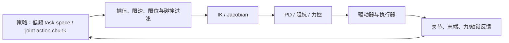

# 机器人学基础：从坐标系到真机闭环

VLA、World Model、MBRL、WAM 和 RL 最终都要驱动真实机器人。机器人学这一层负责把模型输出变成**坐标明确、满足约束、可以执行和可以排错**的运动。本章以 Ubuntu 22.04、ROS 2 Humble 和 MoveIt 2 Humble 为基线，串起几何表示、TF、RViz 2、运动规划、控制、手眼标定和部署。

## 1. 先建立一条完整链路

一条可工作的机器人闭环通常是：

```text
相机 / 关节 / 力觉
        -> 时间同步与坐标变换（TF）
        -> 状态估计与目标表达
        -> VLA / WM / WAM / MBRL / RL
        -> task-space 或 joint-space 动作
        -> IK / 轨迹生成 / 碰撞检查
        -> ros2_control 与机器人驱动
        -> 执行反馈，再回到观测
```

每一层解决的问题不同：

| 层 | 核心对象 | 必须回答的问题 |
| --- | --- | --- |
| 几何 | frame、$SO(3)$、$SE(3)$ | 这个点、位姿和动作是在哪个坐标系里？ |
| 运动学 | FK、IK、Jacobian | 目标是否可达，关节如何到达？ |
| 动力学 | $M(q)$、$C(q,\dot q)$、$g(q)$ | 需要多大力/力矩，接触会怎样？ |
| 轨迹与控制 | 插值、PD、阻抗、力控 | 如何平滑且稳定地执行动作？ |
| ROS 2 工具链 | TF、RViz 2、MoveIt 2、`ros2_control` | 消息、模型、规划和执行是否连通？ |
| 感知与标定 | 内参、外参、hand-eye | 相机看到的位置能否正确变到机器人坐标系？ |
| 安全与评测 | 限位、碰撞、急停、延迟 | 失败时能否停住，问题出在哪一层？ |

推荐入口：

- [Modern Robotics](https://modernrobotics.northwestern.edu/)：运动学、动力学、轨迹与控制。
- [ModernRobotics](https://github.com/NxRLab/ModernRobotics)：教材配套实现。
- [Pinocchio](https://github.com/stack-of-tasks/pinocchio)：刚体运动学、动力学和自动微分。
- [ROS 2 Humble](https://docs.ros.org/en/humble/)、[MoveIt 2 Humble](https://moveit.picknik.ai/humble/index.html)：本章命令和 API 的版本基线。

### 1.1 可直接组合的开源项目

没有一个官方仓库同时覆盖 TF、RViz 2、MoveIt 2、URDF、控制器和全部依赖。建议固定 Humble 分支，按顺序组合：

| 目标 | 项目 | 先验证什么 |
| --- | --- | --- |
| TF2 广播与监听 | [`geometry2/examples_tf2_py`](https://github.com/ros2/geometry2/tree/humble/examples_tf2_py) | frame 树能否连通、查询方向是否正确 |
| RViz 2 与规划 | [`moveit2_tutorials`](https://github.com/moveit/moveit2_tutorials/tree/humble) | Panda 模型能否显示、目标能否规划 |
| URDF/SRDF 资源 | [`moveit_resources`](https://github.com/moveit/moveit_resources/tree/ros2) | 机器人模型、planning group 和末端 link |
| 控制器示例 | [`ros2_control_demos`](https://github.com/ros-controls/ros2_control_demos/tree/humble) | trajectory action 和控制器状态 |
| 手眼标定 | [`moveit_calibration`](https://github.com/moveit/moveit_calibration) | eye-in-hand/eye-to-hand 配置与求解 |

先验证 TF，再验证 RViz/MoveIt，最后才接真实驱动。这样可以把坐标错误、规划错误和硬件通信错误分开。

### 1.2 ROS 2 与 OpenCV 依赖安装

本节以 Ubuntu 22.04 + ROS 2 Humble 为准。先加载 ROS 2 软件源环境，再安装 ROS 图像接口和 OpenCV：

```bash
source /opt/ros/humble/setup.bash
sudo apt update
sudo apt install -y \
  python3-opencv libopencv-dev python3-numpy \
  ros-humble-vision-opencv ros-humble-cv-bridge \
  ros-humble-image-transport ros-humble-image-geometry \
  ros-humble-camera-info-manager ros-humble-rqt-image-view
```

这些包的分工是：`python3-opencv` 提供 Python 的 `cv2`，`libopencv-dev` 提供 C++ 头文件和链接库，`cv_bridge` 在 ROS 图像消息与 OpenCV 图像之间转换，`image_transport` 处理原始/压缩图像传输，`image_geometry` 提供相机模型，`camera_info_manager` 管理内参文件，`rqt_image_view` 用于快速查看图像 topic。

验证安装：

```bash
python3 -c "import cv2, numpy; print('OpenCV', cv2.__version__, 'NumPy', numpy.__version__)"
ros2 pkg prefix cv_bridge
ros2 pkg prefix image_transport
ros2 run rqt_image_view rqt_image_view
```

如果是独立的非 ROS Python 工程，可以使用虚拟环境：

```bash
sudo apt install -y python3-venv python3-pip
python3 -m venv .venv
source .venv/bin/activate
python -m pip install -U pip
python -m pip install numpy scipy matplotlib pyyaml transforms3d opencv-python
```

ROS 节点若要直接使用 `cv_bridge`，优先使用系统的 `python3-opencv` 和 ROS 环境；独立算法脚本才使用虚拟环境里的 `opencv-python`。不要在同一个环境中随意混装两套 OpenCV/NumPy，尤其不要用 pip 覆盖 ROS 2 依赖后再运行 `cv_bridge`。

如果需要从 USB 相机发布 ROS 2 图像，还可以安装：

```bash
sudo apt install -y ros-humble-v4l2-camera
ros2 run v4l2_camera v4l2_camera_node
```

Python 项目可以在虚拟环境中安装纯 Python 依赖，但不要随意用 `pip` 覆盖 ROS 2 系统 Python、NumPy 或 OpenCV；混用版本容易导致 `cv_bridge` 导入失败。遇到 `ImportError` 时先检查 `which python3`、`python3 -c "import cv2"` 和 `ros2 pkg prefix cv_bridge`，再确认是否在同一个终端 source 了 Humble 和工作空间。

安装资料：

- [鱼香 ROS 社区论坛](https://fishros.org.cn/forum/)：安装报错、驱动、相机和 ROS 2 实践问题的讨论入口。

### 1.3 Piper ROS Humble：从仿真到真实机械臂

[Piper ROS](https://github.com/agilexrobotics/piper_ros/tree/humble) 是 AgileX Piper 机械臂的 ROS 2 资源集合。本教程引用它的 `humble` 分支，其中包含驱动、`piper_description`（URDF）、MoveIt 2、Gazebo、MuJoCo 以及 USB-CAN 配置脚本。它是 Piper 专用资源，不是通用机械臂驱动；关节名称、夹爪参数、控制器和 CAN 波特率应以该分支当前 README 与本机固件为准。

建议先在 Ubuntu 22.04 上完成仿真，再连接真实硬件：

```bash
git clone https://github.com/agilexrobotics/piper_ros.git ~/piper_ros
cd ~/piper_ros
git checkout humble

source /opt/ros/humble/setup.bash
sudo apt update
sudo apt install -y \
  ros-humble-ros2-control ros-humble-ros2-controllers \
  ros-humble-controller-manager ros-humble-xacro \
  ros-humble-joint-state-publisher ros-humble-robot-state-publisher \
  ros-humble-rviz2 ros-humble-moveit ros-humble-gazebo-ros-pkgs
python3 -m pip install -U piper_sdk python-can scipy

colcon build --symlink-install
source install/setup.bash
```

先验证模型和仿真链路：

```bash
ros2 launch piper_description display_urdf.launch.py

# Gazebo 仿真（二选一）
ros2 launch piper_gazebo piper_gazebo.launch.py
ros2 launch piper_gazebo piper_no_gripper_gazebo.launch.py

# MuJoCo 仿真（二选一）
ros2 run piper_mujoco piper_mujoco_ctrl.py
ros2 run piper_mujoco piper_no_gripper_mujoco_ctrl.py
```

仿真启动后，另开终端检查接口：

```bash
source /opt/ros/humble/setup.bash
source ~/piper_ros/install/setup.bash
ros2 topic list
ros2 topic echo /joint_states --once
ros2 run tf2_tools view_frames
ros2 control list_controllers
```

真实 Piper 的 MoveIt 入口按是否带夹爪选择：

```bash
# 真机：先启动 piper_single_ctrl，再二选一
ros2 launch piper_with_gripper_moveit demo.launch.py
ros2 launch piper_no_gripper_moveit demo.launch.py
```

Gazebo 的 MoveIt 入口不同，必须先启动 Gazebo，再启动对应的 `piper_moveit.launch.py`：

```bash
ros2 launch piper_gazebo piper_gazebo.launch.py
ros2 launch piper_with_gripper_moveit piper_moveit.launch.py

# 无夹爪模型
ros2 launch piper_gazebo piper_no_gripper_gazebo.launch.py
ros2 launch piper_no_gripper_moveit piper_moveit.launch.py
```

具体参数和当前文件布局以 [`src/piper_moveit/README.md`](https://github.com/agilexrobotics/piper_ros/blob/humble/src/piper_moveit/README.md) 及 [`src/piper_sim/README.md`](https://github.com/agilexrobotics/piper_ros/blob/humble/src/piper_sim/README.md) 为准。规划成功只说明规划场景和控制器接口可用，不等于真实机械臂已经安全执行。

接入真机时，先安装并检查 CAN 工具。USB-CAN 的硬件端口编码必须替换成自己机器上 `find_all_can_port.sh` 输出的值：

```bash
sudo apt install -y can-utils ethtool iproute2
bash find_all_can_port.sh

# 只有一个 CAN 模块时；can0 可改名，波特率 1000000 按 Piper 要求保留
bash can_activate.sh can0 1000000

# 多个模块时，按上游脚本说明使用实际 USB 端口编码
# 例如：bash can_activate.sh can_piper 1000000 "3-1.4:1.0"
ip -details link show can0
```

确认 CAN 接口后，再启动单臂驱动。`auto_enable:=false` 用于把“上电”和“使能”分成两个可检查步骤：

```bash
ros2 run piper piper_single_ctrl \
  --ros-args \
  -p can_port:=can0 \
  -p auto_enable:=false \
  -p gripper_exist:=true \
  -p gripper_val_mutiple:=2

# 也可以使用上游 launch（参数按硬件配置调整）
ros2 launch piper start_single_piper.launch.py \
  can_port:=can0 auto_enable:=false \
  gripper_exist:=true gripper_val_mutiple:=2

ros2 launch piper start_single_piper_rviz.launch.py
ros2 topic echo /joint_states --once
ros2 service call /enable_srv piper_msgs/srv/Enable \
  "{enable_request: true}"
```

验证顺序应是：急停可用 → 机械臂处于安全工作空间 → CAN 无错误帧 → `/joint_states` 持续更新 → TF 树连通 → 低速单关节小幅动作 → 再做夹爪、RViz/MoveIt 和任务级动作。结束测试时显式关闭使能：

```bash
ros2 service call /enable_srv piper_msgs/srv/Enable \
  "{enable_request: false}"
```

常见问题的定位边界：

| 现象 | 先查什么 | 不要直接假设 |
| --- | --- | --- |
| 找不到 `piper` 包 | 是否 `source install/setup.bash`，是否成功 `colcon build` | 不是先改 Python 路径 |
| 没有 `/joint_states` | 驱动进程、`can_port`、CAN 链路和控制器状态 | RViz 本身不会产生关节状态 |
| RViz 模型姿态错误 | URDF 版本、`robot_state_publisher` 和 TF frame | 不要用任意静态 TF“修正”模型 |
| MoveIt 能规划但不运动 | controller action、硬件使能和速度/限位 | 规划成功不代表执行成功 |
| 夹爪数值不对 | `gripper_exist` 和 `gripper_val_mutiple`、固件版本 | 不要把夹爪当普通转动关节处理 |

Piper 的 URDF 涉及固件版本差异：上游 README 对 `S-V1.6-3` 前后的 J2/J3 DH 坐标有说明。若模型与真机零位不一致，先核对固件和对应 URDF，再进行手眼标定；不要通过修改标定外参掩盖模型版本错误。完成标定后，可按本章手眼标定和 `rosbag2` 小节记录 `/tf`、`/tf_static`、图像、`/joint_states` 与动作命令，保留失败复现所需的时间戳和参数。

## 2. 坐标系、旋转和位姿

### 2.1 frame 和变换记号

本章统一使用：$T^A_B$ 表示“坐标系 B 在坐标系 A 中的位姿”，也表示把 B 系坐标转换到 A 系。对点 $p^B$：

$$
p^A=T^A_B\begin{bmatrix}p^B\\1\end{bmatrix}.
$$

因此矩阵连乘满足：

$$
T^A_C=T^A_B T^B_C,
\qquad
T^B_A=(T^A_B)^{-1}.
$$

最常见的机器人 frame 链是：

```text
world/map -> odom -> base_link -> ... -> tool0/ee_link
                                      -> camera_link -> camera_optical_frame
```

`world`/`map` 是任务或地图参考系，`odom` 连续但可能漂移，`base_link` 是机器人基座，`tool0`/`ee_link` 是末端，`camera_optical_frame` 遵循相机光学轴约定。frame 名称、方向和单位必须在整个系统中保持一致。

### 2.2 $SO(3)$：只有旋转

$SO(3)$ 是合法三维旋转的集合。旋转矩阵 $R$ 满足：

$$
R^\mathsf{T}R=I,\qquad \det(R)=1,
$$

所以 $R^{-1}=R^\mathsf{T}$。它有 3 个自由度，但可以用不同数量的数存储：

| 表示 | 形状 | 关键注意事项 |
| --- | --- | --- |
| Euler 角 | 3 | 轴顺序影响结果，存在万向节锁 |
| 旋转向量/轴角 | 3 | $r=\theta u$，长度是弧度；适合小增量 |
| 四元数 | 4 | 必须是单位四元数；$q$ 与 $-q$ 表示同一旋转 |
| 旋转矩阵 | $3\times3$ | 直接满足几何约束，但有 9 个存储数 |
| 6D rotation | 6 | 两个三维向量正交化后恢复 $R$，不是 6 个旋转自由度 |

旋转向量通过指数映射进入 $SO(3)$：

$$
R=\exp([r]_\times),\qquad r=\theta u.
$$

不能把两个旋转向量逐元素相加当成旋转复合；复合应使用矩阵乘法、四元数乘法或李群运算。

#### 6D rotation

网络输出 $a_1,a_2\in\mathbb{R}^3$ 后，用 Gram--Schmidt 正交化：

$$
b_1=\frac{a_1}{\lVert a_1\rVert},\qquad
\tilde b_2=a_2-b_1(b_1^\mathsf{T}a_2),\qquad
b_2=\frac{\tilde b_2}{\lVert\tilde b_2\rVert},\qquad
b_3=b_1\times b_2,
$$

$$
R=[b_1\;b_2\;b_3].
$$

实际代码要处理零向量和近似共线的退化情况：

```python
import numpy as np

def rotation_6d_to_matrix(x6, eps=1e-8):
    a1, a2 = np.asarray(x6, dtype=float).reshape(2, 3)
    n1 = np.linalg.norm(a1)
    b1 = a1 / max(n1, eps)
    a2_orth = a2 - b1 * np.dot(b1, a2)
    b2 = a2_orth / max(np.linalg.norm(a2_orth), eps)
    b3 = np.cross(b1, b2)
    return np.column_stack((b1, b2, b3))
```

#### 四元数

数学上常写 $q=(w,x,y,z)$，轴角 $(u,\theta)$ 对应：

$$
q=\left(\cos\frac{\theta}{2},\;u_x\sin\frac{\theta}{2},\;u_y\sin\frac{\theta}{2},\;u_z\sin\frac{\theta}{2}\right).
$$

必须满足 $\lVert q\rVert=1$。Hamilton 乘积是旋转复合：

$$
q_1\otimes q_2=
\left(w_1w_2-\mathbf v_1^\mathsf{T}\mathbf v_2,
w_1\mathbf v_2+w_2\mathbf v_1+\mathbf v_1\times\mathbf v_2\right).
$$

ROS 2 `geometry_msgs/Quaternion` 的字段顺序是 `x, y, z, w`，与许多数学文献的 `w, x, y, z` 不同，读写时必须显式转换：

```python
import numpy as np

def normalize_quaternion_xyzw(q, eps=1e-8):
    q = np.asarray(q, dtype=float).reshape(4)  # ROS order: x, y, z, w
    norm = np.linalg.norm(q)
    if norm < eps:
        raise ValueError("zero quaternion cannot represent a rotation")
    return q / norm
```

### 2.3 $SE(3)$：旋转加平移

刚体位姿写成：

$$
T^A_B=
\begin{bmatrix}
R^A_B & p^A_B\\
0 & 1
\end{bmatrix}\in SE(3).
$$

$SE(3)$ 的**通常数据形状是 $4\times4$ 矩阵**，不是长度为 6 的向量；它有 6 个自由度，即 3 个平移加 3 个旋转。逆为：

$$
(T^A_B)^{-1}=T^B_A=
\begin{bmatrix}
(R^A_B)^\mathsf{T} & -(R^A_B)^\mathsf{T}p^A_B\\
0 & 1
\end{bmatrix}.
$$

代码中通常是：

```python
R = T[:3, :3]   # SO(3)
p = T[:3, 3]    # translation in R^3
T = np.eye(4)   # SE(3)
```

大写 $SO(3)$、$SE(3)$ 表示实际旋转/位姿；小写 $\mathfrak{so}(3)$、$\mathfrak{se}(3)$ 表示单位元附近的切空间，常用于角速度、线速度和小增量。做 TF、FK、手眼标定和位姿拼接时，先掌握大写对象即可。

### 2.4 等变、不变和协变

这些词描述的是**模型改变参考坐标系后，输出应该怎样变化**，不是新的坐标系。设 $g=(R,t)\in SE(3)$：

- 等变：$f(g\cdot x)=\rho_{out}(g)f(x)$，输出按规定规则一起变换；
- 不变：$f(g\cdot x)=f(x)$，输出保持不变；
- 协变：很多论文中与等变近似同义，但仍应以作者定义为准。

点云中的点变换为：

$$
p_i'=Rp_i+t.
$$

动作要按对象类型变换：点使用 $Rp+t$，方向/速度/法向使用 $Rv$（不加平移），标量保持不变，完整位姿用 $T'=gT$。因此通常有：

| 任务输出 | 性质 | 例子 |
| --- | --- | --- |
| 类别、距离、碰撞判定 | 不变 | 场景整体旋转后类别不变 |
| 法向、位移、速度、力方向 | 等变 | 场景旋转后向量变为 $Rv$ |
| 末端位置/姿态动作 | 通常等变 | 参考系旋转后动作随之旋转 |

直观地说，很多论文中的“点云旋转后动作也旋转”就是等变的基本含义。但重力、桌面、相机光轴、关节限位和接触可能提供固定方向，所以不能默认任务对任意 $SE(3)$ 都对称。$E(3)$ 还包含镜像反射，只有任务确实对镜像对称时才使用它。

工程检查可比较：

$$
e_{eq}=\left\|f(g\cdot x)-\rho_{out}(g)f(x)\right\|.
$$

## 3. TF/tf2：让坐标系带时间运行

### 3.1 TF 的作用

ROS 2 Humble 的 TF 是一棵带时间戳的坐标树。发布者提供父 frame 到子 frame 的变换，tf2 在缓存中按时间查询和组合变换。静态安装关系（如 `ee_link -> camera_link`）应由静态变换发布；关节链和里程计等动态关系由 `robot_state_publisher`、定位或驱动发布。

TF 树必须满足：每个 frame 只有一个父节点；同一条边不能由两个节点同时发布；传感器消息的 `header.frame_id` 必须在同一棵树中。

### 3.2 命令行排查

以下命令默认已经执行 `source /opt/ros/humble/setup.bash`：

```bash
ros2 topic list | grep tf
ros2 topic echo /tf --once
ros2 topic echo /tf_static --once
ros2 run tf2_tools view_frames
ros2 run tf2_ros tf2_echo base_link tool0
```

`tf2_echo A B` 查询的是 B 在 A 中的位姿。时间戳过旧、未来时间、frame 不存在或树断开，会导致 lookup/extrapolation 错误。调试顺序是：先查 frame 名称，再查树是否连通，再查时间戳，最后才检查外参数值。

### 3.3 ROS 2 通信与 QoS

ROS 2 中有三种常用通信接口：

| 接口 | 方向和特点 | 典型用途 |
| --- | --- | --- |
| topic | 发布者向零个或多个订阅者持续发送消息，不等待响应 | 图像、`/joint_states`、TF、传感器流 |
| service | 一次请求对应一次响应，适合短操作 | 触发校准、读取配置、复位状态 |
| action | 可反馈、可取消、带最终结果的长任务 | 轨迹执行、导航、抓取任务 |

常用排查命令：

```bash
ros2 node list
ros2 node info /my_node
ros2 topic list -t
ros2 topic info /joint_states --verbose
ros2 topic hz /joint_states
ros2 topic echo /joint_states --once
ros2 topic pub --once /chatter std_msgs/msg/String "{data: hello}"
ros2 service list -t
ros2 service type /reset
ros2 service call /reset std_srvs/srv/Empty "{}"
ros2 action list -t
ros2 action info /joint_trajectory_controller/follow_joint_trajectory
```

### 3.3.1 环境、包和接口

每个新终端先加载 ROS 2 和工作空间：

```bash
source /opt/ros/humble/setup.bash
source ~/ros2_ws/install/setup.bash
printenv | grep -E 'ROS_|AMENT_PREFIX_PATH'
ros2 doctor --report
```

查找包、可执行文件和消息接口：

```bash
ros2 pkg list
ros2 pkg prefix <package_name>
ros2 pkg executables <package_name>
ros2 interface list
ros2 interface show sensor_msgs/msg/Image
ros2 interface package sensor_msgs
```

运行节点或 launch 文件：

```bash
ros2 run <package_name> <executable_name>
ros2 launch <package_name> <launch_file>.launch.py
ros2 run <package_name> <executable_name> --ros-args -r __node:=debug_node
ros2 run <package_name> <executable_name> --ros-args -r /input:=/camera/image_raw
```

最后两条分别是节点重命名和 topic remapping。命令行中的真实名称要以 `ros2 node list` 和 `ros2 topic list` 为准。

### 3.3.2 参数、日志和生命周期

```bash
ros2 param list /my_node
ros2 param get /my_node use_sim_time
ros2 param set /my_node use_sim_time true
ros2 param dump /my_node > my_node.yaml
ros2 param load /my_node my_node.yaml
ros2 node info /my_node
ros2 lifecycle nodes
ros2 lifecycle get /my_lifecycle_node
ros2 lifecycle set /my_lifecycle_node configure
ros2 lifecycle set /my_lifecycle_node activate
```

日志等级可以临时调整：

```bash
ros2 service call /my_node/set_logger_level rcl_interfaces/srv/SetLoggerLevel \
  "{logger_name: 'my_node', level: 'DEBUG'}"
```

生命周期节点通常按 `unconfigured -> inactive -> active` 运行；只有在节点实现了 lifecycle 接口时，`ros2 lifecycle` 命令才适用。

### 3.3.3 Topic、Service 和 Action 的补充命令

```bash
ros2 topic type /camera/image_raw
ros2 topic find sensor_msgs/msg/Image
ros2 topic pub -r 10 /cmd_vel geometry_msgs/msg/Twist \
  "{linear: {x: 0.1}, angular: {z: 0.0}}"
ros2 service type /controller_manager/list_controllers
ros2 service find std_srvs/srv/Empty
ros2 action send_goal /fibonacci example_interfaces/action/Fibonacci \
  "{order: 5}"
```

`ros2 topic pub -r 10` 会持续发布，按 `Ctrl+C` 停止；给真实机器人发送命令前必须确认 topic、单位、frame 和安全限幅。`action send_goal` 适合验证 action 是否可用，轨迹 action 的 goal 字段必须以具体接口定义为准。

### 3.3.4 工作空间构建

```bash
cd ~/ros2_ws
rosdep install --from-paths src --ignore-src -r -y
colcon list
colcon build --symlink-install
colcon build --packages-select <package_name> --symlink-install
colcon test --event-handlers console_direct+
source install/setup.bash
```

`--symlink-install` 便于 Python 和资源文件修改后直接生效；C++ 代码、接口定义或依赖变化后仍应重新构建。构建失败时先看首个失败包，不要只看最后一行的汇总错误。

### 3.3.5 ROS 2 守护进程和网络排查

```bash
ros2 daemon status
ros2 daemon stop
ros2 daemon start
ros2 multicast receive
ros2 multicast send
```

同一 ROS_DOMAIN_ID 和可互通的 DDS 网络是节点发现的前提。多机通信时还要检查 `ROS_DOMAIN_ID`、网络接口、防火墙和 DDS 实现；单机上“节点互相看不到”时可先重启 daemon，但 daemon 重启不能修复真正的 DDS 网络或 QoS 不兼容。

QoS（Quality of Service）决定消息如何传输。最容易遇到的是可靠性不兼容：传感器通常使用 `best_effort`，而调试订阅默认可能是 `reliable`，两者不匹配时看不到数据。常用选项包括：

| 选项 | 含义 | 常见取值 |
| --- | --- | --- |
| reliability | 是否保证消息送达 | 传感器常用 `best_effort`；控制命令通常用 `reliable` |
| durability | 新订阅者能否拿到历史消息 | 实时流常用 `volatile`；静态配置可用 `transient_local` |
| history/depth | 保留策略和队列长度 | `keep_last` 配合合适的 depth |
| deadline/lifespan | 更新截止时间和消息有效期 | 用于实时控制和过期数据约束 |

查看和临时匹配发布者的 QoS：

```bash
ros2 topic info /camera/image_raw --verbose
ros2 topic echo /camera/image_raw --qos-reliability best_effort --qos-history keep_last --qos-depth 10
```

不要为了“收到数据”盲目把所有 topic 改成 `reliable`：高带宽图像在拥塞时可以允许丢帧，控制命令和轨迹结果通常不能静默丢失。namespace 或 remapping 也会改变名称，排查时以 `ros2 node/topic list` 的实际名称为准。

### 3.4 `rclpy` 查询示例

`rclpy` 是 ROS 2 的 Python 客户端库，负责节点生命周期、参数、通信接口和回调调度；TF 数据缓存和查询由 `tf2_ros.Buffer` 负责。

| API | 作用 |
| --- | --- |
| `rclpy.init()` / `shutdown()` | 初始化/释放 ROS 2 Python 运行时 |
| `Node` | 节点基类，承载日志、参数、topic、service 和 timer |
| `create_timer()` | 注册周期回调，回调不应长时间阻塞 |
| `rclpy.spin(node)` | 交给 executor 处理回调 |
| `rclpy.time.Time()` | TF 中的时间查询；零时间通常表示最新可用变换 |
| `Duration` | 超时或时间间隔 |

```python
import rclpy
from rclpy.duration import Duration
from rclpy.node import Node
from tf2_ros import Buffer, TransformListener

class TfProbe(Node):
    def __init__(self):
        super().__init__("tf_probe")
        self.buffer = Buffer()
        self.listener = TransformListener(self.buffer, self)
        self.timer = self.create_timer(0.1, self.tick)

    def tick(self):
        try:
            tf = self.buffer.lookup_transform(
                "base_link", "tool0", rclpy.time.Time(),
                timeout=Duration(seconds=0.2),
            )
            p = tf.transform.translation
            self.get_logger().info(f"tool0: {p.x:.3f}, {p.y:.3f}, {p.z:.3f}")
        except Exception as exc:
            self.get_logger().warn(f"TF lookup failed: {exc}")

rclpy.init()
node = TfProbe()
rclpy.spin(node)
node.destroy_node()
rclpy.shutdown()
```

查询相机数据时，应按图像时间戳查询 TF，而不是无条件使用“当前最新值”。

## 4. RViz 2：把 ROS 2 状态画出来

RViz 2 是可视化和交互工具：它订阅 topic，并通过 TF 把机器人、坐标系、图像、点云和规划场景放到同一个三维视图中。它不负责物理仿真、运动规划或电机控制。

启动：

```bash
ros2 run rviz2 rviz2
ros2 run rviz2 rviz2 -d ~/ros2_ws/src/my_robot_description/rviz/robot.rviz
```

打开后按以下顺序检查：

1. 在 **Global Options** 设置 `Fixed Frame`，机械臂通常用 `base_link`，移动机器人通常用 `map` 或 `odom`。
2. 添加 `TF` 和 `RobotModel`，先确认 frame 树和 URDF 模型。
3. 再添加 `Image`、`PointCloud2`、`LaserScan` 或 `Marker`，检查 topic、`frame_id` 和 QoS。
4. 用 **File -> Save Config As** 保存 `.rviz` 配置。

与 MoveIt 2 配合时，`demo.launch.py` 通常会一起启动 RViz：

```bash
ros2 launch <your_moveit_config> demo.launch.py
```

在 MotionPlanning 面板先选择 planning group，拖动末端目标，点击 **Plan** 查看轨迹，再确认无误后点击 **Execute**。只点击 Plan 不会驱动真机。

常见问题：

| 现象 | 优先检查 |
| --- | --- |
| Fixed Frame 不存在 | `view_frames`、frame 名称和 TF 根节点 |
| RobotModel 不显示 | `robot_description`、URDF、`robot_state_publisher` |
| 传感器画面为空 | topic 数据、QoS、`frame_id` |
| 模型跳变/抖动 | 重复 TF 发布者、时间戳、`odom -> base_link` 的唯一来源 |
| MotionPlanning 无法规划 | TF、关节状态、SRDF group、Planning Scene 和控制器 |

## 5. URDF、运动学和 MoveIt 2

### 5.1 URDF 和 SRDF

URDF 描述 link、joint、惯性、视觉和碰撞几何；SRDF 在 URDF 之上描述 MoveIt 语义，例如 planning group、末端执行器、默认姿态和禁碰对。能加载 URDF，不代表 MoveIt 已经知道哪组关节是机械臂或哪个 link 是末端。

### 5.2 正/逆运动学和 Jacobian

给定关节状态 $q$，正运动学得到末端位姿：

$$
x=f(q).
$$

逆运动学寻找满足目标和约束的关节解：

$$
q^*=\arg\min_q d\big(f(q),x_{target}\big),
$$

同时满足关节限位、碰撞和工作空间约束。微分运动学为：

$$
\dot x=J(q)\dot q.
$$

当 $J(q)$ 接近秩亏时会出现奇异位形，关节速度可能被放大。VLA/RL 输出 task-space action 时，IK、插值和限位过滤应放在策略之外。

### 5.3 MoveIt 2 的规划管线

MoveIt 2 Humble 的输入是当前关节状态、目标、机器人模型和 Planning Scene，输出通常是一条带时间的 `JointTrajectory`：

```text
目标位姿/关节目标
    -> TF + 当前关节状态
    -> IK 与约束检查
    -> Planning Scene（机器人 + 障碍物）
    -> OMPL/Pilz 等规划器
    -> 时间参数化与速度/加速度限制
    -> ros2_control 控制器
    -> 轨迹执行与反馈
```

安装和工作空间准备：

```bash
source /opt/ros/humble/setup.bash
sudo apt update
sudo apt install ros-humble-tf2-tools ros-humble-rviz2 \
  ros-humble-moveit ros-humble-ros2-control \
  ros-humble-ros2-controllers
ros2 run moveit_setup_assistant moveit_setup_assistant
source ~/ros2_ws/install/setup.bash
```

用 Setup Assistant 生成配置后，检查 planning group、IK 插件、`joint_limits.yaml`、规划 pipeline、控制器名称/关节顺序和 SRDF 禁碰对。

### 5.4 `ros2_control`：把轨迹交给硬件

`ros2_control` 把硬件驱动和控制器分开：

```text
硬件接口（state/command interfaces）
    -> controller_manager
    -> joint_state_broadcaster
    -> joint_trajectory_controller
    -> MoveIt 2 或 action client
```

硬件通常提供 `position`、`velocity`、`effort` 等 state/command interface。`joint_state_broadcaster` 发布关节状态；`joint_trajectory_controller` 接收带时间戳的关节轨迹，常通过 `FollowJointTrajectory` action 对外提供接口。控制器名称、关节顺序和接口组合必须以机器人配置为准。

常用命令：

```bash
ros2 control list_hardware_interfaces
ros2 control list_controllers
ros2 control load_controller joint_state_broadcaster --set-state active
ros2 control load_controller joint_trajectory_controller --set-state active
ros2 control switch_controllers --activate joint_trajectory_controller
ros2 action info /joint_trajectory_controller/follow_joint_trajectory
ros2 topic echo /joint_states --once
```

实际切换前确认控制器名称存在；`joint_state_broadcaster` 通常应保持 active，示例中的 deactivate 只用于说明命令格式，不应机械照抄。规划成功但执行失败时，依次检查控制器是否 active、轨迹的 joint name/顺序是否一致、接口类型是否匹配、action 是否可用，以及硬件是否报告 fault。

### 5.5 C++ 规划逻辑

```cpp
moveit::planning_interface::MoveGroupInterface move_group(node, "arm");
move_group.setPoseReferenceFrame("base_link");
move_group.setEndEffectorLink("tool0");
move_group.setPoseTarget(target_pose);

moveit::planning_interface::MoveGroupInterface::Plan plan;
const auto result = move_group.plan(plan);
if (result != moveit::core::MoveItErrorCode::SUCCESS) {
  throw std::runtime_error("planning failed");
}
move_group.execute(plan);
move_group.clearPoseTargets();
```

真实节点还需创建 `rclcpp::Node`、executor 和参数。目标位姿必须明确参考 frame、末端 link，四元数必须归一化；执行前还要检查关节限位、速度/加速度缩放、碰撞距离和控制器状态。

### 5.6 Planning Scene 和碰撞

Planning Scene 是机器人状态和碰撞世界的快照，包括静态/动态障碍物、附着物体和允许碰撞矩阵（ACM）。抓取物体后，要把它从世界碰撞集合移到附着集合，否则规划器会把手里的物体当成外部障碍物。

最小检查：先只加载机器人，再加入盒子，检查 RViz 与 Planning Scene 的位置一致性；让末端接近盒子，确认碰撞会阻止危险轨迹；附着盒子后重新规划，确认允许碰撞对正确。

### 5.7 与 VLA/RL 的接口边界

```text
VLA / RL 输出 task-space goal 或 delta pose
    -> TF 变到 planning frame
    -> MoveIt 2 做 IK、碰撞检查和轨迹规划
    -> ros2_control 执行
    -> joint state / TF / 力觉 / 执行结果反馈
```

不要把 MoveIt 规划成功率当成策略成功率。至少分开记录目标可达性、规划成功、控制器接受、执行完成、碰撞和总延迟。

## 6. 动力学、轨迹和控制

常见刚体动力学形式为：

$$
M(q)\ddot q+C(q,\dot q)\dot q+g(q)=\tau.
$$

其中 $M(q)$ 是惯性矩阵，$C(q,\dot q)\dot q$ 汇总 Coriolis 和离心项，$g(q)$ 是重力项，$\tau$ 是关节力矩。若显式建模摩擦或末端外力，可扩展为

$$
M(q)\ddot q+C(q,\dot q)\dot q+g(q)+\tau_f=\tau+J(q)^\mathsf{T}F_{ext}.
$$

控制层通常是：



- PD/位置控制实现简单，适合自由空间和已有底层伺服器的机器人。
- 阻抗控制用虚拟刚度和阻尼调节接触行为，常写成 $F=K(x_d-x)+D(\dot x_d-\dot x)$。
- 力/扭矩控制依赖可靠的力传感或力矩估计，适合接触丰富任务，但对标定和安全边界更敏感。
- 策略低频输出不能直接当作电机目标，必须在控制频率下插值、限速并处理丢帧。

## 7. 感知、手眼标定与 sim-to-real

真机部署前至少固定：相机内参和畸变、曝光、关节零位、工具坐标、夹爪范围、传感器时间同步、动作单位、控制频率和延迟。仿真到真机时，要单独记录 domain randomization 改变了哪些参数，以及哪些误差只在真实硬件出现。

### 7.1 手眼标定的记号

仍令 $B$ 为基座、$E$ 为末端、$C$ 为相机、$T$ 为标定板。

#### Eye-in-hand：相机装在末端

相机随末端运动，未知固定外参通常是 $T^E_C$；标定板固定在基座附近。第 $i$ 个姿态满足：

$$
T^B_{E,i}T^E_C T^C_{T,i}=T^B_T.
$$

两组姿态相消标定板后得到：

$$
A_{ij}X=XB_{ij},
$$

$$
A_{ij}=(T^B_{E,j})^{-1}T^B_{E,i},\qquad
X=T^E_C,\qquad
B_{ij}=T^C_{T,j}(T^C_{T,i})^{-1}.
$$

#### Eye-to-hand：相机固定在外部

相机不随末端运动，未知量通常是 $T^B_C$；标定板固定在末端，未知量是 $T^E_T$：

$$
T^B_C T^C_{T,i}=T^B_{E,i}T^E_T.
$$

这是 robot-world/hand-eye 的 $AX=YB$ 类问题。使用工具时要明确选择 `eye-in-hand` 或 `eye-to-hand`，并核对 `base_frame`、`ee_frame`、`camera_frame`、`target_frame`。

### 7.2 每条采样数据应该保存什么

不要只保存图片和最终矩阵。第 $i$ 条样本至少保存同一时刻的：

| 字段 | 记号/形状 | 来源与用途 |
| --- | --- | --- |
| 图像 | $I_i$ | `image_raw`，用于复查检测 |
| 内参与畸变 | $K,d$ | `CameraInfo`，用于 PnP/标定板位姿 |
| 标定板位姿 | $T^C_{T,i}$ | ArUco、棋盘格或 AprilTag |
| 关节状态 | $q_i$、时间戳 | `/joint_states`，用于 FK |
| 末端位姿 | $T^B_{E,i}$ | TF 查询或 FK |
| frame 名称 | 四个 frame 字符串 | 防止矩阵方向混淆 |
| 时间信息 | $t_i^{img},t_i^q,t_i^{tf}$ | 检查错配和延迟 |
| 检测质量 | 重投影误差、角点数、置信度 | 剔除误检和模糊样本 |

图像、CameraInfo、关节状态和 TF 应尽量对应同一时刻；机器人运动时不能用旧关节状态配最新图像。仓库提供了可运行的采样/求解骨架：[examples/hand_eye_calibration](../examples/hand_eye_calibration/README.md)。

### 7.3 采样姿态

建议使用固定、平整、尺寸已知的标定板，采集 15--30 个稳定姿态。每次采样前停止机器人或等速度低于阈值，确认标定板完整可见，再同时记录图像、CameraInfo、$q_i$ 和 $T^B_{E,i}$。样本应覆盖近、中、远距离和不同方位，并同时改变位置和姿态，至少使用两个不同旋转轴。

只平移、只绕一个轴旋转或姿态变化太小，会让方程病态；不要把机器人推到限位、奇异位形或危险接触位置。

### 7.4 求解后的验证

Eye-in-hand 解出 $\widehat T^E_C$ 后，对每条样本重建标定板位姿：

$$
\widehat T^B_{T,i}=T^B_{E,i}\widehat T^E_C T^C_{T,i}.
$$

比较不同样本的平移差：

$$
e^p_{ij}=\left\|\widehat p^B_{T,i}-\widehat p^B_{T,j}\right\|_2,
$$

以及旋转差：

$$
e^R_{ij}=\cos^{-1}\left(\frac{\operatorname{tr}(R_{ij})-1}{2}\right),
\qquad
R_{ij}=(\widehat R^B_{T,j})^{-1}\widehat R^B_{T,i}.
$$

实现时把反余弦输入截断到 $[-1,1]$。报告平移误差（mm）、旋转误差（deg）、重投影误差和异常点规则，并做三种验证：留出姿态、图像重投影、把相机点变到 `base_link` 后执行已知位置任务。

若误差随工作空间或姿态系统性变化，优先排查内参、板尺寸、TF 方向、时间同步、机器人零位和工具坐标，而不是先更换求解器。

### 7.5 发布外参

Eye-in-hand 的结果是 `ee_link -> camera_link` 这条机器人链上的固定边，不能把它误发布成独立的 `base_link -> camera_link`：

```bash
ros2 run tf2_ros static_transform_publisher \
  <tx> <ty> <tz> <qx> <qy> <qz> <qw> <frame_id> <child_frame_id>
```

确认 `ee_link` 已由 URDF/`robot_state_publisher` 发布，且没有重复发布者；若使用 `camera_optical_frame`，还要接入相机驱动定义的 `camera_link -> camera_optical_frame` 并检查 REP 103 轴约定。发布后用 `view_frames`、`tf2_echo` 和 RViz 2 验证。

## 8. rosbag2：记录、回放和复现

`rosbag2` 用于把一次运行中的 topic 保存下来，便于复查时间同步、TF、控制器反馈和策略失败。记录前先列出真实 topic 名称，再按任务选择，避免录下大量无关数据。

```bash
ros2 topic list
ros2 bag record -o hand_eye_run_01 \\
  /tf /tf_static /joint_states \\
  /camera/image_raw /camera/camera_info
ros2 bag info hand_eye_run_01
ros2 bag play hand_eye_run_01 --clock
ros2 bag play hand_eye_run_01 --rate 0.5
```

回放时，让需要使用 bag 时间戳的节点启用仿真时间：

```bash
ros2 param set /my_node use_sim_time true
```

带图像的 bag 可能很大，可以只记录压缩图像或缩短采样窗口。复现实验时固定 bag 名称、代码版本、参数文件、frame、时间基准和随机种子。回放只重现消息，不会自动重现电机动力学、网络延迟或硬件安全状态。

## 9. 部署前检查和仓库主线接口

部署前逐项确认：

- 所有动作、位姿和传感器消息的 frame、单位和时间戳明确；
- 目标经过 TF 变换后再进入 IK/规划；
- 关节限位、速度/加速度、碰撞和急停由安全层执行；
- 规划成功、控制器接受、轨迹执行和任务成功分别记录；
- 仿真和真机的相机内参、尺度、动作归一化、频率和延迟有对应关系。

| 仓库主线 | 机器人学接口 | 首先验证什么 |
| --- | --- | --- |
| VLA | 视觉/语言/本体状态 -> task-space 或 joint action chunk | frame、单位、IK 可达性、控制频率 |
| WM/WAM | 状态/图像 + action -> 未来表征或 action chunk | 动作敏感性、闭环收益、长时程漂移 |
| MBRL | 学习动力学/奖励 -> imagined rollout、MPC 或价值更新 | 模型偏差、样本效率和规划成本 |
| RL | observation、action、reward、termination | reward 是否对应真实任务和安全约束 |
| 双臂真机 | 两臂状态、相对位姿、同步动作、碰撞约束 | 标定、同步、控制接口和急停流程 |

机器人学的目标不是把所有问题都交给策略，而是提供一层可解释的几何、约束和执行接口：策略负责“想做什么”，TF 负责“在哪个坐标系”，MoveIt 2 负责“能否规划”，控制器负责“如何稳定执行”，安全层负责“什么时候必须停下”。
