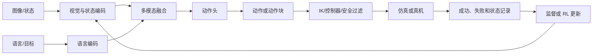

# 👁️ VLA：视觉语言到动作

> VLA（Vision-Language-Action）把视觉、语言和机器人状态接到同一个策略接口，输出可执行动作。

**下一步**：[模型基础](model-basics.md) · [机器人学基础](robotics.md) · [论文清单](papers.md)

VLA 的核心不是“给图像配一句话”，而是在当前本体和控制接口下学习策略：

$$
\pi_\theta(a_{t:t+H-1}\mid o_{t-L+1:t},l,s_{t-L+1:t}),
$$

其中 $o$ 是视觉观测，$l$ 是语言或目标条件，$s$ 是机器人状态，$H$ 是一次输出的动作块长度。

## 1. VLA 的输入和输出

常见输入包括：

- 一路或多路 RGB/RGB-D 图像；
- 语言指令、目标图像或结构化子目标；
- 关节位置/速度、末端位姿、夹爪状态和历史动作；
- 机器人本体标识、相机标定和任务上下文。

常见动作接口包括关节位置、关节速度、末端位姿增量、夹爪开合和连续动作块。文档或代码必须同时说明坐标系、单位、控制频率、动作范围和执行时长。

## 2. 一条 VLA 训练链路



训练通常分为三层：

1. **表示与对齐**：让视觉 token、语言 token 和本体状态进入同一上下文；
2. **动作监督**：用示范学习动作回归、离散 action token、diffusion 或 flow matching；
3. **闭环适配**：在目标任务、本体和控制频率上微调，并用仿真或真机反馈校正。

## 3. 动作头怎么选

| 动作头 | 学习对象 | 优点 | 需要检查 |
| --- | --- | --- | --- |
| 连续回归 | $\hat a_t=f_\theta(c_t)$ | 推理快、实现简单 | 多峰动作会被平均，需处理限位和平滑 |
| 离散 token | $p_\theta(u_t\mid c_t)$ | 易接入自回归 Transformer | 量化误差、词表设计和控制延迟 |
| Diffusion | $p_\theta(a_{t:t+H-1}\mid c_t)$ | 能表达多峰连续动作 | 采样步数、推理延迟和动作边界 |
| Flow matching | $v_\theta(x,\tau,c_t)$ | ODE 采样步数可较少 | solver、步数、时间参数化和稳定性 |

其中 $c_t$ 表示融合后的上下文。action chunk 能减少单步抖动，但每个 chunk 执行多久、何时重新规划必须明确。

## 4. VLA 与机器人接口

模型输出通常不能直接写入电机。推荐将接口拆成：

```text
VLA 输出
  -> 单位与坐标系检查
  -> 逆运动学或关节映射
  -> 关节限位/速度/加速度过滤
  -> 碰撞检查与控制器
  -> 执行短动作块
  -> 重新观测
```

对于末端位姿动作，至少要说明使用哪一个参考坐标系、旋转表示（旋转矩阵、四元数或轴角）、是否左乘/右乘以及插值方式。对于真机，还要记录推理延迟、动作下发延迟、控制频率和急停条件。

## 5. 训练数据与评测

示范数据不应只保存视频。一个可复现的片段还应包含时间戳、图像与状态同步、动作命令、实际执行状态、任务条件、成功/失败标签、终止原因和本体/标定信息。

评测至少分开报告：单任务成功率、跨任务或跨布局泛化、长时程完成率、动作平滑度、推理延迟、恢复能力和安全事件。视频相似度不能替代真实动作成功率。

## 6. 与 WM、WAM 和 RL 的关系

- **VLA 与 WM**：VLA 直接生成动作；WM 预测动作造成的未来。未来表征可以作为 VLA 的辅助目标或输入。
- **VLA 与 WAM**：WAM 要求未来世界和动作生成存在联合或紧密耦合，详见[WAM 专题](wam.md)。
- **VLA 与 RL**：监督微调得到初始策略后，可以用 PPO、GRPO、SAPO 或其他 RL 方法做后训练，详见[强化学习基础](reinforcement-learning.md)。

## 7. 论文与代码入口

优先从 [OpenVLA](https://arxiv.org/abs/2406.09246)、[π0](https://arxiv.org/abs/2410.24164)、[π0.5](https://arxiv.org/abs/2504.16054)、[Diffusion Policy](https://arxiv.org/abs/2303.04137) 和 [Open X-Embodiment](https://arxiv.org/abs/2310.08864) 建立主线，再按具体任务查[论文清单](papers.md)和[代码仓](codebases.md)。
