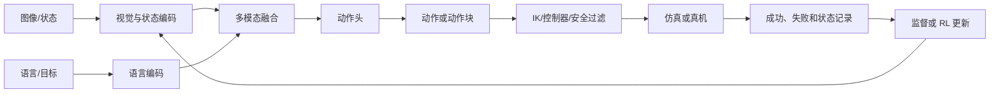

# 👁️ VLA：视觉语言到动作

> VLA（Vision-Language-Action）把视觉、语言和机器人状态放进同一个策略输入，输出可执行动作。

**下一步**：[模型基础](model-basics.md) · [机器人学基础](robotics.md) · [论文清单](papers.md)

VLA 的核心是在当前本体和控制约定下学习策略：

$$
\pi_\theta(a_{t:t+H-1}\mid o_{t-L+1:t},l,s_{t-L+1:t}),
$$

其中 $o$ 是视觉观测，$l$ 是语言或目标条件，$s$ 是机器人状态，$H$ 是一次输出的动作块长度。

先把几个时间量分开：$L$ 表示输入的历史长度，$H$ 表示一次预测的未来长度，$S$ 表示执行多少步后重新规划，$\Delta t$ 表示底层控制周期。它们不是同一个“动作频率”：策略可能每隔 $S\Delta t$ 重新推理一次，但底层控制器仍以 $\Delta t$ 的频率运行。

## 1. VLA 的输入和输出

常见输入包括：

- 一路或多路 RGB/RGB-D 图像；
- 语言指令、目标图像或结构化子目标；
- 关节位置/速度、末端位姿、夹爪状态和历史动作；
- 机器人本体标识、相机标定和任务上下文。

常见动作格式包括关节位置、关节速度、末端位姿增量、夹爪开合和连续动作块。文档或代码必须同时说明坐标系、单位、控制频率、动作范围和执行时长。

动作最好先写清楚语义，再讨论模型：

| 动作表示      | 例子                                 | 执行层要补充的内容                |
| ------------- | ------------------------------------ | --------------------------------- |
| 关节目标      | $q_{t+1}$ 或关节增量 $\Delta q_t$ | 关节顺序、单位、限位和位置控制器  |
| 关节速度/力矩 | $\dot q_t$ 或 $\tau_t$             | 控制周期、零阶保持、速度/力矩上限 |
| 末端位姿      | $\Delta \xi_t$ 或 $T_{t+1}$       | 参考坐标系、旋转表示、IK 和插值   |
| 夹爪动作      | 开合量、速度或二值命令               | 标定方向、开合范围和接触保护      |
| 潜在动作      | $z_t$                              | 解码器、时间尺度和跨本体映射      |

多部分动作可以写成 $a_t=(a_t^{\mathrm{arm}},a_t^{\mathrm{grip}})$。这不是为了增加记号，而是避免把夹爪开合、末端位姿和关节控制误当成同一种回归量。

把输入写成策略条件更清楚：

$$
c_t=F_\theta(o_{t-L+1:t},l,s_{t-L+1:t},a_{t-L:t-1}),
\qquad
\hat a_{t:t+H-1}=G_\theta(c_t).
$$

这里 $c_t$ 是融合后的上下文，历史动作是否输入要看实现。语言可以是任务指令、目标描述或子目标；状态可以是关节、末端、夹爪和本体标识。不要因为模型接收了语言，就默认语言真的改变了动作；应通过替换指令或目标的对照实验验证。

视觉、语言和状态通常先分别编码，再投影到同一上下文中：

```text
图像/深度       -> vision encoder       -> visual tokens
语言/目标       -> language encoder     -> language tokens
关节/末端/夹爪  -> state projector      -> state tokens
历史动作        -> action embedding     -> action context
                                      -> multimodal backbone
                                      -> action head
```

融合可以是 token 拼接、cross-attention、FiLM/adapter 条件化或专门的 action expert。实现时要检查 attention mask：动作 token 是否能看到未来标签、状态 token 是否按时间对齐，以及多相机帧是否来自同一时间戳。

### 1.1 骨干与动作头

常见组合可以按“信息怎样流到动作”来区分：

| 组合                       | 信息流                                                     | 适合的场景                             | 主要风险                           |
| -------------------------- | ---------------------------------------------------------- | -------------------------------------- | ---------------------------------- |
| decoder-only prefix        | 图像、语言、状态作为前缀，动作 token 自回归生成            | 复用语言模型和统一序列训练             | token 延迟、连续动作量化误差       |
| encoder + action head      | 多模态编码器产生上下文，再回归动作或动作块                 | 低延迟、动作输出明确                   | 多峰动作容易平均                   |
| 双流/交叉注意力            | 视觉语言流与 action expert 分开，通过 cross-attention 交互 | 保留通用视觉语言骨干，同时专门建模动作 | 训练阶段和推理阶段的连接方式容易不一致 |
| diffusion/flow action head | 上下文条件化连续动作分布，采样动作块                       | 多峰、接触和路径选择                   | 采样步数、solver 和延迟            |

“Transformer VLA”“diffusion VLA”描述的是不同层次：前者通常指上下文融合骨干，后者指动作生成目标。一个模型可以同时使用 Transformer 和 diffusion；比较工作时应分别记录 backbone、动作头、条件注入位置和采样过程。

### 1.2 时间对齐和可用信息

训练样本中至少有三类时间：观测时间 $\tau_o$、命令下发时间 $\tau_a$ 和执行状态时间 $\tau_s$。理想的因果关系是

$$
a_t^{\mathrm{cmd}}\xrightarrow[\text{延迟 }d]{\text{控制器}}s_{t+1}^{\mathrm{exec}},
\qquad d=\tau_s-\tau_a.
$$

这里 $a_t^{\mathrm{cmd}}$ 是策略发出的命令，$s_{t+1}^{\mathrm{exec}}$ 是控制器实际执行后的状态，$d$ 是命令到状态反馈的延迟。若数据只保存命令、不保存执行状态，模型会把通信延迟、限幅和跟踪误差错误地归因于策略。

多相机数据也要以时间戳对齐；不能把相差很大的帧简单拼成一个“当前观测”。当相机、关节和夹爪的频率不同时，应明确采用最近邻、线性插值、保持上一帧，还是用时间编码交给模型学习。

## 2. 一条 VLA 训练链路



训练通常分为四层：

1. **表示与对齐**：让视觉 token、语言 token 和本体状态进入同一上下文；
2. **动作监督**：用示范学习动作回归、离散 action token、diffusion 或 flow matching；
3. **任务/本体适配**：在目标任务、本体、相机和控制频率上微调，校准动作归一化与坐标变换；
4. **闭环后训练**：用失败数据、偏好、可验证奖励或 RL 修正只在示范分布内有效的行为。

一条完整的行为克隆样本不是“图像加动作”这么简单，至少要能对齐：观测历史、语言/目标、动作命令、执行后的状态、时间戳、episode 边界和成功/失败结果。真实机器人还应区分 commanded action 与 executed action，因为控制器限幅、延迟和跟踪误差会改变实际后果。

### 2.1 监督目标如何写

离散动作 token 的行为克隆目标是条件交叉熵：

$$
\mathcal L_{\mathrm{token}}=-\sum_t m_t\log p_\theta(u_t\mid c_t,u_{<t}),
$$

其中 $u_t$ 是量化后的动作 token，$m_t$ 是有效位置掩码。连续动作可以使用回归目标：

$$
\mathcal L_{\mathrm{reg}}=\sum_t m_t\,\rho\!\left(\hat a_t-a_t^{\mathrm{cmd}}\right),
$$

其中 $\rho$ 可以是 L1、L2 或 Huber 损失。动作块训练时，$t$ 既可以表示控制步，也可以表示一个 chunk 的起点；必须在数据和代码中保持同一种定义。

如果同时训练状态、进度或接触辅助头，可写成

$$
\mathcal L=\lambda_a\mathcal L_a+\lambda_s\mathcal L_s+\lambda_p\mathcal L_p+\lambda_c\mathcal L_c,
$$

其中 $\mathcal L_a$ 是动作损失，$\mathcal L_s$ 是状态预测损失，$\mathcal L_p$ 是任务进度或成功预测损失，$\mathcal L_c$ 是接触/碰撞等约束损失。辅助项只有在消融中确实改善闭环行为时才值得保留。

### 2.2 训练阶段和参数更新

常见的参数路径有三种：

1. **冻结通用骨干，只训练投影层和动作头**：成本低，适合先检查数据与动作格式是否正确；
2. **用 LoRA、adapter 或 action expert 做本体适配**：保留视觉语言能力，同时学习目标机器人和控制频率；
3. **解冻部分视觉层或全部骨干**：适合本体差异、相机视角或任务域差异很大，但更容易过拟合。

每个阶段都要固定动作归一化、坐标系和数据划分。否则 loss 下降可能只是因为重新定义了动作尺度，而不是策略真的更好。

### 2.3 teacher forcing 与闭环分布偏移

自回归 action token 训练常把真实历史 token 放入上下文，这叫 teacher forcing。部署时历史来自模型自身和控制器的执行结果，二者分布不同，误差会逐步积累。常见缓解方式包括 action chunk、scheduled sampling、噪声扰动观测、从模型 rollout 收集纠偏数据，以及在仿真或真机上做闭环后训练。

检查时要问两个问题：训练输入是否包含部署时拿不到的未来状态？动作头是否在训练时看到真实后续动作、推理时却要从零生成？如果答案是“是”，应重新设计 mask 或把该变量改成仅训练期的辅助监督。

## 3. 动作头怎么选

| 动作头        | 学习对象                          | 优点                     | 需要检查                           |
| ------------- | --------------------------------- | ------------------------ | ---------------------------------- |
| 连续回归      | $\hat a_t=f_\theta(c_t)$        | 推理快、实现简单         | 多峰动作会被平均，需处理限位和平滑 |
| 离散 token    | $p_\theta(u_t\mid c_t)$         | 易接入自回归 Transformer | 量化误差、词表设计和控制延迟       |
| Diffusion     | $p_\theta(a_{t:t+H-1}\mid c_t)$ | 能表达多峰连续动作       | 采样步数、推理延迟和动作边界       |
| Flow matching | $v_\theta(x,\tau,c_t)$          | ODE 采样步数可较少       | solver、步数、时间参数化和稳定性   |

其中 $c_t$ 表示融合后的上下文。action chunk 能减少单步抖动，但每个 chunk 执行多久、何时重新规划必须明确。

### 3.1 离散动作与连续动作

离散 action token 先把连续控制量量化，再做自回归预测：

$$
p_\theta(u_t\mid c_t,u_{<t}),
$$

优点是可以复用语言模型的序列训练和解码工具，代价是量化误差、码本设计和逐 token 延迟。连续回归直接预测 $a_t$ 或动作块，推理快，但多峰行为可能被平均。Diffusion 和 flow matching 通过采样条件分布保留多种合理动作，详细的噪声、速度场和 ODE 公式见[模型基础](model-basics.md)。

### 3.2 动作块和时间语义

动作块不是简单把多个动作拼在一起。需要区分：

- **horizon**：模型一次预测的未来步数 $H$；
- **stride**：实际执行后重新预测的步数 $S$；
- **控制周期**：底层控制器的时间间隔；
- **策略周期**：策略每次获得新观测并生成动作的时间间隔。

当 $S<H$ 时，策略采用 receding horizon：只执行动作块前部，再用新观测覆盖后部预测。报告结果时应同时给出 $H$、$S$、控制频率和端到端延迟，否则不同 VLA 的“动作频率”无法比较。

## 4. VLA 与机器人连接

模型输出通常不能直接写入电机。推荐把执行链路拆成：

```text
VLA 输出
  -> 单位与坐标系检查
  -> 逆运动学或关节映射
  -> 关节限位/速度/加速度过滤
  -> 碰撞检查与控制器
  -> 执行短动作块
  -> 重新观测
```

对于末端位姿动作，至少要说明使用哪一个参考坐标系、旋转表示（旋转矩阵、四元数或轴角）、是否左乘/右乘以及插值方式。对于真机，还要记录推理延迟、动作下发延迟、控制频率和急停条件。

一个可执行的推理循环可以写成：

```text
读取最近 L 个观测、状态和任务条件
  -> 编码并融合上下文 c_t
  -> 生成动作块 a[t:t+H-1]
  -> 做单位、坐标、限位和碰撞检查
  -> 执行前 S 步
  -> 检查跟踪误差、接触和终止条件
  -> 重新观测并滚动预测
```

如果策略输出末端位姿，IK、插值、速度/加速度限制和安全控制器应位于策略之后；如果策略输出关节目标，也要说明目标是位置、速度还是力矩。策略本身不应绕过这些约束直接驱动电机。

## 5. 训练数据与评测

示范数据不应只保存视频。一个可复现的片段还应包含时间戳、图像与状态同步、动作命令、实际执行状态、任务条件、成功/失败标签、终止原因和本体/标定信息。失败片段可用于进度、风险和终止预测，但不应未经筛选地当作行为模仿目标。

### 5.1 从轨迹切成训练样本

一条 episode 通常会按滑动窗口切成样本。以时刻 $t$ 为起点，输入最近 $L$ 个观测和状态，标签是未来 $H$ 个动作：

$$
\mathcal D_t=\left(o_{t-L+1:t},s_{t-L+1:t},l,
a_{t:t+H-1},m_{t:t+H-1}\right),
$$

其中 $m$ 是有效位置掩码。窗口靠近 episode 末尾时，不能把 reset 后的新轨迹补到当前动作块中；应截断标签并用 $m=0$ 屏蔽补齐位置。随机切窗要避免训练集和测试集共享同一 episode 的相邻片段，否则结果会被数据泄漏抬高。

动作归一化通常按维度计算：

$$
\tilde a_t=D_a^{-1}(a_t-\mu_a),
$$

其中 $\mu_a$ 和 $D_a$ 表示训练数据的中心与尺度。关节、平移、旋转和夹爪应分别处理；旋转也不能像普通欧氏向量一样随意平均。部署时要做逆变换，并确认统计量来自正确的机器人和动作格式。

### 5.2 多数据源和跨本体训练

把不同机器人数据混在一起之前，要先统一语义，而不是只把动作补成相同维度。常见做法包括：

- 将动作转换到末端位姿增量或其他共享任务空间；
- 为每种机器人保留独立 action head，通过本体标识选择；
- 使用统一 latent action，再由本体解码器恢复关节命令；
- 只共享视觉语言骨干，在每个本体上训练 adapter 或 action expert。

跨本体训练最容易出错的地方是：相同数值在不同机器人上代表不同位移、坐标轴或夹爪方向。必须在数据层统一单位、坐标和控制周期，不能期待模型自动猜出这些差异。

### 5.3 监督微调之后怎样继续学

行为克隆先让策略学会“像示范那样做”，但不会自动学会恢复、风险和长时程信用分配。后续可以根据反馈来源选择：

| 反馈 | 常见用途 | 要防止的问题 |
| --- | --- | --- |
| 成功/失败标签 | 训练成功、进度或终止头 | 标签只反映场景难度，不反映动作质量 |
| 成对偏好 | 比较两条动作或 rollout | 偏好模型过拟合表观视频 |
| 可验证奖励 | RL 后训练或候选动作排序 | 奖励漏洞和仿真偏差 |
| 人工纠偏 | DAgger 式补充偏离状态 | 成本高、纠偏分布不均 |
| 失败后果 | 风险、接触和恢复策略 | 直接模仿失败动作 |

使用 PPO、GRPO 或 SAPO 等方法时，首先要定义“一个样本”是单步动作、动作块还是整段响应，再明确奖励落在哪个位置。序列级成功奖励可以广播到动作 token，但这并不等于每个 token 都有独立的即时奖励。

评测至少分开报告：单任务成功率、跨任务或跨布局泛化、长时程完成率、动作平滑度、推理延迟、恢复能力和安全事件。视频相似度不能替代真实动作成功率。

建议把评测拆成四层：

1. **语义层**：指令替换、目标替换和未见物体/场景；
2. **动作层**：动作误差、平滑度、边界违规和执行跟踪误差；
3. **闭环层**：任务成功率、长时程完成率、失败恢复和重置次数；
4. **系统层**：控制频率、推理/通信延迟、显存、吞吐和安全事件。

跨本体结果还要报告适配投入，包括标定、IK/FK、动作映射、数据量和控制器修改，不能只比较模型参数量。

### 5.4 常见故障怎样定位

| 现象 | 先检查什么 |
| --- | --- |
| 动作方向稳定地反了 | 坐标系、四元数顺序、左右乘和动作反归一化 |
| 离线动作误差低，闭环成功率低 | teacher forcing、动作延迟、执行状态缺失和误差累积 |
| 语言替换后动作几乎不变 | 指令是否进入 action head、数据是否有语言对照、mask 是否正确 |
| 夹爪时机总是偏早或偏晚 | 图像/状态时间戳、策略周期、动作块对齐和接触反馈 |
| 跨机器人迁移突然失效 | 动作语义、控制周期、相机外参、IK 和夹爪方向 |
| action chunk 接管时跳变 | stride、旧 chunk 当前执行位置、平滑和 request-to-handoff 延迟 |

## 6. 与 WM、WAM 和 RL 的关系

- **VLA 与 WM**：VLA 直接生成动作；WM 预测动作造成的未来。未来表征可以作为 VLA 的辅助目标或输入。
- **VLA 与 WAM**：WAM 要求未来世界和动作生成存在联合或紧密耦合，详见[WAM 专题](wam.md)。
- **VLA 与 RL**：监督微调得到初始策略后，可以用 PPO、GRPO、SAPO 或其他 RL 方法做后训练，详见[强化学习基础](reinforcement-learning.md)。

## 7. 论文与代码入口

优先从 [OpenVLA](https://arxiv.org/abs/2406.09246)、[π0](https://arxiv.org/abs/2410.24164)、[π0.5](https://arxiv.org/abs/2504.16054)、[Diffusion Policy](https://arxiv.org/abs/2303.04137) 和 [Open X-Embodiment](https://arxiv.org/abs/2310.08864) 建立主线，再按具体任务查[论文清单](papers.md)和[代码仓](codebases.md)。
