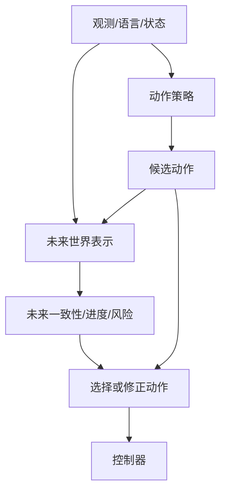

# 🌍 WAM：世界与动作联合建模

> WAM（World Action Model）把“动作会造成什么”和“下一步该怎么动”放进同一个紧密闭环。

**预计阅读**：20 min<br>
**前置知识**：VLA、World Model 和机器人动作格式<br>
**下一步**：[WM 专题](world-model-directions.md) · [VLA 专题](vla.md) · [论文清单](papers.md)

WAM 不是新的空间表示，而是一种模型组织方式。它可以使用像素、视频 latent、对象粒子、scene flow 或 3D/4D 场景，但必须说明未来预测如何影响动作。

可以把一个 WAM 拆成四个可检查的模块：

```text
当前上下文 c_t
  -> 候选动作生成 q_phi(a | c_t)
  -> 动作条件的未来预测 p_theta(x' | c_t, a)
  -> 进度/价值/风险评分 V_omega(x', a, l)
  -> 动作选择与控制器
```

每篇工作都需要了解：未来表征在哪里产生，动作在哪里注入，哪个量最终改变了动作，以及控制器如何执行选中的动作。

## 1. 核心输入输出

给定上下文 $c_t$、候选动作 $a_{t:t+H-1}$ 和未来表示 $x$，WAM 通常用以下关系表达：

$$
p_\theta(x_{t+1:t+H},a_{t:t+H-1}\mid c_t),
$$

或先预测未来再解码动作：

$$
\hat x_{t+1:t+H}=F_\theta(c_t,a_{t:t+H-1}),
\qquad
\hat a_{t:t+H-1}=G_\phi(c_t,\hat x_{t+1:t+H}).
$$

关键检查是：改变候选动作后，未来预测或动作评分是否发生合理变化，并且这种变化是否改善闭环控制。

WAM 的核心数据关系可以拆成两个条件分布：

$$
p_\theta(x_{t+1:t+H}\mid c_t,a_{t:t+H-1}),
\qquad
p_\phi(a_{t:t+H-1}\mid c_t,x_{t+1:t+H}),
$$

前者回答“这样做会发生什么”，后者回答“为了得到想要的未来应该怎样做”。实际系统可以只显式实现其中一项，另一项由共享表征、排序器或 inverse dynamics 隐式承担，但论文必须说明动作和未来之间的因果方向。

若把目标条件 $l$ 和当前上下文并入 $c_t$，一个更完整的因果分解是

$$
p(x_{t+1:t+H},a_{t:t+H-1}\mid c_t)
=p_\theta(x_{t+1:t+H}\mid c_t,a_{t:t+H-1})
\,p_\phi(a_{t:t+H-1}\mid c_t).
$$

这个分解表达的是联合分布的建模方式，不表示训练时一定要按两个网络串行计算。若动作由未来反推，则需要额外说明 inverse dynamics 或 action decoder 的输入是否包含未来真实状态。

## 2. 四类常见架构



### 2.1 级联式

先生成动作条件未来，再由未来解码动作或用逆动力学得到动作。优点是因果链容易检查，代价是未来生成和动作解码会增加延迟。

### 2.2 联合式

在同一个 Transformer、diffusion 或 flow 模型中联合预测未来 token、状态和动作。优点是共享表征，难点是损失权重、时间对齐和动作格式容易被未来重建目标淹没。

### 2.3 隐式式

训练时使用未来监督或辅助预测，推理时不显式生成完整未来，而是让未来相关表征改变动作头。此时必须通过消融证明未来监督确实改善了动作，而不是只增加了训练成本。

### 2.4 架构取舍与判据

| 架构       | 训练时的主要路径                         | 推理时的主要路径       | 适合检查的问题                                 |
| ---------- | ---------------------------------------- | ---------------------- | ---------------------------------------------- |
| 显式级联   | 先学$x'$，再用 $x'$ 生成或筛选 $a$ | 对多个候选动作 rollout | 未来预测是否对动作敏感，rollout 误差是否可接受 |
| 联合建模   | 共享 backbone，同时预测$x'$ 与 $a$   | 单次前向或少量采样     | 损失权重、时间 mask 和共享表示是否失衡         |
| 隐式耦合   | 未来辅助损失塑造隐藏状态                 | 只运行动作头           | 去掉未来损失后动作是否显著退化                 |
| 规划式 WAM | 学习动力学、价值或风险                   | MPC/MCTS/候选动作搜索  | 规划收益是否抵消模型误差和延迟                 |

“有未来预测”不等于“做了 WAM”。如果未来分支从不接收候选动作，或者其输出不参与动作概率、排序、价值或控制约束，它更接近普通 WM 的辅助任务。

### 2.5 动作如何进入未来预测

动作可以通过四种方式注入：

- 把关节/末端动作编码成 action token，与视觉 token 拼接；
- 用 cross-attention 或条件归一化调制未来预测器；
- 在每个时间块注入动作，保持 chunk 内的时间对齐；
- 先由控制器、URDF 和运动学生成机器人部分，再让模型预测物体和场景的响应。

最后一种方式可以减少机器人本体外观的学习负担，但仍要验证接触、遮挡和控制误差是否被正确传递。

动作注入还要处理尺度和坐标：关节动作、末端位姿增量和 latent action 不能直接共用同一个数值归一化。建议先定义

$$
\tilde a_t=D_a^{-1}(a_t-\mu_a),
$$

其中 $\mu_a$ 和 $D_a$ 是训练集统计量或每个动作维度的尺度，再把归一化后的动作编码为 token、条件向量或扩散输入。部署时必须执行逆变换，并重新检查关节限位、速度和碰撞。

## 3. 训练时需要什么数据

每个时间片应能对齐观测、动作和实际后果：

```text
(观测历史, 语言/目标, commanded action,
 executed state, future observation, reward/progress,
 termination, collision/contact, timestamp, calibration)
```

真实机器人要区分 commanded action 与 executed action。控制器限幅、延迟和跟踪误差会让二者不同；只记录命令，模型可能学到命令与后果之间的错误关系。

成功与失败样本都应保留。失败动作可以用于未来预测、进度、风险或终止头，但不应自动作为 imitation target。

除了正向轨迹，还可以从同一时间片构造反事实训练对：固定 $c_t$，替换候选动作 $a^{(n)}$，并把实际未来、进度变化或终止结果作为比较信号。反事实动作可以来自同一轨迹的时间错位、另一条轨迹、策略采样、带噪专家动作或控制器允许范围内的随机扰动。这样模型才有机会学到“动作不同会导致后果不同”，而不是只记住观测与成功标签的相关性。

### 3.1 失败动作怎么学

把动作模仿和动作后果分开：成功轨迹的动作可以作为 imitation target，失败轨迹的动作不进入模仿分支，但其未来状态、碰撞、滑移、任务倒退和终止原因仍然监督 world/value 分支。一个简化目标是

$$
\mathcal L
=m_{\mathrm{succ}}\lambda_a\mathcal L_{\mathrm{action}}
+\lambda_f\mathcal L_{\mathrm{future}}
+\lambda_v\mathcal L_{\mathrm{value}},
$$

其中 $m_{\mathrm{succ}}=1$ 表示成功动作，$m_{\mathrm{succ}}=0$ 表示失败动作。这样模型会同时学习“成功时怎样动”和“错误动作会造成什么”。

推理时对候选动作做反事实比较：

```text
a^(n) ~ policy(c_t)
future^(n), risk^(n) = world_value(c_t, a^(n))
n* = argmax_n [progress^(n) - λ risk^(n)]
执行 a^(n*) 的短动作块
```

更完整的执行器还应包含不确定性门控：

$$
J(a^{(n)})=\mathbb E[\mathrm{progress}^{(n)}]
-\lambda_r\,\mathbb E[\mathrm{risk}^{(n)}]
-\lambda_u\,U^{(n)},
$$

其中 $U^{(n)}$ 表示未来预测或价值估计的不确定性。可以用 ensemble 方差、扩散采样方差、校准后的置信区间或 OOD 检测得到 $U^{(n)}$。当不确定性超过阈值时，系统应降低动作幅度、重新观测、切换保守控制器或请求人工介入，而不是继续执行最高均值动作。

评分分支必须看到候选动作。若只根据当前观测输出一个与动作无关的分数，就无法判断哪个动作导致了更好的未来。评估时应加入 action swap、off-expert action、失败类型覆盖和风险校准。

### 3.2 训练目标和掩码

可以把 WAM 的训练目标拆成动作、未来、价值和约束四部分：

$$
\mathcal L_{\mathrm{WAM}}
=m_{\mathrm{succ}}\lambda_a\mathcal L_a
+\lambda_x\mathcal L_x
+\lambda_v\mathcal L_v
+\lambda_r\mathcal L_r,
$$

其中 $\mathcal L_a$ 学成功动作，$\mathcal L_x$ 学动作条件未来，$\mathcal L_v$ 学进度或价值，$\mathcal L_r$ 学风险、碰撞或终止。$m_{\mathrm{succ}}$ 只屏蔽动作模仿项，不应把失败样本从整个 batch 删除。

若未来是离散 token，可用 next-token 交叉熵；若未来是 latent、状态或点云，可用回归、对比、分布匹配或 flow/diffusion 损失；若未来是成功概率，则可用二元交叉熵或校准后的 proper scoring rule。文档应明确每一项的预测对象和时间范围，不能只写“联合训练”。

动作条件未来预测通常需要一个时间掩码：预测 $x_{t+k}$ 时只能看到 $c_t$ 和 $a_{t:t+k-1}$，不能看到真实的 $x_{t+k}$ 或未来动作。训练中可使用 teacher forcing 让模型读取真实的前一步未来，但评测时还应报告自由滚动误差，因为部署时后续未来来自模型自身。

## 4. 运行时流程

```text
读取历史观测和任务条件
  -> 生成候选动作块
  -> 预测各候选动作的未来/进度/风险
  -> 按成功概率、目标距离和安全约束评分
  -> 只执行短动作块
  -> 重新观测、检查偏差并滚动更新
```

对应的伪代码是：

```python
context = encode(observation_history, language, robot_state)
candidates = action_policy.sample(context, num_samples=N)
scores = []
for action_chunk in candidates:
    future = world_model.rollout(context, action_chunk)
    value, risk, uncertainty = evaluator(future, action_chunk, goal)
    scores.append(value - risk_weight * risk - uncertainty_weight * uncertainty)
chosen = candidates[argmax(scores)]
controller.execute(safety_filter(chosen)[:stride])
```

这段伪代码把 `commanded action`、未来 rollout、评分和控制器分开。实际项目还要在 `safety_filter` 中执行坐标变换、限位、碰撞检查和动作平滑，并把执行后的状态写回下一次上下文。

### 4.1 候选动作从哪里来

候选动作并不一定由 WAM 自己从零生成，可以来自：

- VLA、Diffusion Policy 或 flow policy 的多次采样；
- 专家动作加小扰动，用于局部修正；
- MPC 的 shooting、CEM 或其他优化器；
- 高层规划器给出的技能或子目标，再由低层策略展开；
- 安全控制器允许集合内的保守动作。

候选集太窄时，未来模型只能在几个相似动作之间排序；候选集太宽时，模型会评估大量训练分布之外的动作。应同时报告候选数量、采样温度或噪声尺度、动作约束和 OOD 处理方式。

### 4.2 多步 rollout 和误差累积

显式 rollout 可以一次预测完整未来，也可以递推预测：

$$
\hat x_{t+k+1}=F_\theta(\hat x_{t+k},a_{t+k}),
\qquad \hat x_t=x_t.
$$

递推时每一步都把预测结果作为下一步输入，因此单步误差会改变后续状态分布。训练中的 teacher-forced 单步误差低，不代表自由滚动也稳定。应分别报告单步预测、固定动作序列的多步 rollout，以及闭环重新观测后的控制结果。

滚动范围也不是越长越好。接触任务中，短期几何和接触预测往往比很长但模糊的视频更有用；长时程任务可以把短期 world model 与进度、记忆或任务图结合，而不是要求一个像素生成器承担所有时间尺度。

WAM 的闭环证据要同时覆盖：动作敏感性、未来预测误差、候选动作排序、控制延迟、chunk handoff、失败检测和恢复。只展示未来视频，不能证明 WAM 改善了机器人控制。

真实部署还要检查动作请求和动作接管之间的时间差。新动作块请求时，旧动作可能仍在执行；如果直接把新块的第一步当成当前状态，可能出现 boundary jump。应记录 request time、handoff time、实际接管状态、chunk stride、控制频率和推理延迟，并在接管前做动作平滑或短暂重规划。

## 5. 与 WM、VLA、MBRL 的边界

- **WM** 关注未来状态或场景的预测；WAM 关注未来预测如何进入动作生成。
- **VLA** 可以没有显式未来；WAM 可以以 VLA 为动作骨架，再加入未来监督或未来评分。
- **MBRL** 关注模型是否被用于 rollout、MPC、价值或策略更新；WAM 不一定做规划，MBRL 也不一定使用视频 WM。

一个实用判断顺序是：

1. 是否存在未来状态、未来表征或未来风险目标？
2. 动作是否作为条件进入未来预测，或由未来反推动作？
3. 未来分支是否改变候选动作、动作概率或动作排序？
4. 测试时是否需要显式想象，还是只在训练中提供辅助监督？
5. 是否有真实闭环收益，而不只是未来视频质量提升？

代表性工作与代码见[论文清单](papers.md)、[Fast-WAM](https://github.com/yuantianyuan01/FastWAM)和[Awesome-WAM](https://github.com/OpenMOSS/Awesome-WAM)。
