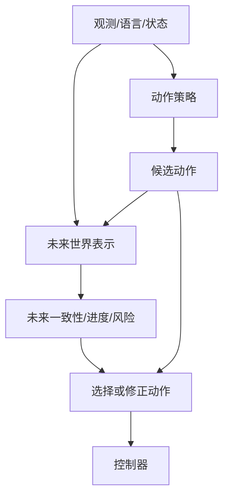

# 🌍 WAM：世界与动作联合建模

> WAM（World Action Model）把“动作会造成什么”和“下一步该怎么动”放进同一个紧密闭环。

**下一步**：[WM 专题](world-model-directions.md) · [VLA 专题](vla.md) · [论文清单](papers.md)

WAM 不是新的空间表示，而是一种模型组织方式。它可以使用像素、视频 latent、对象粒子、scene flow 或 3D/4D 场景，但必须说明未来预测如何影响动作。

## 1. 最小接口

给定上下文 $c_t$、候选动作 $a_{t:t+H-1}$ 和未来表示 $x$，WAM 至少包含以下一种关系：

$$
p_\theta(x_{t+1:t+H},a_{t:t+H-1}\mid c_t),
$$

或先预测未来再解码动作：

$$
\hat x_{t+1:t+H}=F_\theta(c_t,a_{t:t+H-1}),
\qquad
\hat a_{t:t+H-1}=G_\phi(c_t,\hat x_{t+1:t+H}).
$$

关键检查是：改变候选动作后，未来预测或动作评分是否发生合理变化，并且这种变化是否改善闭环控制。

## 2. 三种常见架构



### 2.1 级联式

先生成动作条件未来，再由未来解码动作或用逆动力学得到动作。优点是因果链容易检查，代价是未来生成和动作解码会增加延迟。

### 2.2 联合式

在同一个 Transformer、diffusion 或 flow 模型中联合预测未来 token、状态和动作。优点是共享表征，难点是损失权重、时间对齐和动作接口容易被未来重建目标淹没。

### 2.3 隐式式

训练时使用未来监督或辅助预测，推理时不显式生成完整未来，而是让未来相关表征改变动作头。此时必须通过消融证明未来监督确实改善了动作，而不是只增加了训练成本。

## 3. 训练时需要什么数据

每个时间片应能对齐观测、动作和实际后果：

```text
(观测历史, 语言/目标, commanded action,
 executed state, future observation, reward/progress,
 termination, collision/contact, timestamp, calibration)
```

真实机器人要区分 commanded action 与 executed action。控制器限幅、延迟和跟踪误差会让二者不同；只记录命令，模型可能学到命令与后果之间的错误关系。

成功与失败样本都应保留。失败动作可以用于未来预测、进度、风险或终止头，但不应自动作为 imitation target。

## 4. 运行时流程

```text
读取历史观测和任务条件
  -> 生成候选动作块
  -> 预测各候选动作的未来/进度/风险
  -> 按成功概率、目标距离和安全约束评分
  -> 只执行短动作块
  -> 重新观测、检查偏差并滚动更新
```

WAM 的闭环证据要同时覆盖：动作敏感性、未来预测误差、候选动作排序、控制延迟、chunk handoff、失败检测和恢复。只展示未来视频，不能证明 WAM 改善了机器人控制。

## 5. 与 WM、VLA、MBRL 的边界

- **WM** 关注未来状态或场景的预测；WAM 关注未来预测如何进入动作生成。
- **VLA** 可以没有显式未来；WAM 可以以 VLA 为动作骨架，再加入未来监督或未来评分。
- **MBRL** 关注模型是否被用于 rollout、MPC、价值或策略更新；WAM 不一定做规划，MBRL 也不一定使用视频 WM。

## 6. 阅读与实践检查表

读一篇 WAM 工作时，记录：

1. 未来表示是什么，张量如何随时间变化；
2. 动作以条件、交替 token、逆动力学还是独立 action head 进入；
3. 未来监督只在训练期使用，还是推理期也 rollout；
4. 候选动作是否真的改变未来预测和最终选择；
5. 是否报告真实控制频率、推理延迟、成功率和失败类型。

代表性工作与代码见[论文清单](papers.md)、[Fast-WAM](https://github.com/yuantianyuan01/FastWAM)和[Awesome-WAM](https://github.com/OpenMOSS/Awesome-WAM)。
